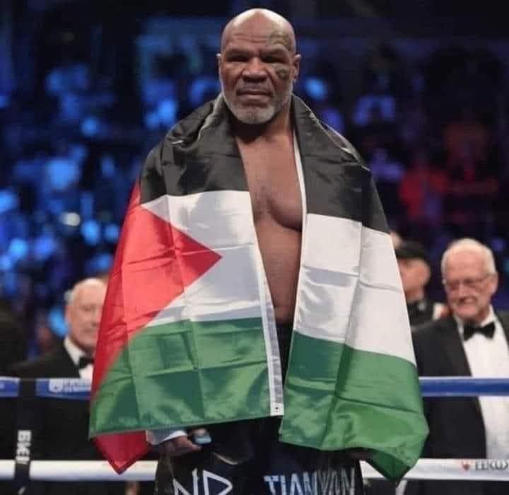
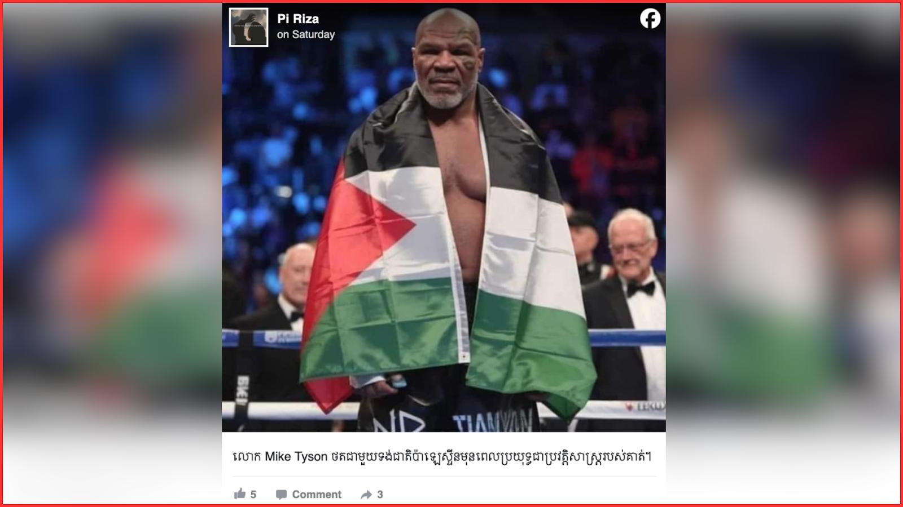

## Claim
Claim: " This is an authentic image of Mike Tyson posing with the Palestinian flag in the ring before his fight against Jake Paul on November, 15, 2024."

## Actions
```
reverse_search()
web_search("Mike Tyson Jake Paul fight November 15 2024")
```

## Evidence
### Evidence from `reverse_search`
From [Source](https://srilanka.factcrescendo.com/english/ai-generated-image-falsely-shows-mike-tyson-with-palestinian-flag/): Found exact image on website with title: Mike Tyson did not pose with the Palestine flag
Content: The website srilanka.factcrescendo.com published on July 20, 2025, states that the image of Mike Tyson with the Palestinian flag is AI-generated and not authentic. , , , , , , . The website also mentions that the image was widely shared on social media, and that the Fact Crescendo team watched the live stream of the fight between Jake Paul and Mike Tyson on November 16, and did not see Tyson wearing the Palestinian flag. The result of the fact check is "False". .


### Evidence from `web_search`
The fight between Jake Paul and Mike Tyson took place on November 15, 2024, at the AT&T Stadium in Arlington, Texas. Jake Paul won by unanimous decision. The fight was streamed on Netflix. 
The New York Times also reported on the fight and included a photo. 


## Elaboration
The image is not authentic. According to srilanka.factcrescendo.com, the image is AI-generated. The website also states that the Fact Crescendo team watched the live stream of the fight and did not see Tyson wearing the Palestinian flag.


## Final Judgement
The claim that the image is authentic is false. Multiple sources, including fact-checking websites, confirm that the image is AI-generated and not a real photo of Mike Tyson. Additionally, the fact-checkers watched the live stream of the fight and did not see Tyson with the Palestinian flag. `false`

### Verdict: FALSE

### Justification
The claim is false. The image of Mike Tyson with the Palestinian flag is AI-generated, as confirmed by fact-checking websites like srilanka.factcrescendo.com ([Source](https://srilanka.factcrescendo.com/english/ai-generated-image-falsely-shows-mike-tyson-with-palestinian-flag/)). Furthermore, the live stream of the fight did not show Tyson with the flag.
