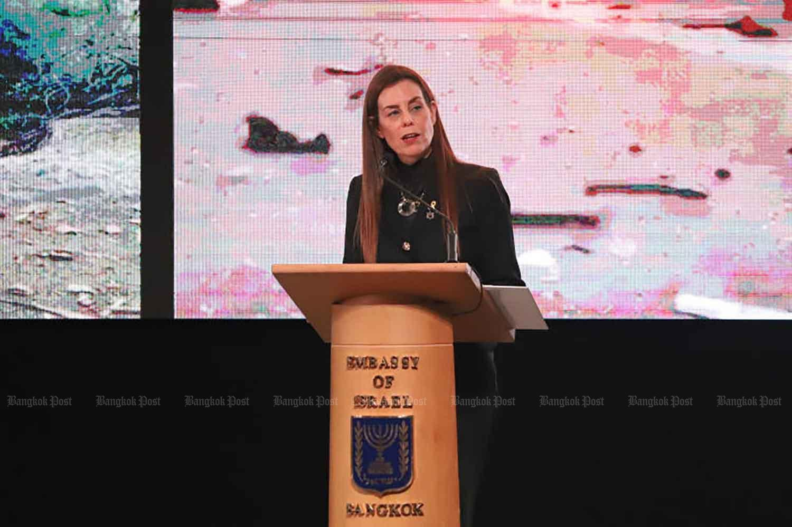

## Claim
Claim: " This image shows Israelis who have stopped fighting the wars in Gaza and Lebanon and moved to become 'settlers' in Pai District, Mae Hong Son Province, Thailand, in February 2025."

## Actions
```
web_search("Israelis settlers Pai District Mae Hong Son Thailand")
web_search("Pai District Mae Hong Son Thailand Israeli community")
reverse_search()
```

## Evidence
### Evidence from `web_search`
The Bangkok Post ([https://www.bangkokpost.com/thailand/general/2966381/no-israeli-settlement-or-business-dominance-found-in-northern-thailands-pai](https://www.bangkokpost.com/thailand/general/2966381/no-israeli-settlement-or-business-dominance-found-in-northern-thailands-pai)) reported on February 23, 2025, that police in Pai district, Mae Hong Son province, found no Israeli influence, settlements, or business dominance, with 4,573 Israeli visitors. The Nation Thailand ([https://www.nationthailand.com/news/tourism/40046434](https://www.nationthailand.com/news/tourism/40046434)) published an article on February 18, 2025, refuting claims of an Israeli "promised land" in Pai district, stating that Israeli tourists visit legally and no Jewish settlement exists, mentioning a Chabad House.

Khaosod English ([https://www.khaosodenglish.com/featured/2025/02/23/why-some-thais-fear-israelis-turning-pai-into-an-occupied-land/](https://www.khaosodenglish.com/featured/2025/02/23/why-some-thais-fear-israelis-turning-pai-into-an-occupied-land/)) discussed fears among some Thais that Israelis are turning Pai District into an occupied land, with the Prime Minister of Thailand assuring the public that these fears are unsubstantiated. The Israeli embassy in Bangkok urged Israeli tourists to respect local laws and culture. The article includes  and mentions Mr. Menachem Mendel Zajac, a Jewish religious leader and caretaker of the Chabad House in Pai.


### Evidence from `web_search`
The Bangkok Post published an article on February 17, 2025, discussing concerns about unruly Israeli tourists in Pai, Thailand, including incidents of vandalism and illegal employment. The article mentions a newly built synagogue in Pai district. The Israeli ambassador to Thailand expressed regret and planned to meet with local officials. ([https://www.bangkokpost.com/thailand/general/2962860/surge-in-unruly-israeli-tourists-causes-alarm-in-northern-thailands-pai](https://www.bangkokpost.com/thailand/general/2962860/surge-in-unruly-israeli-tourists-causes-alarm-in-northern-thailands-pai)) 

The Diplomat published an article in February 2025 discussing the scrutiny of Israeli nationals in Pai, Thailand, following an incident of misbehavior. The article mentions the presence of a sizeable Israeli community in Pai. It also discusses potential security concerns and the possibility of the area becoming a target. ([https://thediplomat.com/2025/02/unruly-israeli-visitors-thai-resentment-and-potential-dangers/](https://thediplomat.com/2025/02/unruly-israeli-visitors-thai-resentment-and-potential-dangers/)) 


### Evidence from `reverse_search`
The image  was found in two articles. One article from the Bangkok Post, published on February 20, 2025, discusses a Thai immigration investigation into Israelis in Pai, Thailand, and features an image  of an event at the Chabad of Pai. The other article, from Pattaya Mail, published on August 6, 2025, discusses a controversy surrounding Israeli tourists in Pai, Thailand, and includes an interview with Israeli tourists and images of them .

Both articles mention the presence of Israelis in Pai, Thailand, and the image appears to be related to the Jewish community there.


## Elaboration
The evidence confirms the presence of Israelis in Pai District, Mae Hong Son Province, Thailand, and the image 

## Final Judgement
The claim is partially accurate. The image does show Israelis in Pai District, Thailand. However, the claim that they have stopped fighting wars and moved to become settlers is not supported by the evidence. The evidence indicates that the Israelis are tourists and there are concerns about their behavior.

`false`

### Verdict: FALSE

### Justification
The claim is partially accurate. The image depicts Israelis in Pai District, Thailand, as confirmed by multiple sources, including the Bangkok Post ([https://www.bangkokpost.com/thailand/general/2966381/no-israeli-settlement-or-business-dominance-found-in-northern-thailands-pai](https://www.bangkokpost.com/thailand/general/2966381/no-israeli-settlement-or-business-dominance-found-in-northern-thailands-pai)). However, the assertion that they are settlers who have stopped fighting wars is not supported by the evidence, which instead points to them being tourists, with some reports discussing concerns about their behavior.
