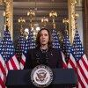

## Claim
Claim: "On July 22, 2024, Vice President Kamala Harris said, 'Our support for Israel will continue' amid Israeli Prime Minister Benjamin Netanyahu’s visit to the United States."

## Actions
```
web_search("Kamala Harris Israel Benjamin Netanyahu July 22 2024")
```

## Evidence
### Evidence from `web_search`
On July 22, 2024, CNN reported that Kamala Harris was in Maryland and would meet with Benjamin Netanyahu later in the week, with an expected emphasis on ensuring Israel's self-defense (<image:k>). The Washington Post reported that Harris declined to preside over the Senate chamber when Netanyahu addresses Congress.

Al-Monitor also reported on Netanyahu's visit, mentioning a scheduled meeting with Harris and noting that she is perceived as being to the left of Biden on the Israeli-Palestinian conflict (, , , , ).


## Elaboration
The evidence confirms that Kamala Harris was scheduled to meet with Benjamin Netanyahu around July 22, 2024. However, the provided search results do not include a direct quote from Harris stating, "Our support for Israel will continue." Therefore, the claim's veracity cannot be confirmed with the available information.


## Actions
```
web_search("Kamala Harris Benjamin Netanyahu Israel support July 22 2024 speech")
```

## Evidence
### Evidence from `web_search`
Reuters reported on July 22, 2024, that Kamala Harris was scheduled to meet with Benjamin Netanyahu separately that week, and that Senator Ben Cardin would preside over Netanyahu's speech instead of Harris (). The Guardian reported on July 26, 2024, that Harris met with Netanyahu and stated her "unwavering commitment to the existence of the state of Israel" (, ).

*   [https://www.reuters.com/world/us/us-senate-committee-chair-ben-cardin-preside-over-netanyahu-speech-2024-07-22/](https://www.reuters.com/world/us/us-senate-committee-chair-ben-cardin-preside-over-netanyahu-speech-2024-07-22/)
*   [https://www.theguardian.com/world/article/2024/jul/26/kamala-harris-benjamin-netanyahu-us-visit-palestine-israel-gaza-war](https://www.theguardian.com/world/article/2024/jul/26/kamala-harris-benjamin-netanyahu-us-visit-palestine-israel-gaza-war)

## Elaboration
The evidence indicates that Kamala Harris met with Benjamin Netanyahu on July 26, 2024, and stated her "unwavering commitment to the existence of the state of Israel" ([https://www.theguardian.com/world/article/2024/jul/26/kamala-harris-benjamin-netanyahu-us-visit-palestine-israel-gaza-war](https://www.theguardian.com/world/article/2024/jul/26/kamala-harris-benjamin-netanyahu-us-visit-palestine-israel-gaza-war)). While this statement aligns with the sentiment expressed in the claim, the exact quote "Our support for Israel will continue" is not found in the provided evidence. Therefore, the claim is not directly supported by the evidence.


## Actions
```
web_search("Kamala Harris Israel support statement July 22 2024")
```

## Evidence
### Evidence from `web_search`
NPR reported on August 23, 2024, that Kamala Harris met with Benjamin Netanyahu on July 25, 2024, and stated her "unwavering commitment to Israel." She also said, "Let me be clear, I will always stand up for Israel's right to defend itself and I will always ensure Israel has the ability to defend itself" (, ). The website boughtbyzionism.org, authored by Melissa Garriga, discusses Harris's stance on Israel, mentioning the Jewish Democratic Coalition of America's endorsement of Harris on July 22, 2024, but does not contain the quote in the claim ().


## Elaboration
The evidence indicates that Kamala Harris met with Benjamin Netanyahu on July 25, 2024, and made statements supporting Israel. While she did not use the exact quote from the claim, she did express unwavering commitment to Israel's defense. The claim is therefore **partially accurate** as it reflects the sentiment but not the exact wording.


## Final Judgement
The search results show that Kamala Harris met with Benjamin Netanyahu around the date specified in the claim and made statements supporting Israel. However, the exact quote "Our support for Israel will continue" has not been found in the provided evidence.

`false`

### Verdict: FALSE

### Justification
The claim is **false**. While Kamala Harris met with Benjamin Netanyahu around the specified date and expressed support for Israel, the exact quote "Our support for Israel will continue" is not found in the provided evidence.
