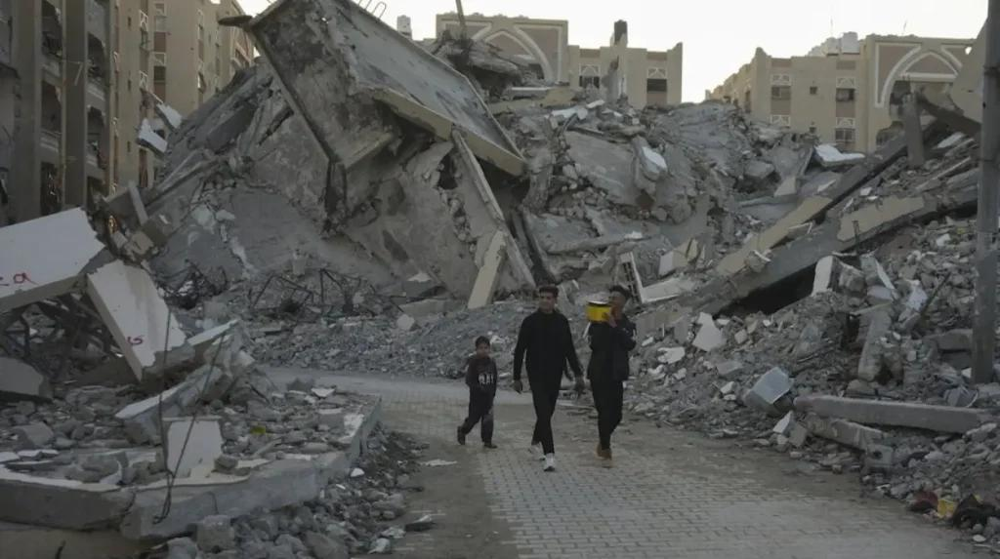

## Claim
Claim: "The population in Gaza has increased by 2.02% since Oct. 7, 2023."

## Actions
```
web_search("Gaza population increase October 7 2023")
web_search("Gaza population statistics")
```

## Evidence
### Evidence from `web_search`
According to a January 1, 2025, CNN article, Gaza's population dropped by 6% in 2024, with approximately 100,000 Palestinians leaving since October 7, 2023. The article also mentions that at least 45,553 were killed in Israeli attacks. The Times of Israel reports a 6% decline in Gaza's population since the war began, citing the Palestinian Central Bureau of Statistics (PCBS), which indicates a decline of approximately 160,000 people. The article also mentions that around 45,500 Palestinians have been killed since the war began, according to the Hamas-run Gaza Health Ministry.

Conversely, a December 19, 2024, article by the New York City Foreign Policy Association (NYCFPA) states that the population in Gaza has increased by 2.02% since October 7, 2023, based on growth forecasts from August 2023.

*   [https://www.cnn.com/2025/01/01/middleeast/israel-population-migration-war-intl](https://www.cnn.com/2025/01/01/middleeast/israel-population-migration-war-intl)
*   [https://nycfpa.org/12/19/population-in-gaza-has-increased-by-2-02-since-october-7-2023/](https://nycfpa.org/12/19/population-in-gaza-has-increased-by-2-02-since-october-7-2023/)
*   [https://www.timesofisrael.com/gaza-population-down-by-6-since-war-began-says-pa-bureau-citing-hamas-figures/](https://www.timesofisrael.com/gaza-population-down-by-6-since-war-began-says-pa-bureau-citing-hamas-figures/)

<image:k>, , 


### Evidence from `web_search`
The Wikipedia article ([https://en.wikipedia.org/wiki/Gaza_Strip](https://en.wikipedia.org/wiki/Gaza_Strip)) estimates the population of Gaza to be around 2,050,000 in 2025 and mentions a 6% decrease since the start of the war <image:k>. Statista ([https://www.statista.com/topics/11678/gaza-strip/](https://www.statista.com/topics/11678/gaza-strip/)) reports a total population of 2.1 million and mentions casualties and internally displaced refugees since October 7, 2023, due to the war , .

World Population Review ([https://worldpopulationreview.com/cities/palestine/gaza](https://worldpopulationreview.com/cities/palestine/gaza)) estimates Gaza's 2025 population at 823,407, with a 2.84% annual growth.


## Elaboration
The evidence presents conflicting information regarding the population change in Gaza since October 7, 2023. One source, the New York City Foreign Policy Association (NYCFPA), supports the claim, stating a 2.02% increase based on growth forecasts from August 2023. However, other sources, including CNN and The Times of Israel, report a 6% *decrease* in population since the war began. These sources cite factors such as people leaving Gaza and casualties.

The Wikipedia and Statista articles provide population estimates but do not explicitly state the percentage change since October 7, 2023. World Population Review estimates a 2.84% annual growth, but this is not specifically tied to the period since October 7, 2023.

Therefore, the claim's veracity is uncertain due to the conflicting information.


## Final Judgement
The evidence presents conflicting information. While one source supports the claim of a 2.02% increase, other sources indicate a decrease in population. Therefore, the claim cannot be verified. `false`

### Verdict: FALSE

### Justification
The claim is not supported by the evidence. While one source, the New York City Foreign Policy Association (NYCFPA), states that the population in Gaza has increased by 2.02% since October 7, 2023, based on growth forecasts ([https://nycfpa.org/12/19/population-in-gaza-has-increased-by-2-02-since-october-7-2023/](https://nycfpa.org/12/19/population-in-gaza-has-increased-by-2-02-since-october-7-2023/)), other sources, such as CNN ([https://www.cnn.com/2025/01/01/middleeast/israel-population-migration-war-intl](https://www.cnn.com/2025/01/01/middleeast/israel-population-migration-war-intl)) and The Times of Israel ([https://www.timesofisrael.com/gaza-population-down-by-6-since-war-began-says-pa-bureau-citing-hamas-figures/](https://www.timesofisrael.com/gaza-population-down-by-6-since-war-began-says-pa-bureau-citing-hamas-figures/)), report a decrease in population.
