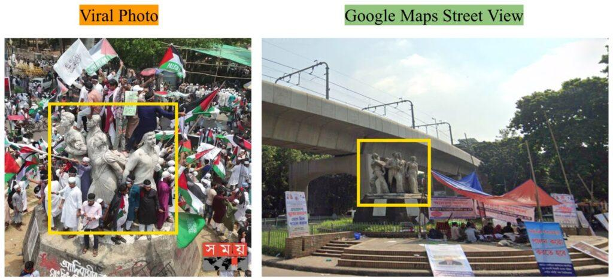

## Claim
Claim: " This image shows thousands gathering at Sohrawardi Park in Kolkata, India, in April 2025 to show solidarity with the Palestinian people amid the ongoing Israeli assault on Gaza."

## Actions
```
web_search("Sohrawardi Park Kolkata Palestine protest")
image_search("Sohrawardi Park Kolkata Palestine protest")
```

## Evidence
### Evidence from `web_search`
The image in the claim shows a protest in solidarity with the Palestinian people. However, the photos are not from Kolkata, India, as the claim states. According to Factly ([Source](https://factly.in/photos-of-a-protest-held-in-solidarity-with-palestine-in-dhaka-bangladesh-are-falsely-shared-as-those-from-kolkata/)), the photos are from a protest held in Suhrawardy Udyan in Dhaka, Bangladesh, on April 12, 2025, with approximately 100,000 participants (, ).

Tezzfeed ([Source](https://tezzfeed.com/latest-news/palestinian-media-shares-bangladeshs-pro-gaza-protest-photos-mistakenly-labels-them-as-kolkata-1744522142539)) also discusses the mislabeling of the photos. Kashif ([Source](https://kashif.ps/en/index.php/2025/04/14/images-of-demonstration-in-solidarity-with-palestine-from-bangladesh-circulate-as-from-india/)) confirms that the images are from Dhaka, Bangladesh, and were falsely claimed to be from Kolkata, India (, ).


## Elaboration
The claim is inaccurate. The images depict a protest in solidarity with the Palestinian people, but the event took place in Dhaka, Bangladesh, not Kolkata, India. The protest occurred on April 12, 2025, at Suhrawardy Udyan in Dhaka, with approximately 100,000 participants.


## Final Judgement
The claim is false because the images are from a protest in Dhaka, Bangladesh, not Kolkata, India. The evidence confirms the location as Dhaka and identifies the misrepresentation of the event's location. `false`

### Verdict: FALSE

### Justification
The images in the claim show a protest in support of Palestine, but the event occurred in Dhaka, Bangladesh, not Kolkata, India, as stated in the claim. Multiple sources, including Factly ([Source](https://factly.in/photos-of-a-protest-held-in-solidarity-with-palestine-in-dhaka-bangladesh-are-falsely-shared-as-those-from-kolkata/)), confirm the location as Dhaka and the mislabeling of the event.
