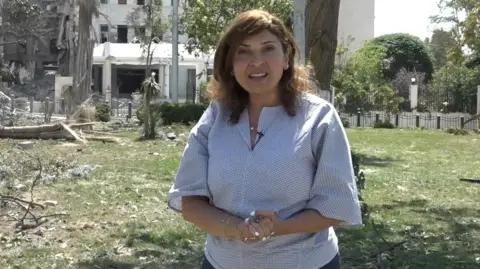
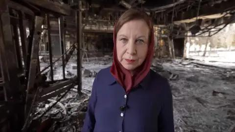

## Claim
Claim: " This image shows two children in Gaza in April 2025 found dead under the rubble of their home two months after an Israeli airstrike destroyed it."

## Actions
```
web_search("children found rubble home Gaza Israeli airstrike")
image_search("children found rubble Gaza")
```

## Evidence
### Evidence from `web_search`
PBS News published an article on March 20, 2025, about an Israeli airstrike in Khan Younis, Gaza, that killed at least 16 people, mostly women and children, including a month-old girl's parents and brother. The war began on October 7, 2023, and nearly 49,000 Palestinians have been killed since then. ([https://www.pbs.org/newshour/world/month-old-girl-pulled-from-rubble-in-gaza-after-airstrike-killed-her-parents](https://www.pbs.org/newshour/world/month-old-girl-pulled-from-rubble-in-gaza-after-airstrike-killed-her-parents)) 

The BBC published an article on December 29, 2023, about a baby girl pulled alive from the rubble in Rafah after an Israeli air strike that killed her mother and sister. More than 21,500 people - mostly children and women - have been killed during Israeli retaliatory attacks on Gaza. The BBC also published several videos in July and August 2025 about the conflict between Israel and Palestine. ([https://www.bbc.com/news/av/world-middle-east-67843832](https://www.bbc.com/news/av/world-middle-east-67843832)) , , , , , ,  Democracy Now! reported on May 27, 2025, about an Israeli airstrike that hit the home of a Palestinian pediatrician, killing nine of her ten children. Emergency workers pulled the charred bodies of the children from the rubble. ([https://www.democracynow.org/2025/5/27/dr_alaa_al_najjar_gaza](https://www.democracynow.org/2025/5/27/dr_alaa_al_najjar_gaza)) 


### Evidence from `image_search`
Save the Children published an article about the situation in Gaza (). VPM.org/NPR News contains an image of two children in Gaza standing in rubble (). Human Rights Watch published an article on November 22, 2023, about the impact of hostilities on children in Gaza ().

The search results do not contain information about the specific image provided in the claim ().


## Elaboration
The evidence confirms that Israeli airstrikes in Gaza have resulted in the deaths of many children. However, the search results do not provide any information about the specific image in the claim. Therefore, the claim cannot be verified.


## Actions
```
reverse_search()
```

## Evidence
### Evidence from `reverse_search`
From [Source](https://kashif.ps/en/index.php/2025/04/14/image-of-two-mummified-children-in-a-bolivian-museum-goes-viral-as-from-gaza/): Found exact image on website with title: Image of two mummified children in a Bolivian museum goes viral as ...
Content: The website kashif.ps published an article on April 14, 2025, stating that the image in the claim is of two mummified children in a Bolivian museum, not children found in Gaza. The image was posted on Flickr in 2006 and shows mummified Spanish children from the 1800s. , .


## Elaboration
The claim is false. The image depicts two mummified children from a Bolivian museum, not children found in Gaza.


## Final Judgement
The initial search did not provide information about the specific image. However, a reverse image search revealed that the image is of mummified children from a Bolivian museum, not children from Gaza.

`false`

### Verdict: FALSE

### Justification
The claim is false. The image in the claim depicts mummified children from a Bolivian museum, not children found in Gaza after an Israeli airstrike. This was confirmed by a reverse image search, which identified the image and its origin ([https://kashif.ps/en/index.php/2025/04/14/image-of-two-mummified-children-in-a-bolivian-museum-goes-viral-as-from-gaza/](https://kashif.ps/en/index.php/2025/04/14/image-of-two-mummified-children-in-a-bolivian-museum-goes-viral-as-from-gaza/)).
