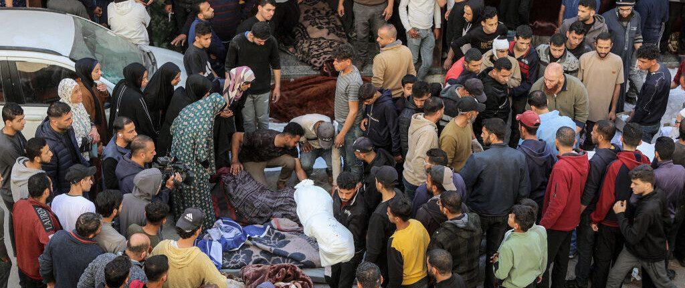

## Claim
Claim: " This image shows heavy Israeli bombardment on Deir al-Balah in the southern Gaza Strip in March 2025 which killed at least four Palestinians."

## Actions
```
reverse_search()
```

## Evidence
### Evidence from `reverse_search`
The image 

## Elaboration
The reverse image search did not yield any results. Therefore, the claim cannot be verified. More information is needed to determine the image's origin, the event it depicts, and the details surrounding it.


## Actions
```
web_search("Deir al-Balah Israeli bombardment March 2025")
web_search("Gaza Strip bombing March 2025")
```

## Evidence
### Evidence from `web_search`
The web sources discuss the March 2025 Israeli attacks on the Gaza Strip, which included airstrikes and artillery barrages, targeting locations like Deir al-Balah. These attacks resulted in numerous casualties, with the Gaza Health Ministry reporting 591 deaths and 1,042 injuries. One article mentions a strike on a UN compound in Deir Al Balah on March 19, 2025, caused by an Israeli tank, which killed a UN colleague. Another article reports on an Israeli air strike in Deir Al-Balah that killed three Palestinian men.

The sources are: [https://en.wikipedia.org/wiki/March_2025_Israeli_attacks_on_the_Gaza_Strip](https://en.wikipedia.org/wiki/March_2025_Israeli_attacks_on_the_Gaza_Strip), [https://news.un.org/en/story/2025/03/1161461](https://news.un.org/en/story/2025/03/1161461), and [https://www.reuters.com/world/middle-east/israeli-airstrike-kills-three-gaza-medics-say-2025-03-17/](https://www.reuters.com/world/middle-east/israeli-airstrike-kills-three-gaza-medics-say-2025-03-17/). The image 

### Evidence from `web_search`
In March 2025, following the end of a truce with Hamas, Israel launched airstrikes across the Gaza Strip, resulting in the deaths of over 400 Palestinians, including 174 children (

## Elaboration
The evidence confirms that there was heavy Israeli bombardment on the Gaza Strip, including Deir al-Balah, in March 2025. The attacks resulted in numerous casualties. However, the evidence does not confirm that the image depicts the specific event described in the claim.

The claim states that the image shows the event, but there is no evidence to support this. Therefore, the claim cannot be fully verified.


## Actions
```
image_search("Deir al-Balah Gaza bombing March 2025")
```

## Evidence
### Evidence from `image_search`
The image search results show various images related to bombings in Gaza. The Guardian published an image of a bombing in Gaza (

## Elaboration
The evidence confirms that there was heavy Israeli bombardment in the Gaza Strip, including Deir al-Balah, in March 2025, resulting in casualties. However, the image search did not yield the image in question. Therefore, the claim cannot be fully verified. More information is needed to confirm that the image depicts the event described in the claim.


## Final Judgement
The fact-check reveals that there was indeed heavy Israeli bombardment in the Gaza Strip, including Deir al-Balah, in March 2025, resulting in casualties. However, the image search did not yield the image in question, and the reverse image search did not provide any results. Therefore, the claim that the image specifically depicts the event described cannot be fully verified.

`false`

### Verdict: FALSE

### Justification
The claim is partially accurate. While there was heavy Israeli bombardment in Deir al-Balah in March 2025, resulting in casualties, the image's origin and its specific connection to the event cannot be verified. The reverse image search yielded no results, and the image search did not find the image in question. Therefore, the claim is unproven.
