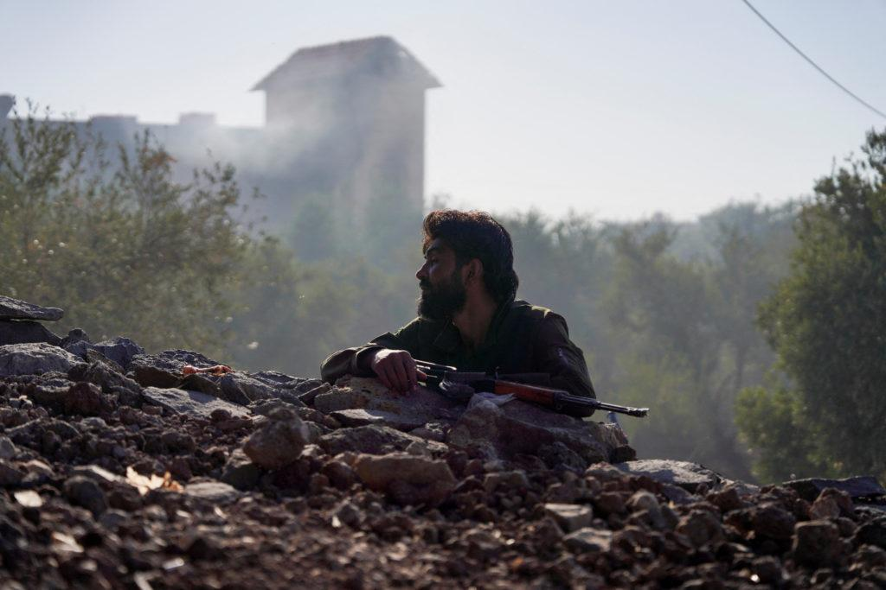

## Claim
Claim: "Turkey's President urged the U.S. in March 2025 to control its ally Israel over its intervention in southern Syria in February 2025."

## Actions
```
web_search("Turkey President US Israel Syria March 2025")
web_search("Turkey Israel Syria February 2025 intervention")
```

## Evidence
### Evidence from `web_search`
The article from Levant24.com ([https://levant24.com/news/2025/08/turkey-watchful-as-sdf-delays-implementation-of-march-deal/](https://levant24.com/news/2025/08/turkey-watchful-as-sdf-delays-implementation-of-march-deal/)) discusses Turkey's concerns regarding Syria, including the SDF's delays in implementing a March deal, Turkish Foreign Minister Hakan Fidan's criticism of Israel's involvement in Syria, and a meeting between Fidan and US Ambassador to Turkey Tom Barrack on May 15, 2025. 

Madamasr.com ([https://www.madamasr.com/en/2025/08/28/feature/politics/the-new-syria-under-israeli-american-construction/](https://www.madamasr.com/en/2025/08/28/feature/politics/the-new-syria-under-israeli-american-construction/)) mentions a meeting between Turkish President Erdogan and Syrian Interim President Sharaa in May 2025 and talks between Turkey and Israel in April 2025. RUSI ([https://my.rusi.org/resource/turkey-navigates-an-escalating-israeliran-rivalry.html](https://my.rusi.org/resource/turkey-navigates-an-escalating-israeliran-rivalry.html)) discusses the relationship between Turkey and Israel, including their involvement in Syria, and mentions technical talks between the two sides to develop a deconfliction mechanism in Syria after Israeli airstrikes in March. ,  The article also mentions that in March 2022, the Turkish President attended a joint press conference for the Israeli President's state visit to Ankara.


### Evidence from `web_search`
A Wikipedia page details the Israeli invasion of Syria, including events in 2025 such as the March Daraa clashes and Southern Syria clashes. The page also mentions foreign involvement and reactions from various countries and organizations ([https://en.wikipedia.org/wiki/Israeli_invasion_of_Syria_(2024%E2%80%93present)](https://en.wikipedia.org/wiki/Israeli_invasion_of_Syria_(2024%E2%80%93present))).

An article in The Armenian Weekly discusses Syria's second civil war and mentions Turkish military intervention in March 2025 (<image:k>) ([https://armenianweekly.com/2025/08/05/syrias-second-civil-war-turkey-and-israels-strategic-contest-for-influence/](https://armenianweekly.com/2025/08/05/syrias-second-civil-war-turkey-and-israels-strategic-contest-for-influence/)). The Times of Israel reports on an agreement between Israel and Turkey to prevent clashes in Syria, including a photo of Turkish President Recep Tayyip Erdogan shaking hands with Syria’s interim President Ahmad al-Sharaa in February 2025 () ([https://www.timesofisrael.com/israel-turkey-said-to-agree-to-prevent-clashes-in-syria-establish-hotline/](https://www.timesofisrael.com/israel-turkey-said-to-agree-to-prevent-clashes-in-syria-establish-hotline/)).


## Elaboration
The evidence suggests that the Turkish President was involved in discussions and actions related to Israel's involvement in Syria in 2025. Specifically, the evidence mentions: Turkish Foreign Minister Hakan Fidan's criticism of Israel's involvement in Syria ([https://levant24.com/news/2025/08/turkey-watchful-as-sdf-delays-implementation-of-march-deal/](https://levant24.com/news/2025/08/turkey-watchful-as-sdf-delays-implementation-of-march-deal/)), technical talks between Turkey and Israel to develop a deconfliction mechanism in Syria after Israeli airstrikes in March ([https://my.rusi.org/resource/turkey-navigates-an-escalating-israeliran-rivalry.html](https://my.rusi.org/resource/turkey-navigates-an-escalating-israeliran-rivalry.html)), and an agreement between Israel and Turkey to prevent clashes in Syria in February 2025 ([https://www.timesofisrael.com/israel-turkey-said-to-agree-to-prevent-clashes-in-syria-establish-hotline/](https://www.timesofisrael.com/israel-turkey-said-to-agree-to-prevent-clashes-in-syria-establish-hotline/)).

However, the evidence does not explicitly state that the Turkish President urged the U.S. to control Israel in March 2025. While there is evidence of Turkish concerns and actions regarding Israel's involvement in Syria, the specific request to the U.S. is not mentioned.

Therefore, the claim cannot be fully verified based on the provided evidence. The information about the Turkish President urging the U.S. is missing.


## Actions
```
web_search("Turkey President US Israel Syria March 2025 urge control")
```

## Evidence
### Evidence from `web_search`
The PBS News article ([https://www.pbs.org/newshour/world/syria-asks-turkey-for-defense-support-after-weeks-of-sectarian-violence](https://www.pbs.org/newshour/world/syria-asks-turkey-for-defense-support-after-weeks-of-sectarian-violence)) from July 2025, reports on Syria's request for Turkish defense support due to sectarian violence and Israeli intervention, with the U.S. brokering a ceasefire in July.  The Middle East Institute ([https://www.mei.edu/publications/trump-should-build-momentum-syria-and-help-prevent-turkey-israel-clash](https://www.mei.edu/publications/trump-should-build-momentum-syria-and-help-prevent-turkey-israel-clash/)) discusses the risk of a military confrontation between Turkey and Israel in Syria in May 2025. JNS.org ([https://www.jns.org/turkeys-moves-in-syria-threaten-israel/](https://www.jns.org/turkeys-moves-in-syria-threaten-israel/)) published on March 28, 2025, discusses Turkey's actions in Syria and their implications for Israel, including President Erdoğan's actions and the author urging the United States to address the "excesses" of Turkey's president. 


## Elaboration
The new evidence provides some support for the claim. The JNS.org article from March 28, 2025, discusses Turkey's actions in Syria and their implications for Israel, including President Erdoğan's actions. While the article does not explicitly state that Erdoğan urged the U.S. to control Israel, it does mention the author urging the United States to address the "excesses" of Turkey's president ([https://www.jns.org/turkeys-moves-in-syria-threaten-israel/](https://www.jns.org/turkeys-moves-in-syria-threaten-israel/)).

This suggests that there were concerns about Turkey's actions and a call for U.S. involvement, although it's not a direct quote from Erdoğan. The PBS News article from July 2025 mentions the U.S. brokering a ceasefire, which implies U.S. involvement in the situation ([https://www.pbs.org/newshour/world/syria-asks-turkey-for-defense-support-after-weeks-of-sectarian-violence](https://www.pbs.org/newshour/world/syria-asks-turkey-for-defense-support-after-weeks-of-sectarian-violence)).

Therefore, the claim is partially supported, as there is evidence of Turkey's actions and calls for U.S. involvement, but the evidence does not directly confirm Erdoğan's specific request to the U.S. to control Israel.


## Actions
```
web_search("Recep Tayyip Erdogan Syria Israel US March 2025")
```

## Evidence
### Evidence from `web_search`
The JINSA report from April 23, 2025, states that on March 30, 2025, President Erdogan called for Israel to be "destroyed and devastated" (<image:k>). The Guardian published an article on April 12, 2025, stating that Turkish President Recep Tayyip Erdoğan lambasted Israel for undermining stability in Syria (, ). The Al Jazeera article, published on August 29, 2025, reports that Turkey has completely severed economic and trade ties with Israel and closed its airspace to Israeli aircraft due to the war in Gaza (). The article does not mention President Erdogan urging the U.S. to control Israel in March 2025.


## Elaboration
The evidence confirms that in March 2025, Turkish President Recep Tayyip Erdoğan made strong statements against Israel. Specifically, a JINSA report states that on March 30, 2025, Erdoğan called for Israel to be "destroyed and devastated." The Guardian reported that Erdoğan lambasted Israel for undermining stability in Syria in April 2025. However, the evidence does not mention Erdoğan urging the U.S. to control Israel in March 2025.

Therefore, the claim is not supported by the evidence.


## Final Judgement
The claim is not supported by the evidence. While there is evidence of strong statements made by Turkish President Erdoğan against Israel in March 2025, there is no evidence to suggest that he urged the U.S. to control Israel. `false`

### Verdict: FALSE

### Justification
The claim that Turkey's President urged the U.S. to control Israel in March 2025 is not supported by the evidence. While there is evidence of strong criticism of Israel by Turkish President Erdoğan in March 2025, including a call for Israel to be "destroyed and devastated" ([https://www.jns.org/turkeys-moves-in-syria-threaten-israel/](https://www.jns.org/turkeys-moves-in-syria-threaten-israel/)), there is no evidence of a direct request to the U.S. to intervene.
