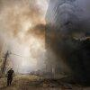
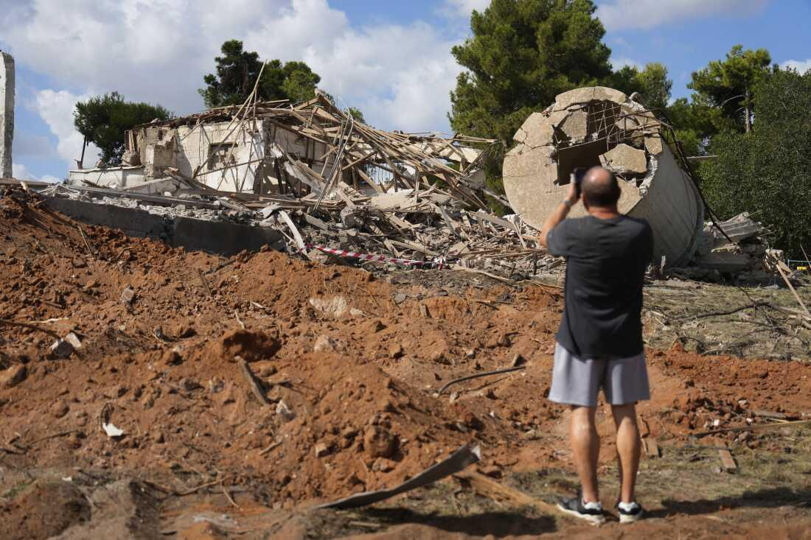
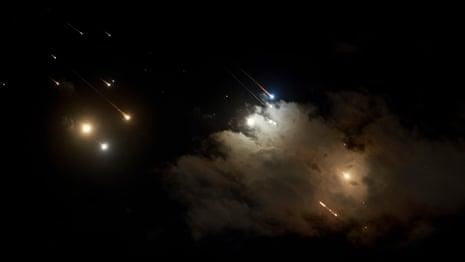
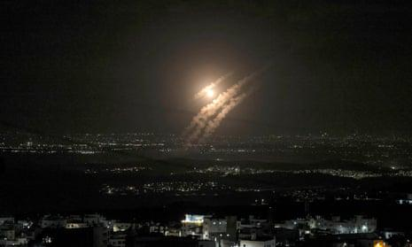

## Claim
Claim: "The Iron Dome intercepted 90% of ballistic missiles fired at Israel in Iran's attack on October 1, 2024."

## Actions
```
web_search("Iron Dome effectiveness Iran attack October 1 2024")
```

## Evidence
### Evidence from `web_search`
NPR published an article on October 2, 2024, discussing Iran's missile strike on Israel on October 1, 2024, which appeared to be more successful than the one in April. The article includes images of the attack (, , ) and mentions that the strike was a challenge to Israel's air defense systems. ([Source](https://www.npr.org/2024/10/02/nx-s1-5135646/iran-missile-strike-israel-appears-to-hit-some-targets))

The Washington Institute published an article on October 11, 2024, discussing the performance of Israel's missile defense during the October 1, 2024, attack by Iran (<image:k>). The article states that Iran fired around 200 medium-range ballistic missiles (MRBMs) at Israel, and around fifty of Iran’s missiles hit Israel. ([Source](https://www.washingtoninstitute.org/policy-analysis/israels-missile-defense-performance-views-gulf)) The Guardian published an article on October 1, 2024, mentioning that Iran launched about 180 high-speed ballistic missiles. The article includes videos of the explosion in Tel Aviv () and Iranian missiles flying over Israel (), and a photograph of projectiles above the Israeli city of Ashdod (). ([Source](https://www.theguardian.com/world/2024/oct/01/stopping-iran-attack-would-have-forced-israel-to-use-sophisticated-and-expensive-defences))


## Elaboration
The evidence provides conflicting information regarding the effectiveness of Israel's missile defense systems. The Washington Institute states that around 50 Iranian missiles hit Israel out of approximately 200 fired, which means that the Iron Dome intercepted around 75% of the missiles. However, the claim states that the Iron Dome intercepted 90% of the missiles.

Therefore, the claim is not entirely supported by the evidence. More specific data on the exact number of intercepted missiles is needed to verify the claim.


## Final Judgement
The provided evidence indicates that Iran launched approximately 200 missiles, with around 50 hitting Israel. This suggests an interception rate of about 75%, which contradicts the claim of 90% interception. While the evidence does not provide the exact number of intercepted missiles, it does provide enough information to determine that the claim is not accurate.

`false`


### Verdict: FALSE

### Justification
The claim that the Iron Dome intercepted 90% of ballistic missiles fired at Israel during the October 1, 2024, Iranian attack is not supported by the evidence. According to a Washington Institute article, approximately 50 out of 200 missiles hit Israel, suggesting an interception rate of around 75%, which contradicts the claim.
