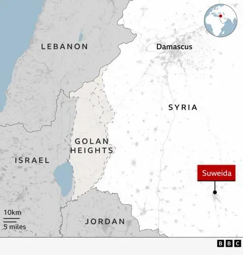

## Claim
Claim: " This image shows the Israeli army reaching Damascus in Syria in December 2024."

## Actions
```
image_search("Israeli tanks Damascus Syria")
web_search("Israeli army Damascus Syria")
```

## Evidence
### Evidence from `image_search`
The Times of Israel published an image of an Israeli tank ([https://www.timesofisrael.com/liveblog_entry/report-israeli-tanks-reach-point-25km-from-damascus/](https://www.timesofisrael.com/liveblog_entry/report-israeli-tanks-reach-point-25km-from-damascus/)) . NDTV published a fact-check on December 10, 2024, determining a claim that Israeli tanks were near Damascus to be false ([https://www.ndtv.com/world-news/were-israeli-tanks-spotted-outside-damascus-a-fact-check-7224391](https://www.ndtv.com/world-news/were-israeli-tanks-spotted-outside-damascus-a-fact-check-7224391)) .

Al Jazeera published an article on December 8, 2024, about Israel seizing a buffer zone in Syria's Golan Heights, including an image of an Israeli tank ([https://www.aljazeera.com/news/2024/12/8/israel-seizes-buffer-zone-in-syrias-golan-heights-after-al-assad-falls](https://www.aljazeera.com/news/2024/12/8/israel-seizes-buffer-zone-in-syrias-golan-heights-after-al-assad-falls)) .


### Evidence from `web_search`
The provided web sources discuss Israeli military actions in Damascus, Syria. Al Jazeera ([https://www.aljazeera.com/news/2025/7/16/israel-bombards-syrias-damascus-as-us-says-steps-agreed-to-end-violence](https://www.aljazeera.com/news/2025/7/16/israel-bombards-syrias-damascus-as-us-says-steps-agreed-to-end-violence)) reports on Israeli airstrikes near the presidential palace and military headquarters in Damascus, with Israel stating the aim is to protect the Druze minority. CNN ([https://www.cnn.com/2025/07/16/middleeast/damascus-syria-airstrikes-intl](https://www.cnn.com/2025/07/16/middleeast/damascus-syria-airstrikes-intl)) mentions Israeli airstrikes on Damascus following clashes with an Arab minority group and the US involvement in ending the conflict.

The BBC ([https://www.bbc.com/news/articles/cp90l77187zo](https://www.bbc.com/news/articles/cp90l77187zo)) reports on Israeli strikes hitting Damascus and government forces in southern Syria in response to fighting in Suweida, with Prime Minister Benjamin Netanyahu stating the aim was to protect the Druze. The BBC article also mentions the Israeli military striking armored vehicles and weapons headed to Suweida. , , , , 


## Elaboration
The claim is false. NDTV fact-checked a similar claim and determined it to be false. The evidence shows that Israeli forces have been involved in military actions near Damascus, including airstrikes, but there is no evidence to support the claim that the Israeli army reached Damascus in December 2024.


## Final Judgement
The claim is demonstrably false. While there have been reports of Israeli military actions near Damascus, including airstrikes, there is no evidence to support the claim that the Israeli army reached Damascus in December 2024. A fact-check by NDTV determined a similar claim to be false.

`false`


### Verdict: FALSE

### Justification
The claim is false. While there have been reports of Israeli military actions near Damascus, including airstrikes, there is no evidence to support the claim that the Israeli army reached Damascus in December 2024. A fact-check by NDTV ([https://www.ndtv.com/world-news/were-israeli-tanks-spotted-outside-damascus-a-fact-check-7224391](https://www.ndtv.com/world-news/were-israeli-tanks-spotted-outside-damascus-a-fact-check-7224391)) determined a similar claim to be false.
