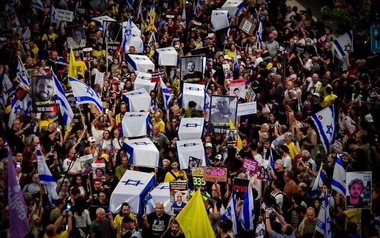

## Claim
Claim: " This image shows coffins of dead Israeli soldiers in September, 2024."

## Actions
```
reverse_search()
web_search("Israeli coffins protest")
```

## Evidence
### Evidence from `web_search`
The BBC article discusses the return of the bodies of Israeli hostages, including Oded Lifschitz, Shiri Bibas and her two young sons, Ariel and Kfir, on February 20, 2025. ([https://www.bbc.com/news/articles/c93npgqlzvpo](https://www.bbc.com/news/articles/c93npgqlzvpo)) The Times of Israel and Euronews report on a protest in Tel Aviv on September 5, 2024, where demonstrators carried mock coffins draped with Israeli flags to symbolize hostages held in Gaza. ([https://www.timesofisrael.com/government-of-blood-protesters-stage-mock-funeral-for-slain-hostages-demand-deal/](https://www.timesofisrael.com/government-of-blood-protesters-stage-mock-funeral-for-slain-hostages-demand-deal/)) ([https://www.euronews.com/2024/09/05/protesters-march-in-tel-aviv-with-makeshift-coffins-to-demand-release-of-gaza-hostages](https://www.euronews.com/2024/09/05/protesters-march-in-tel-aviv-with-makeshift-coffins-to-demand-release-of-gaza-hostages))

The protesters demanded a deal to secure the release of the remaining hostages. , , , , , 


## Elaboration
The evidence indicates that the image depicts a protest in Tel Aviv on September 5, 2024, where demonstrators used mock coffins draped with Israeli flags to symbolize hostages held in Gaza. The claim that the image shows coffins of dead Israeli soldiers is therefore inaccurate.


## Final Judgement
The image shows mock coffins used in a protest in Tel Aviv on September 5, 2024, to symbolize hostages held in Gaza, not dead Israeli soldiers. The claim misrepresents the context of the image.

`false`

### Verdict: FALSE

### Justification
The image shows mock coffins used in a protest in Tel Aviv on September 5, 2024, as reported by the [Times of Israel](https://www.timesofisrael.com/government-of-blood-protesters-stage-mock-funeral-for-slain-hostages-demand-deal/) and [Euronews](https://www.euronews.com/2024/09/05/protesters-march-in-tel-aviv-with-makeshift-coffins-to-demand-release-of-gaza-hostages), to symbolize hostages held in Gaza, not dead Israeli soldiers.
