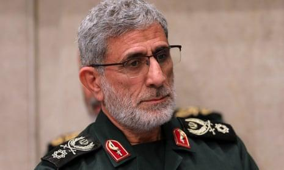
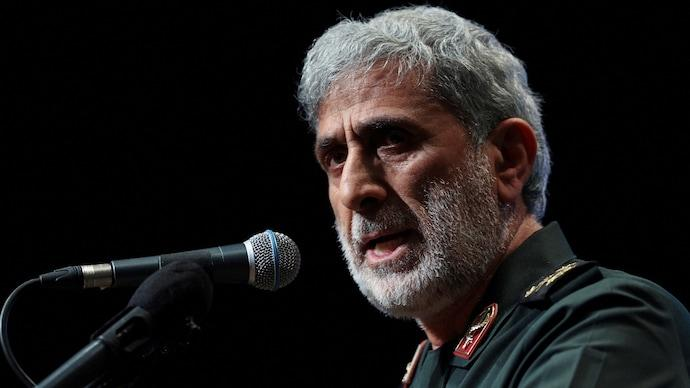

## Claim
Claim: " This is an authentic image of Esmail Qaani, the commander of the Iranian Revolutionary Guards, disguised in a hijab in fear of Israeli bombing."

## Actions
```
reverse_search()
```

## Evidence
### Evidence from `reverse_search`
From [Source](https://www.nairaland.com/8460455/commander-ghost-qaanis-great-escape): Found exact image on website with title: "From Commander To Ghost: Qaani's Great Escape?" - Foreign Affairs
Content: The search result is from Nairaland, a Nigerian forum. It discusses an image of Esmail Qaani, the commander of the Iranian Revolutionary Guards, in disguise. The post suggests that the disguise was a survival tactic following reported Israeli airstrikes. The post also includes a link to an X post by @MOSSADil, which juxtaposes two images of Qaani, one in military attire and the other in civilian disguise.  The forum post also contains several comments from users discussing the situation.


## Elaboration
The evidence suggests that the image is of Esmail Qaani, the commander of the Iranian Revolutionary Guards, in disguise. The Nairaland forum post, which includes the image, discusses the disguise as a survival tactic following reported Israeli airstrikes. The post also links to an X post that juxtaposes images of Qaani in military attire and civilian disguise.

The evidence does not explicitly confirm the claim that the disguise was due to fear of Israeli bombing, but it does suggest this as a possible reason.

Further information is needed to verify the claim definitively, such as official statements or reports confirming the reason for the disguise.


## Actions
```
web_search("Esmail Qaani disguise Israeli bombing")
web_search("Esmail Qaani wearing hijab")
```

## Evidence
### Evidence from `web_search`
The Guardian article from October 10, 2024, discusses Esmail Ghaani's whereabouts following Israeli strikes, mentioning conflicting reports about his health and location, and includes an image of him in military uniform (). The New Arab reported on July 17, 2025, that Esmail Qaani warned Iraqi leaders of potential Israeli attacks during a visit to Baghdad, but the image () is not included in the article.


### Evidence from `web_search`
The search results include an article from Al-Monitor that features an image of Esmail Qaani and discusses his criticism of women without hijabs. The article is from December 2022. ([https://www.al-monitor.com/originals/2022/12/irans-quds-force-leader-criticizes-women-without-hijabs](https://www.al-monitor.com/originals/2022/12/irans-quds-force-leader-criticizes-women-without-hijabs)) , ,  Another article from IranWire, published on October 7, 2024, reports that Qaani has been missing after Israeli airstrikes in Beirut. ([https://iranwire.com/en/politics/134733-irans-quds-force-chief-esmail-qaani-missing-after-beirut-airstrikes/](https://iranwire.com/en/politics/134733-irans-quds-force-chief-esmail-qaani-missing-after-beirut-airstrikes/))

The Gulf States Newsletter (GSN) published an article on October 23, 2024, discussing speculation about Esmail Qaani's health and status, including allegations of injury from an Israeli strike or being an Israeli spy, both of which were denied by Tehran. ([https://www.gsn-online.com/news-centre/key-players/iran-esmail-qaani](https://www.gsn-online.com/news-centre/key-players/iran-esmail-qaani)) <image:i>


## Elaboration
The evidence suggests that Esmail Qaani's whereabouts and health have been subjects of speculation following reported Israeli strikes. One article from IranWire states that Qaani was missing after Beirut airstrikes. The GSN article mentions allegations of injury from an Israeli strike, which Tehran denied. The Al-Monitor article from December 2022 features an image of Qaani and discusses his criticism of women without hijabs. The Guardian article from October 10, 2024, discusses Qaani's whereabouts and includes an image of him in military uniform. The New Arab reported that Qaani warned Iraqi leaders of potential Israeli attacks. However, none of the provided sources confirm the claim that Qaani was disguised in a hijab due to fear of Israeli bombing.


## Actions
```
image_search("Esmail Qaani hijab disguise")
```

## Evidence
### Evidence from `image_search`
From [Source](https://www.indiatoday.in/global/story/iran-rejects-allegations-against-quds-force-commander-esmail-qaani-as-fake-news-2616700-2024-10-14): 
Content: India Today published an article on October 14, 2024, rejecting allegations against Esmail Qaani as fake news. 


## Elaboration
The evidence does not support the claim. While there are reports of speculation about Esmail Qaani's whereabouts and health following Israeli strikes, and an image of him in military uniform, there is no evidence to confirm that the image of him in a hijab is authentic or that it was due to fear of Israeli bombing. India Today rejected allegations against Qaani as fake news.


## Final Judgement
The image search and web searches did not provide any evidence to support the claim that the image is authentic and that the disguise was due to fear of Israeli bombing. The evidence suggests that there was speculation about Esmail Qaani's whereabouts and health following Israeli strikes, but no reliable sources confirm the claim. Therefore, the claim is not factually accurate. `false`

### Verdict: FALSE

### Justification
The claim is not supported by the evidence. While there are reports of speculation about Esmail Qaani's whereabouts and health following Israeli strikes, and an image of him in military uniform, there is no evidence to confirm that the image of him in a hijab is authentic or that it was due to fear of Israeli bombing. India Today rejected allegations against Qaani as fake news.
