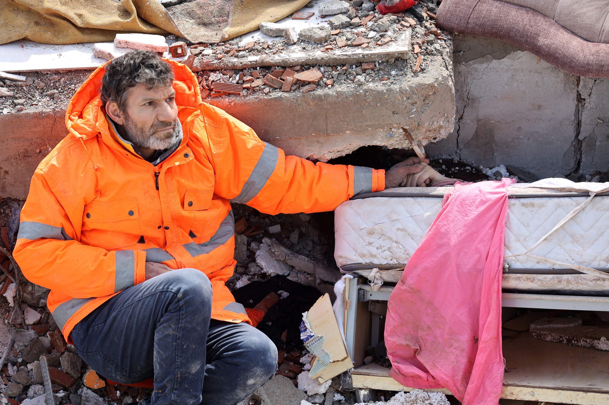

## Claim
Claim: " This image shows a man from Gaza holding the hand of his son killed in an Israeli bombing in July, 2024."

## Actions
```
reverse_search()
web_search("Gaza Israeli bombing July 2024")
```

## Evidence
### Evidence from `reverse_search`
The image () shows Mesut Hancer holding the hand of his 15-year-old daughter, Irmak, who died in the earthquake in Kahramanmaras, Turkey. The earthquake occurred on February 6 or 7, 2023. The photo was taken by Adem Altan, a photographer with AFP.

The image was featured in articles published by The Independent ([https://www.independent.co.uk/news/world/middle-east/turkey-earthquake-father-daughter-hold-hands-b2277655.html](https://www.independent.co.uk/news/world/middle-east/turkey-earthquake-father-daughter-hold-hands-b2277655.html)), SBS News ([https://www.sbs.com.au/news/article/the-story-behind-this-turkey-earthquake-photo-that-many-will-never-forget/2ijedstvo](https://www.sbs.com.au/news/article/the-story-behind-this-turkey-earthquake-photo-that-many-will-never-forget/2ijedstvo)), and CNN ([https://www.cnn.com/2023/02/13/middleeast/turkey-quake-man-daughter-hand-photo-intl](https://www.cnn.com/2023/02/13/middleeast/turkey-quake-man-daughter-hand-photo-intl)). , , , 


### Evidence from `web_search`
The web sources discuss the conflict in Gaza during July 2024, including Israeli airstrikes. One source, a Wikipedia article, details the 13 July 2024 al-Mawasi attack, where Israeli airstrikes killed at least 90 Palestinians. The article also mentions the EU calling for an independent investigation and an arrest warrant for Mohammed Deif. Another source, an Al Jazeera article, reports on Israeli attacks that killed at least 42 Palestinians. A Reuters article discusses the ongoing conflict, mentioning the deaths of over 38,000 Palestinians.

The image 

## Elaboration
The claim is false. The image shows Mesut Hancer holding the hand of his deceased daughter, Irmak, who died in the earthquake in Kahramanmaras, Turkey, in February 2023. The image has nothing to do with Gaza or Israeli bombings.


## Final Judgement
The image is of a man in Turkey after an earthquake, not in Gaza after an Israeli bombing. The claim misrepresents the origin and context of the image. `false`

### Verdict: FALSE

### Justification
The image in the claim is of a man in Turkey after the February 2023 earthquake, not in Gaza after an Israeli bombing, as evidenced by reverse image searches and articles from sources like The Independent ([https://www.independent.co.uk/news/world/middle-east/turkey-earthquake-father-daughter-hold-hands-b2277655.html](https://www.independent.co.uk/news/world/middle-east/turkey-earthquake-father-daughter-hold-hands-b2277655.html)).
