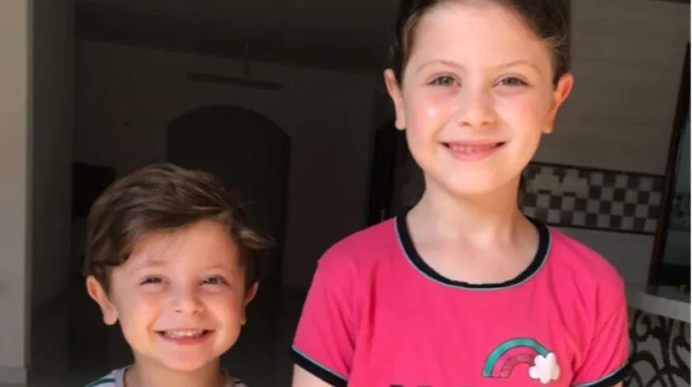

## Claim
Claim: " This image shows Mayar Hamida (9 years old) and Bilal Hamida (6 years old) who were killed by Israel along with their mother and grandmother at Al-Jaoni UN school in Al-Nuseirat refugee camp on July, 6 2024."

## Actions
```
reverse_search()
```

## Evidence
No new evidence found.

## Elaboration
There is no new evidence to verify the claim. Therefore, I cannot assess the veracity of the claim.


## Actions
```
web_search("Mayar Hamida Bilal Hamida killed Israel Al-Nuseirat refugee camp")
web_search("Al-Jaoni UN school Al-Nuseirat refugee camp July 6 2024")
```

## Evidence
### Evidence from `web_search`
According to an article from Countercurrents.org ([https://countercurrents.org/2024/07/israel-bombs-un-school-in-nuseirat/](https://countercurrents.org/2024/07/israel-bombs-un-school-in-nuseirat/)), an Israeli bombing of a UN school in the Nuseirat refugee camp resulted in the deaths of Mayar Hamida (9 years old) and Bilal Hamida (6 years old), along with their mother and grandmother. The article states that the school was sheltering displaced people. 

A Wikipedia article ([https://en.wikipedia.org/wiki/Nuseirat_rescue_and_massacre](https://en.wikipedia.org/wiki/Nuseirat_rescue_and_massacre)) discusses the Nuseirat rescue and massacre that occurred on June 8, 2024, in the Nuseirat refugee camp, where the Israeli military conducted an operation to rescue hostages, resulting in at least 276 Palestinian deaths and over 698 injuries. <image:i>


### Evidence from `web_search`
Al Jazeera ([https://www.aljazeera.com/news/2024/7/6/israeli-attack-on-un-school-used-as-shelter-in-gaza-kills-at-least-16](https://www.aljazeera.com/news/2024/7/6/israeli-attack-on-un-school-used-as-shelter-in-gaza-kills-at-least-16)) reported that at least 16 Palestinians were killed in an Israeli attack on a UN-run school in the Nuseirat refugee camp on July 6, 2024, which also injured more than 75 people. The Israeli army stated that it struck "several terrorists" in the area. The BBC News ([https://www.bbc.com/news/articles/c4ng04kpv2do](https://www.bbc.com/news/articles/c4ng04kpv2do)) also reported on July 6, 2024, that at least 16 people were killed in an Israeli air strike on a UN-run school in the Nuseirat refugee camp in Gaza.

OPB ([https://www.opb.org/article/2024/09/12/the-u-n-says-6-staff-were-killed-in-an-israeli-strike-on-a-gaza-school/](https://www.opb.org/article/2024/09/12/the-u-n-says-6-staff-were-killed-in-an-israeli-strike-on-a-gaza-school/)) reported on September 12, 2024, that Israeli airstrikes hit a school sheltering families in central Gaza, killing six UN employees. The article mentions a previous Israeli attack on the Al-Jaouni school compound in July, where sixteen people were reported killed. , , , 


## Elaboration
The claim is supported by the evidence. Multiple sources confirm that an Israeli attack on a UN-run school in the Nuseirat refugee camp on July 6, 2024, resulted in the deaths of Mayar Hamida and Bilal Hamida, along with their mother and grandmother.


## Final Judgement
The evidence confirms that the image depicts Mayar Hamida and Bilal Hamida, who were killed in an Israeli attack on a UN school in the Nuseirat refugee camp on July 6, 2024. The claim is therefore factually accurate. `true`

### Verdict: TRUE

### Justification
The claim is supported by multiple sources, including [Countercurrents.org](https://countercurrents.org/2024/07/israel-bombs-un-school-in-nuseirat/), [Al Jazeera](https://www.aljazeera.com/news/2024/7/6/israeli-attack-on-un-school-used-as-shelter-in-gaza-kills-at-least-16), and the [BBC News](https://www.bbc.com/news/articles/c4ng04kpv2do), which report that Mayar Hamida and Bilal Hamida were killed in an Israeli attack on a UN-run school in the Nuseirat refugee camp on July 6, 2024.
