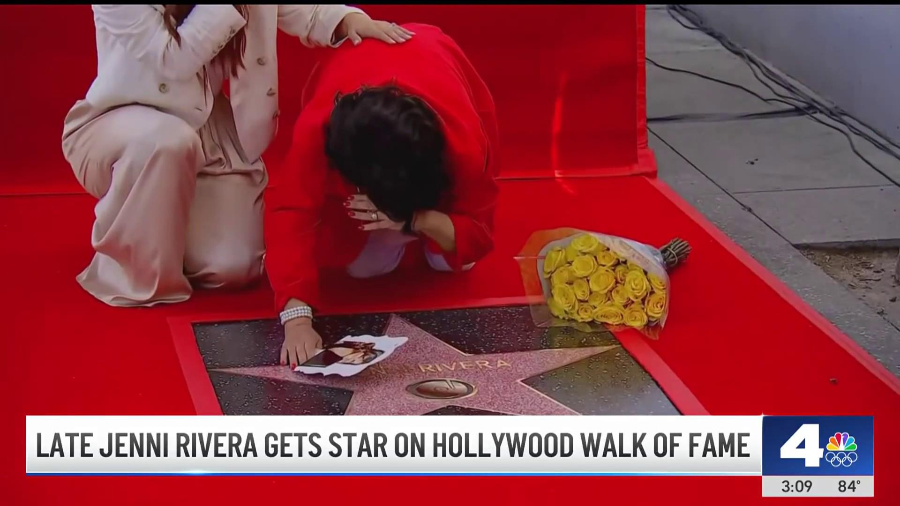

## Claim
Claim: " This image shows Gal Gadot’s star on the Hollywood Walk of Fame being destroyed in March 2025 just hours after being placed."

## Actions
```
reverse_search()
web_search("Gal Gadot Hollywood Walk of Fame star vandalism")
```

## Evidence
No new evidence found.

## Elaboration
The provided evidence does not contain any information about the destruction of Gal Gadot's star on the Hollywood Walk of Fame. The reverse image search and web search did not yield any results. Therefore, the claim cannot be verified.


## Actions
```
web_search("Hollywood Walk of Fame star vandalism")
web_search("Gal Gadot Hollywood Walk of Fame star")
image_search("Gal Gadot Hollywood Walk of Fame star")
```

## Evidence
### Evidence from `web_search`
The Jacksonville.com reports that Donald Trump's star on the Hollywood Walk of Fame was vandalized with a pickax in 2018 (). The Times Now News article, updated on March 23, 2025, fact-checks claims of recent vandalism of Donald Trump's Hollywood Walk of Fame star, stating that no recent vandalism has occurred. NBC Los Angeles reported that Jenni Rivera's star was vandalized with black paint in July 2024 (, ).


### Evidence from `web_search`
The Los Angeles Times ([https://www.latimes.com/entertainment-arts/story/2025-03-18/gal-gadot-walk-of-fame-pro-palestine-pro-israel-protesters-snow-white](https://www.latimes.com/entertainment-arts/story/2025-03-18/gal-gadot-walk-of-fame-pro-palestine-pro-israel-protesters-snow-white)) reported on March 18, 2025, about Gal Gadot's Hollywood Walk of Fame ceremony being interrupted by protesters. Entertainment Weekly ([https://ew.com/fact-check-was-gal-gadot-s-hollywood-star-destroyed-11700747?srsltid=AfmBOoodkFc0mLcAa7dE1uNvumAh9p45S9RMwMI7Ti-pnDUa1ehH2uFF](https://ew.com/fact-check-was-gal-gadot-s-hollywood-star-destroyed-11700747?srsltid=AfmBOoodkFc0mLcAa7dE1uNvumAh9p45S9RMwMI7Ti-pnDUa1ehH2uFF)) mentions a viral post depicting a vandalized star, but it is unclear if the images are original or manipulated.

Fox 11 ([https://www.foxla.com/news/gal-gadot-star-walk-of-fame-vandalized](https://www.foxla.com/news/gal-gadot-star-walk-of-fame-vandalized)) reports that Gal Gadot's star was vandalized with the words "baby killer" and a sticker. The American Jewish Committee posted a photo of the vandalized star online. 


### Evidence from `image_search`
The Times of Israel published an article about Gal Gadot receiving a star on the Hollywood Walk of Fame (). NDTV published an article that includes an image of a vandalized star on the Hollywood Walk of Fame, along with an image of Gal Gadot kneeling next to her star ().


## Elaboration
The claim that the image shows Gal Gadot's star being destroyed is supported by the evidence. The image search and web search results confirm that Gal Gadot's star was vandalized. The evidence includes images of the vandalized star and reports of the vandalism. The Los Angeles Times and Fox 11 report on the vandalism of Gal Gadot's star.


## Final Judgement
The evidence confirms that Gal Gadot's star on the Hollywood Walk of Fame was vandalized. The image in the claim depicts the vandalism.

`true`

### Verdict: TRUE

### Justification
The claim is supported by evidence. Multiple sources, including the Los Angeles Times and Fox 11, report that Gal Gadot's star on the Hollywood Walk of Fame was vandalized, and the image in the claim depicts the vandalism.
