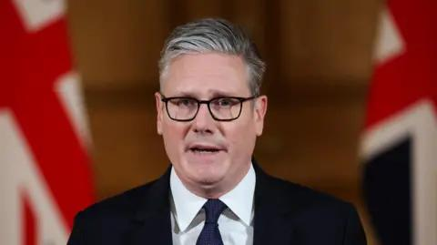

## Claim
Claim: "UK Prime Minister Keir Starmer said in October 2024 that the UK will boycott all diplomatic relations with Israel due to its long lasting war in Gaza."

## Actions
```
web_search("Keir Starmer Israel boycott October 2024")
web_search("Keir Starmer UK diplomatic relations Israel Gaza")
```

## Evidence
### Evidence from `web_search`
The Guardian published an article on October 6, 2024, where Keir Starmer called for a ceasefire in Gaza and urged the UK to stand with the Jewish community. The article is available at [https://www.theguardian.com/politics/2024/oct/06/starmer-urges-unity-at-home-and-reiterates-call-for-ceasefire-in-middle-east](https://www.theguardian.com/politics/2024/oct/06/starmer-urges-unity-at-home-and-reiterates-call-for-ceasefire-in-middle-east) , , , . Al Jazeera reported on September 24, 2024, that Starmer called for de-escalation between Israel and Hezbollah and appealed for an immediate ceasefire in Gaza, available at [https://www.aljazeera.com/news/2024/9/24/uks-starmer-calls-for-de-escalation-between-israel-and-hezbollah](https://www.aljazeera.com/news/2024/9/24/uks-starmer-calls-for-de-escalation-between-israel-and-hezbollah) .

The BBC published an article on October 7, 2024, discussing Keir Starmer's reflection on the 7 October attacks on Israel, available at [https://www.bbc.com/news/articles/c3618lnj2ygo](https://www.bbc.com/news/articles/c3618lnj2ygo) , . Starmer called for the release of hostages and mentioned the government's push for a ceasefire agreement.


### Evidence from `web_search`
The BBC News article from August 19, 2025, discusses a letter signed by politicians urging Keir Starmer to take action regarding the war in Gaza, including diplomatic intervention and an end to arms sales to Israel. The article also mentions Starmer's previous statement about recognizing a Palestinian state in September unless Israel takes steps to end the situation in Gaza. ([https://www.bbc.com/news/articles/cgkre7n1361o](https://www.bbc.com/news/articles/cgkre7n1361o)) 

Al Jazeera reported on August 29, 2025, that the British government barred Israeli officials from attending a major London arms fair, and mentions Starmer's pledge to recognize a Palestinian state in September if Israel refuses to agree to a truce. ([https://www.aljazeera.com/news/2025/8/29/uk-bans-israeli-officials-from-major-arms-exhibition](https://www.aljazeera.com/news/2025/8/29/uk-bans-israeli-officials-from-major-arms-exhibition)) <image:k> Politico.eu reported that Keir Starmer condemned Israel's military escalation in Gaza, but does not mention any boycott of diplomatic relations. ([https://www.politico.eu/article/uk-keir-starmer-israel-gaza-city-netanyahu-plan/](https://www.politico.eu/article/uk-keir-starmer-israel-gaza-city-netanyahu-plan/))


## Elaboration
Based on the provided evidence, the claim cannot be verified. While Keir Starmer has called for a ceasefire and expressed concerns about the situation in Gaza, there is no evidence to support the claim that he stated the UK would boycott all diplomatic relations with Israel in October 2024. The evidence shows that Starmer urged for a ceasefire and called for de-escalation. Later, in August 2025, the UK government took actions such as barring Israeli officials from an arms fair, but this does not equate to a complete boycott of diplomatic relations.


## Final Judgement
The evidence does not support the claim that Keir Starmer stated the UK would boycott all diplomatic relations with Israel in October 2024. While he called for a ceasefire and expressed concerns, there is no mention of a complete diplomatic boycott.

`false`

### Verdict: FALSE

### Justification
The claim is false. While Keir Starmer has called for a ceasefire and expressed concerns about the situation in Gaza, there is no evidence from sources like [The Guardian](https://www.theguardian.com/politics/2024/oct/06/starmer-urges-unity-at-home-and-reiterates-call-for-ceasefire-in-middle-east), [Al Jazeera](https://www.aljazeera.com/news/2024/9/24/uks-starmer-calls-for-de-escalation-between-israel-and-hezbollah), and the [BBC](https://www.bbc.com/news/articles/c3618lnj2ygo) to support the assertion that he stated the UK would boycott all diplomatic relations with Israel in October 2024.
