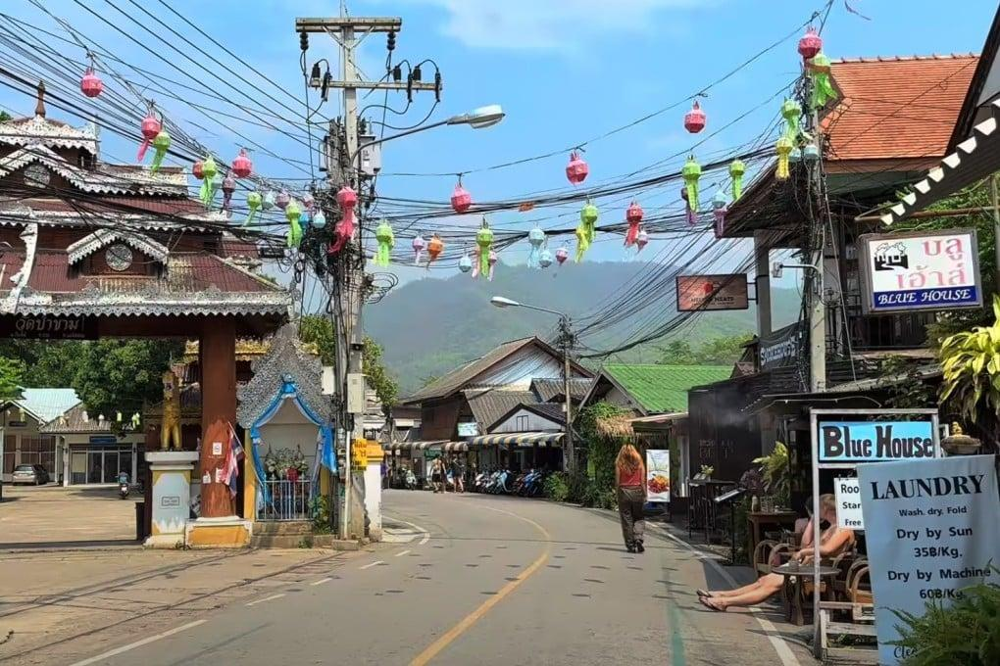

## Claim
Claim: " This image shows Israelis who have stopped fighting the wars in Gaza and Lebanon and moved to become 'settlers' in Pai District, Mae Hong Son Province, Thailand, in February 2025."

## Actions
```
web_search("Israelis settlers Pai District Mae Hong Son Thailand")
image_search("Israelis settlers Pai District Thailand")
```

## Evidence
### Evidence from `web_search`
The Bangkok Post ([https://www.bangkokpost.com/thailand/general/2966381/no-israeli-settlement-or-business-dominance-found-in-northern-thailands-pai](https://www.bangkokpost.com/thailand/general/2966381/no-israeli-settlement-or-business-dominance-found-in-northern-thailands-pai)) reported on February 23, 2025, that police in Pai district, Mae Hong Son, Thailand, found no evidence of Israeli settlements or business dominance, with 4,573 Israelis visiting and only 24 seeking to extend their stay. The Nation Thailand ([https://www.nationthailand.com/news/tourism/40046434](https://www.nationthailand.com/news/tourism/40046434)) published an article on February 18, 2025, refuting claims of a permanent Jewish community in Pai district, clarifying that Israeli tourists visit legally, and mentioning the existence of a Chabad House.

Khaosod English ([https://www.khaosodenglish.com/featured/2025/02/23/why-some-thais-fear-israelis-turning-pai-into-an-occupied-land/](https://www.khaosodenglish.com/featured/2025/02/23/why-some-thais-fear-israelis-turning-pai-into-an-occupied-land/)) discussed fears among some Thais that Israelis are turning Pai District into an occupied land, fueled by online disinformation and the ongoing conflicts in the Middle East. The article also mentions the Israeli embassy in Bangkok urging Israeli tourists to respect local laws and culture. The article includes an image of a gathering of people .


### Evidence from `image_search`
From [Source](https://www.scmp.com/week-asia/lifestyle-culture/article/3299193/young-israelis-rile-thailands-pai-town-their-bad-behaviour): 
Content: The South China Morning Post discusses young Israelis in Pai, Thailand. 


## Elaboration
The evidence suggests that the claim is not entirely accurate. While the image does depict a gathering of people, the provided sources indicate that there were concerns and discussions about Israeli tourists in Pai District, Thailand, in February 2025. However, the evidence does not support the claim that these individuals are "settlers" who have stopped fighting wars in Gaza and Lebanon. Instead, the articles focus on tourism, the legality of their visits, and the fears of some Thais regarding the presence of Israelis.

The Bangkok Post and The Nation Thailand articles refute the idea of Israeli settlements or business dominance. The Khaosod English article mentions the image provided in the claim, but it does not confirm the claim's assertion about the individuals' background or motivations.

The image search results show a different image of Pai, Thailand, and do not provide any additional information to support the claim.


## Final Judgement
The evidence indicates that the claim is misleading. While the image is related to the presence of Israelis in Pai District, Thailand, the sources do not support the assertion that they are "settlers" who have stopped fighting wars. The articles focus on tourism, concerns about their presence, and the lack of evidence of settlements. The claim misrepresents the context and the nature of the situation. `false`

### Verdict: FALSE

### Justification
The claim is misleading. While the image depicts a gathering of people in Pai District, Thailand, the provided sources, including articles from the [Bangkok Post](https://www.bangkokpost.com/thailand/general/2966381/no-israeli-settlement-or-business-dominance-found-in-northern-thailands-pai) and [The Nation Thailand](https://www.nationthailand.com/news/tourism/40046434), do not support the assertion that they are "settlers" who have stopped fighting wars. The articles focus on tourism and concerns about their presence, not on the claim's specific assertions.
