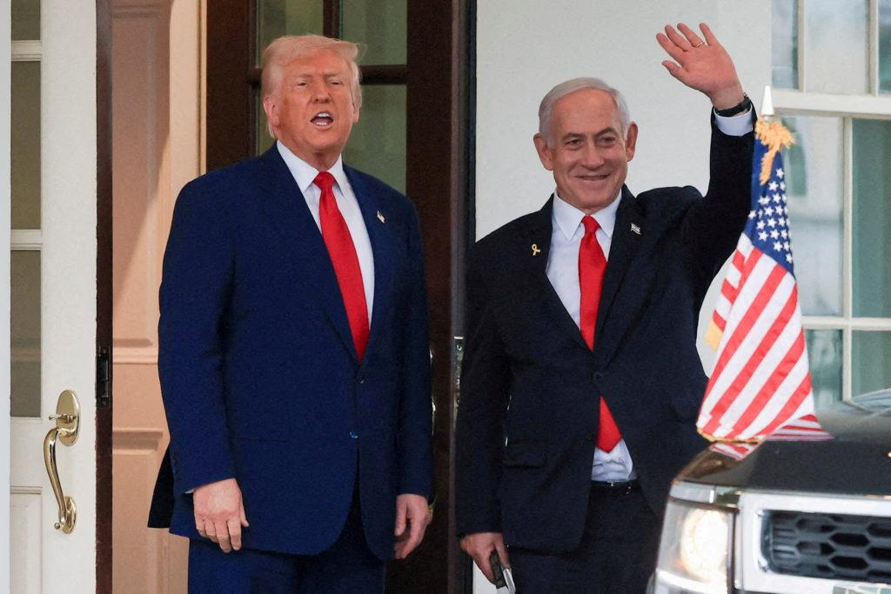

## Claim
Claim: "The assassination plot to kill Donald Trump in 2024 was orchestrated by two Jewish Americans. Israel wants war with Iran but wants American money to fund it and American servicemen to fight it."

## Actions
```
web_search("assassination plot Donald Trump 2024")
web_search("Israel Iran war US involvement")
```

## Evidence
### Evidence from `web_search`
The search results discuss an attempted assassination of Donald Trump in Pennsylvania on July 13, 2024, by Thomas Matthew Crooks, as reported by Wikipedia ([https://en.wikipedia.org/wiki/Attempted_assassination_of_Donald_Trump_in_Pennsylvania](https://en.wikipedia.org/wiki/Attempted_assassination_of_Donald_Trump_in_Pennsylvania)) <image:i>. NPR reports on a Justice Department announcement of an Iranian murder-for-hire plot against Donald Trump, allegedly orchestrated by an Iranian government official, Farhad Shakeri, who was also tasked with plotting the killings of two Jewish-Americans and Israeli tourists ([https://www.npr.org/2024/11/08/nx-s1-5184549/iran-donald-trump-murder-for-hire-plot-justice-department](https://www.npr.org/2024/11/08/nx-s1-5184549/iran-donald-trump-murder-for-hire-plot-justice-department)) , , .

The BBC News reports that the US government charged an Afghan national in connection with the alleged Iranian plot to assassinate Donald Trump, which also involved targeting two Jewish American businesspeople and Israeli tourists ([https://www.bbc.com/news/articles/cx28x187rmko](https://www.bbc.com/news/articles/cx28x187rmko)) .


### Evidence from `web_search`
The PBS article discusses the U.S. military's intervention in the Israel-Iran war, including U.S. bombing of Iranian nuclear sites, and mentions that Israeli Prime Minister Benjamin Netanyahu praised Trump’s decision to attack (). The CNN article discusses the conflict between Israel and Iran, including US involvement and President Trump's role, and mentions a ceasefire brokered by Trump.

The Wikipedia article discusses the Iran–Israel war, which took place from June 13–24, 2025 (<image:i>, <image:j>, <image:k>, <image:l>, <image:m>, <image:n>). The conflict involved Israel, the United States, and Iran, with defensive support from Iraq, Jordan, Saudi Arabia, Qatar, and France.

*   [https://www.pbs.org/newshour/world/what-to-know-about-the-u-s-militarys-intervention-in-the-israel-iran-war](https://www.pbs.org/newshour/world/what-to-know-about-the-u-s-militarys-intervention-in-the-israel-iran-war)
*   [https://www.cnn.com/world/live-news/israel-iran-conflict-us-trump-06-24-25-intl-hnk](https://www.cnn.com/world/live-news/israel-iran-conflict-us-trump-06-24-25-intl-hnk)
*   [https://en.wikipedia.org/wiki/Iran%E2%80%93Israel\_war](https://en.wikipedia.org/wiki/Iran%E2%80%93Israel_war)


## Elaboration
The evidence indicates that an Iranian government official orchestrated a plot to assassinate Donald Trump and target two Jewish Americans. However, the evidence does not support the claim that the assassination plot was orchestrated by two Jewish Americans.

Regarding the second part of the claim, the evidence shows that the U.S. was involved in the Iran-Israel war, including military actions. The evidence does not explicitly state that Israel wants American money or servicemen to fight the war.


## Final Judgement
The search results reveal an Iranian plot to assassinate Donald Trump and target Jewish Americans, but not orchestrated by Jewish Americans. The U.S. was involved in the Iran-Israel war.

The claim is partially false because the first part of the claim is not supported by the evidence. The second part of the claim is also not supported by the evidence. `false`

### Verdict: FALSE

### Justification
The claim is partially false. While there was an attempted assassination of Donald Trump, the plot was orchestrated by an Iranian government official, not Jewish Americans, as reported by NPR ([https://www.npr.org/2024/11/08/nx-s1-5184549/iran-donald-trump-murder-for-hire-plot-justice-department](https://www.npr.org/2024/11/08/nx-s1-5184549/iran-donald-trump-murder-for-hire-plot-justice-department)) and BBC News ([https://www.bbc.com/news/articles/cx28x187rmko](https://www.bbc.com/news/articles/cx28x187rmko)). The U.S. was involved in the Iran-Israel war, but there is no evidence to support the claim that Israel wants American money or servicemen to fight it.
