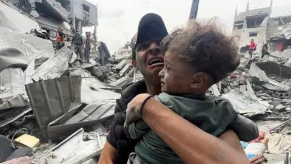
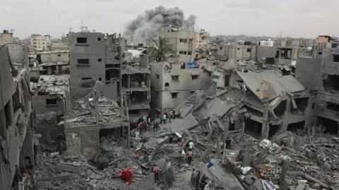

## Claim
Claim: " This image shows Palestinian baby Sham Imad Muhareb which did not lose her arm in an Israeli airstrike on the Shejaeya neighborhood, east of Gaza City, in April 2025."

## Actions
```
web_search("Palestinian baby Sham Imad Muhareb")
web_search("Shejaeya neighborhood Gaza City airstrike April 2025")
```

## Evidence
### Evidence from `web_search`
From [Source](https://www.un.org/unispal/wp-content/uploads/2025/04/196-20250428-ora-01-00-bi.pdf): 
Content: The UN document mentions baby Sham Muhareb, whose arm was amputated following a strike on her home. The document is dated April 28, 2025.


### Evidence from `web_search`
The Wikipedia article discusses the April 9, 2025, airstrike by the Israel Defense Forces (IDF) in the Shuja'iyya neighborhood of Gaza City, which resulted in the deaths of over 35 Palestinians and injuries to at least 70 others. The BBC News article, published on April 9, 2025, reports on an Israeli air strike on a residential building in the Shejaiya neighborhood of Gaza City, which resulted in the deaths of at least 29 Palestinians, including children. , .

ABC News reports on the expansion of Israeli ground operations in the Shejaiya area of the northern Gaza Strip on April 4, 2025. , . The IDF stated that its troops eliminated terrorists and dismantled Hamas infrastructure. The article mentions an Israeli airstrike on a school-turned-shelter in the nearby Tuffah neighborhood on April 4, 2025.


## Elaboration
The UN document states that baby Sham Muhareb's arm was amputated following a strike on her home. The provided evidence also includes reports of an Israeli airstrike in the Shejaeya neighborhood in April 2025.

The claim states that the baby did not lose her arm. Based on the UN document, this statement is false.


## Final Judgement
The evidence indicates that baby Sham Muhareb did lose her arm in an airstrike. The claim states that she did not lose her arm. Therefore, the claim is demonstrably false. `false`

### Verdict: FALSE

### Justification
The claim is false. According to a [UN document](https://www.un.org/unispal/wp-content/uploads/2025/04/196-20250428-ora-01-00-bi.pdf), baby Sham Muhareb's arm was amputated following a strike on her home.
