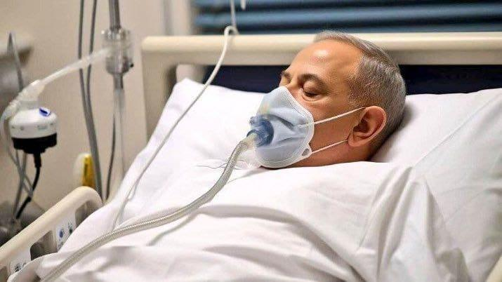

## Claim
Claim: " This is an authentic image of Benjamin Netanyahu being hospitalized in Tel Aviv in November 2024 due to a serious health issue."

## Actions
```
reverse_search()
```

## Evidence
### Evidence from `reverse_search`
The image 

## Elaboration
The reverse image search did not yield any results. Therefore, I cannot verify the claim. I need more information to determine if the image is authentic and if it depicts Benjamin Netanyahu's hospitalization in Tel Aviv in November 2024.


## Actions
```
web_search("Benjamin Netanyahu hospitalization Tel Aviv")
web_search("Benjamin Netanyahu health issues")
```

## Evidence
### Evidence from `web_search`
CNN reported that Benjamin Netanyahu underwent successful prostate surgery on December 29, 2024, and was expected to remain in the hospital for several days of observation. The Times of Israel reported that Netanyahu missed a cabinet meeting due to illness and was diagnosed with intestinal inflammation from spoiled food. NPR reported that Netanyahu was hospitalized in Tel Aviv for a heart procedure to receive a pacemaker on July 22, 2023.

The sources mention various health issues and hospitalizations for Benjamin Netanyahu, including a heart condition, prostate surgery, and a pacemaker. The sources include links to the following articles: [CNN](https://www.cnn.com/2024/12/29/middleeast/netanyahu-prostate-operation-successful-intl-latam), [The Times of Israel](https://www.timesofisrael.com/liveblog_entry/pm-suffering-from-food-poisoning-his-office-says-after-he-skipped-cabinet-meeting/), and [NPR](https://www.npr.org/2023/07/22/1189637298/israel-netanyahu-heart-hospital-pacemaker).


### Evidence from `web_search`
Benjamin Netanyahu has experienced several health issues, including intestinal inflammation from spoiled food, a routine colonoscopy, hernia surgery, and a urinary tract infection. He was diagnosed with intestinal inflammation in July 2025, as reported by Anadolu Agency ([https://www.aa.com.tr/en/middle-east/israeli-prime-minister-diagnosed-with-intestinal-inflammation-after-suffering-from-food-poisoning/3636595](https://www.aa.com.tr/en/middle-east/israeli-prime-minister-diagnosed-with-intestinal-inflammation-after-suffering-from-food-poisoning/3636595)). The Times of Israel reported on his routine colonoscopy in December 2023 and hernia surgery in March 2024 ([https://www.timesofisrael.com/netanyahu-to-undergo-routine-medical-exam-levin-fills-in-as-acting-pm/](https://www.timesofisrael.com/netanyahu-to-undergo-routine-medical-exam-levin-fills-in-as-acting-pm/)).

NDTV reported that Netanyahu was recovering at home after being diagnosed with intestinal inflammation caused by spoiled food on June 25, 2024 ([https://www.ndtv.com/world-news/netanyahu-suffers-dehydration-after-eating-spoiled-food-recovering-at-home-8914034](https://www.ndtv.com/world-news/netanyahu-suffers-dehydration-after-eating-spoiled-food-recovering-at-home-8914034)). <image:i>, <image:k>, 


## Elaboration
The evidence indicates that Benjamin Netanyahu has been hospitalized for various health issues, including a heart procedure, prostate surgery, and intestinal inflammation. However, the provided sources do not mention a hospitalization in Tel Aviv in November 2024 due to a serious health issue. Therefore, I cannot verify the claim based on the available information.


## Actions
```
image_search("Benjamin Netanyahu hospital bed")
```

## Evidence
No new evidence found.

## Elaboration
Based on the evidence, the claim cannot be verified. While Benjamin Netanyahu has experienced several hospitalizations and health issues, there is no mention of a hospitalization in Tel Aviv in November 2024 due to a serious health issue.


## Final Judgement
The image search and web searches did not provide any information to support the claim. While Benjamin Netanyahu has had several hospitalizations, there is no evidence of a hospitalization in Tel Aviv in November 2024. Therefore, the claim is not factually accurate. `false`

### Verdict: FALSE

### Justification
The claim is not supported by the evidence. While Benjamin Netanyahu has had several hospitalizations, including a heart procedure, prostate surgery, and intestinal inflammation, there is no evidence of a hospitalization in Tel Aviv in November 2024, as reported by [CNN](https://www.cnn.com/2024/12/29/middleeast/netanyahu-prostate-operation-successful-intl-latam), [The Times of Israel](https://www.timesofisrael.com/liveblog_entry/pm-suffering-from-food-poisoning-his-office-says-after-he-skipped-cabinet-meeting/), and [NPR](https://www.npr.org/2023/07/22/1189637298/israel-netanyahu-heart-hospital-pacemaker).
