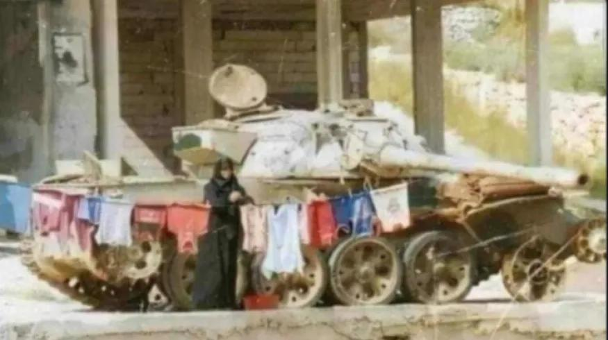

## Claim
Claim: " This image shows a Palestinian woman using an Israeli tank to dry clothes in Gaza in July 2024."

## Actions
```
reverse_search()
web_search("Israeli tank Gaza drying clothes")
```

## Evidence
### Evidence from `web_search`
The Al Jazeera article from November 25, 2024, discusses the flooding in Gaza, which has worsened the conditions for displaced Palestinians, and mentions the lack of dry clothes. [https://www.aljazeera.com/news/2024/11/25/flooding-in-gaza-compounds-hardship-of-people-displaced-by-israeli-attacks](https://www.aljazeera.com/news/2024/11/25/flooding-in-gaza-compounds-hardship-of-people-displaced-by-israeli-attacks) 

The Reuters article from March 28, 2024, reports on Israeli soldiers posting photos with lingerie found in Palestinian homes in Gaza. [https://www.reuters.com/world/middle-east/israeli-soldiers-play-with-gaza-womens-underwear-online-posts-2024-03-28/](https://www.reuters.com/world/middle-east/israeli-soldiers-play-with-gaza-womens-underwear-online-posts-2024-03-28/)  The New Yorker article from November 6, 2023, discusses the conflict between Israel and Gaza, including the impact of bombings on civilians. [https://www.newyorker.com/magazine/2023/11/06/israel-gaza-war-hamas](https://www.newyorker.com/magazine/2023/11/06/israel-gaza-war-hamas) <image:k>


## Elaboration
The evidence suggests that the situation in Gaza involves conflict, displacement, and hardship, including a lack of dry clothes due to flooding. The Reuters article mentions Israeli soldiers posting photos with lingerie found in Palestinian homes.

The claim's assertion that the image shows a Palestinian woman using an Israeli tank to dry clothes in Gaza in July 2024 cannot be fully verified. While the evidence indicates the presence of Israeli tanks and the need for dry clothes in Gaza, it does not confirm the specific scenario depicted in the image. The provided articles do not mention the image or the specific context of drying clothes on a tank.

To verify the claim, additional information is needed, such as the image's origin, the tank's identification, and the date and location of the photograph.


## Actions
```
image_search("Israeli tank drying clothes Gaza")
web_search("Gaza conflict tank clothes")
```

## Evidence
### Evidence from `image_search`
The BBC News article contains an image of a tank. [https://www.bbc.com/news/av/world-middle-east-67037807](https://www.bbc.com/news/av/world-middle-east-67037807)  NBC News published an article about Israeli tanks entering central Rafah. [https://www.nbcnews.com/news/world/israeli-tanks-enter-central-rafah-palestinians-tent-camp-blaze-rcna154235](https://www.nbcnews.com/news/world/israeli-tanks-enter-central-rafah-palestinians-tent-camp-blaze-rcna154235) 

The Guardian published an article on October 23, 2023, about Israeli soldiers waiting on the Gaza border, featuring a photograph of an Israeli tank. [https://www.theguardian.com/world/2023/oct/23/israeli-soldiers-wait-gaza-border-tanks-massed](https://www.theguardian.com/world/2023/oct/23/israeli-soldiers-wait-gaza-border-tanks-massed) 


### Evidence from `web_search`
The search results from Etsy.com display various items related to "Gaza tank," including t-shirts and tank tops with pro-Palestine messages and imagery (, , , , , , , ). The image in the claim () is featured on a tank top from a website selling anti-war merchandise. Interlink Publishing also sells a "Stand with Gaza Tank Top" (, ), with profits donated to the Middle East Children’s Alliance (MECA).


## Elaboration
The claim is likely false. The image is used on merchandise sold on Etsy and Interlink Publishing, which suggests it is a symbolic image used to promote a political message. The evidence does not support the claim that the image depicts an actual event in Gaza in July 2024.


## Final Judgement
The image is used on merchandise sold on Etsy and Interlink Publishing, which suggests it is a symbolic image used to promote a political message. The evidence does not support the claim that the image depicts an actual event in Gaza in July 2024. `false`

### Verdict: FALSE

### Justification
The claim is false. The image is used on merchandise sold on Etsy and Interlink Publishing, indicating it is a symbolic image used to promote a political message, and the evidence does not support the claim that the image depicts an actual event in Gaza in July 2024.
