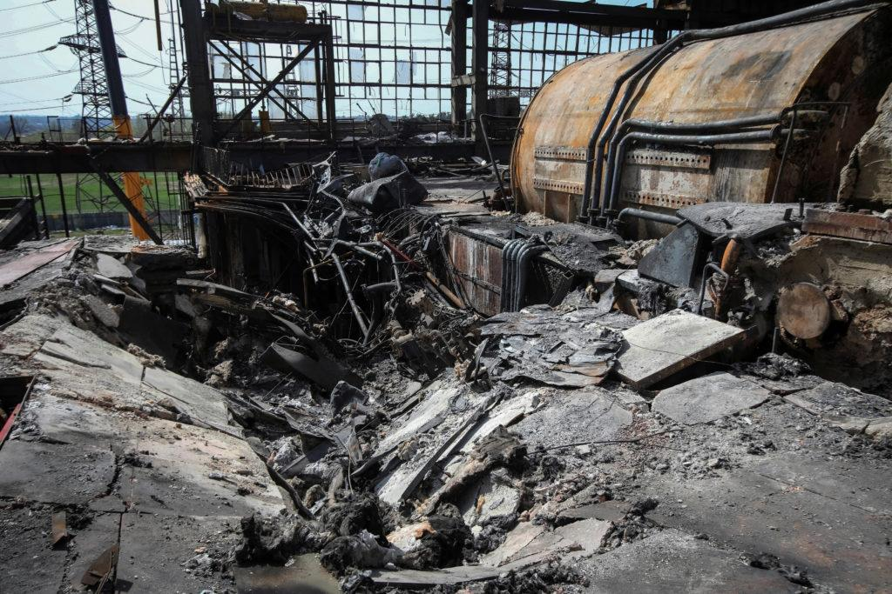

## Claim
Claim: " This image shows Ukrainian President Volodymyr Zelenskyy in March 2025 signing Israeli bombs intended for use against Palestinians in Gaza."

## Actions
```
web_search("Volodymyr Zelenskyy signing bombs")
web_search("Volodymyr Zelenskyy Israeli bombs")
image_search("Volodymyr Zelenskyy signing ammunition")
```

## Evidence
### Evidence from `web_search`
The image shows Ukrainian President Volodymyr Zelenskyy signing artillery shells at a U.S. munitions factory, not Israeli bombs. The event took place in the context of the war in Ukraine. Zelenskyy wrote "Glory to Ukraine" and "Thanks for Support" on the shells. The event was shared by Governor Josh Shapiro on September 23, 2024.

The event took place at the Scranton Army Ammunition Plant in Pennsylvania. The article from Caliber.Az, published on October 15, 2024, discusses Ukrainian President Volodymyr Zelenskyy's visit to the Scranton Army Ammunition Plant in Pennsylvania, where he signed munitions. The article mentions that Zelenskyy inscribed messages on US bombs, including the phrase "Glory to Ukraine." The visit stirred controversy and elicited mixed reactions.


### Evidence from `web_search`
The PBS News article from April 15, 2024, discusses the Ukrainian Foreign Minister's statement that Israel's success in thwarting an Iranian attack shows what Ukraine could achieve with more support from its partners. The article also mentions that Russia fired nearly 130 exploding drones, more than 80 Russian missiles, and nearly 700 guided aerial bombs at Ukraine. ()

The jstribune.com article from October 24, 2022, discusses the Israeli policy of not supplying weapons to Ukraine. It mentions that Volodymyr Zelenskyy stated that Israel's decision not to support Kyiv has encouraged Russia’s military partnership with Iran. Zelenskyy was also upset that Israel refused to supply even non-lethal communications systems for the Ukrainian military.


### Evidence from `image_search`
The Guardian ([https://www.theguardian.com/us-news/2024/sep/25/trump-zelenskyy-ukraine-feud-republicans-election-interference](https://www.theguardian.com/us-news/2024/sep/25/trump-zelenskyy-ukraine-feud-republicans-election-interference)) and BBC News ([https://www.bbc.com/news/articles/c5y30244467o](https://www.bbc.com/news/articles/c5y30244467o)) both published images of Volodymyr Zelenskyy signing ammunition.

The Penn Capital-Star ([https://penncapital-star.com/government-politics/shapiro-casey-meet-with-zelenskyy-at-scranton-pennsylvania-ammunitions-factory/](https://penncapital-star.com/government-politics/shapiro-casey-meet-with-zelenskyy-at-scranton-pennsylvania-ammunitions-factory/)) also published an image of Volodymyr Zelenskyy.


## Elaboration
The image shows Volodymyr Zelenskyy signing artillery shells at a U.S. munitions factory in Pennsylvania, not Israeli bombs. The event occurred in September 2024, not March 2025. The shells were intended for use in the war in Ukraine, not against Palestinians in Gaza. Zelenskyy wrote "Glory to Ukraine" and "Thanks for Support" on the shells.


## Final Judgement
The claim is demonstrably false. The image depicts Zelenskyy signing artillery shells at a U.S. munitions factory, not Israeli bombs. The event took place in September 2024, not March 2025, and the shells were intended for use in the war in Ukraine, not against Palestinians in Gaza. `false`

### Verdict: FALSE

### Justification
The image depicts Ukrainian President Volodymyr Zelenskyy signing artillery shells at a U.S. munitions factory in Pennsylvania, as confirmed by multiple sources, including the [Guardian](https://www.theguardian.com/us-news/2024/sep/25/trump-zelenskyy-ukraine-feud-republicans-election-interference) and the [BBC](https://www.bbc.com/news/articles/c5y30244467o). The event occurred in September 2024, and the shells were intended for use in the war in Ukraine, not Israeli bombs for use against Palestinians in Gaza.
