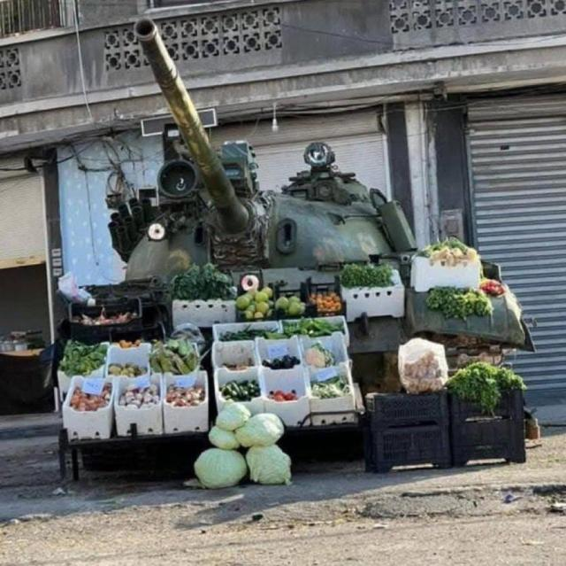
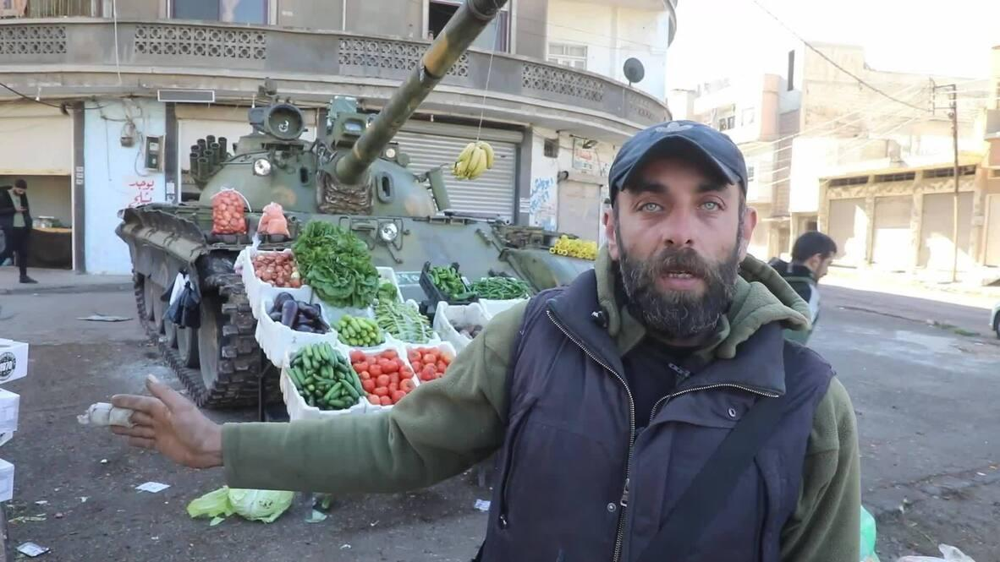

## Claim
Claim: " This image shows a vegetable stand in Gaza in January 2025 with a Merkava tank, the pride of the Israeli army, as its decor."

## Actions
```
web_search("vegetable stand Gaza Merkava tank")
image_search("vegetable stand tank Gaza")
```

## Evidence
### Evidence from `web_search`
The image () shows a vegetable stand with a tank. According to a fact-check from [AOL](https://www.aol.com/fact-check-image-claims-show-141025316.html), the tank is a Syrian T-55, not an Israeli Merkava tank, and the image was taken in Syria.

[Wikipedia](https://en.wikipedia.org/wiki/Merkava) states that the Merkava is an Israeli main battle tank. A [Forbes](https://www.forbes.com/sites/davidaxe/2023/10/15/hamas-distributed-a-handy-guide-to-destroying-israeli-tanks/) article discusses Hamas's guide on destroying Israeli Merkava tanks.


### Evidence from `image_search`
Al Jazeera published an image of Merkava tanks (). The Associated Press published an image of a vegetable market in Gaza (). A video from viory.video shows a market vendor selling fruits and vegetables from an abandoned tank (). The video was published on December 21, 2024.


## Elaboration
The claim is inaccurate. The tank in the image is not an Israeli Merkava tank, but a Syrian T-55, according to an AOL fact-check ([https://www.aol.com/fact-check-image-claims-show-141025316.html](https://www.aol.com/fact-check-image-claims-show-141025316.html)). The image was taken in Syria, not Gaza. The image search results confirm the existence of Merkava tanks and vegetable markets in Gaza, but do not support the claim's specific details.


## Final Judgement
The claim is inaccurate because the tank in the image is a Syrian T-55, not an Israeli Merkava tank, and the image was taken in Syria, not Gaza.

`false`

### Verdict: FALSE

### Justification
The image depicts a vegetable stand with a tank, but the tank is a Syrian T-55, not an Israeli Merkava tank, and the image was taken in Syria, not Gaza, as confirmed by an AOL fact-check ([https://www.aol.com/fact-check-image-claims-show-141025316.html](https://www.aol.com/fact-check-image-claims-show-141025316.html)).
