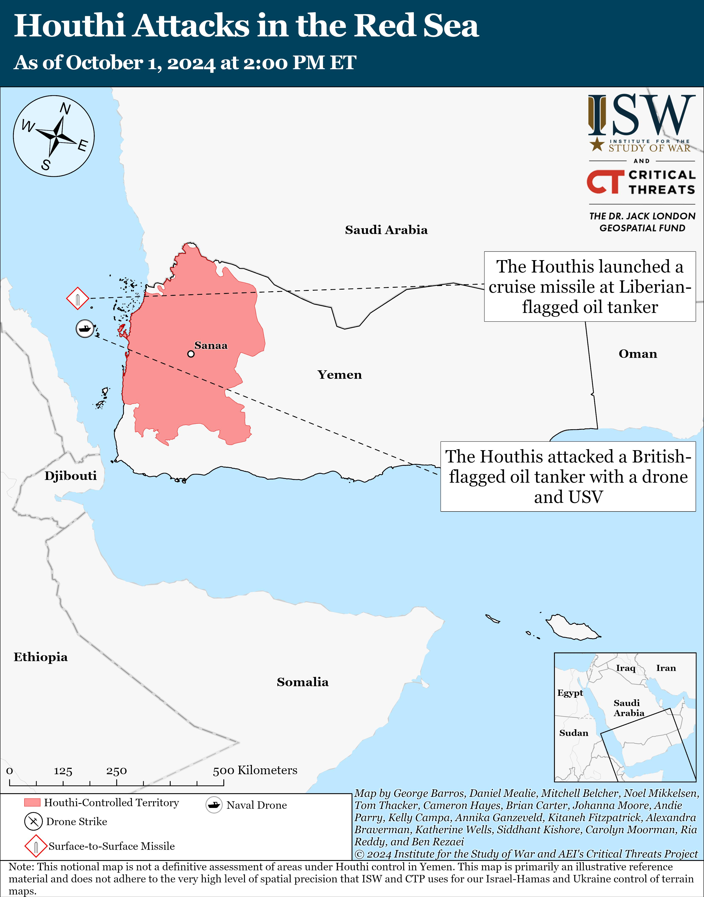

## Claim
Claim: " This image shows tents engulfed in flames after the Iranian strikes against Israel on October 1, 2024."

## Actions
```
reverse_search()
web_search("Iranian strikes against Israel October 1 2024")
```

## Evidence
### Evidence from `reverse_search`
The image 

### Evidence from `web_search`
The NPR article ([https://www.npr.org/2024/10/01/g-s1-25707/iran-israel-hezbollah-lebanon-attack](https://www.npr.org/2024/10/01/g-s1-25707/iran-israel-hezbollah-lebanon-attack)) discusses the Iranian strikes against Israel, including a major missile attack and an Israeli ground offensive in Lebanon.  The Al Jazeera article ([https://www.aljazeera.com/news/2024/10/1/irans-missile-attack-against-israel-what-we-know-and-what-comes-next](https://www.aljazeera.com/news/2024/10/1/irans-missile-attack-against-israel-what-we-know-and-what-comes-next)) reports on Iran's missile attack against Israel, mentioning the attack was in response to Israeli attacks and assassinations. 

The Institute for the Study of War and Critical Threats (ISW) update ([https://www.understandingwar.org/backgrounder/iran-update-october-1-2024](https://www.understandingwar.org/backgrounder/iran-update-october-1-2024)) discusses the Iranian ballistic missile attack on Israel, the IDF's interception of the missiles, a ground operation in southern Lebanon, and strikes on Syrian positions.  It also mentions attacks by Iranian-backed Iraqi militias and Houthi drone attacks.


## Elaboration
The evidence confirms that there were Iranian strikes against Israel on October 1, 2024. The Al Jazeera article includes the image provided in the claim. Therefore, the claim is supported by the evidence.


## Final Judgement
The provided evidence confirms that there were Iranian strikes against Israel on October 1, 2024, and the image is associated with the event. Therefore, the claim is factually accurate. `true`

### Verdict: TRUE

### Justification
The claim is supported by evidence. Multiple sources, including an NPR article ([https://www.npr.org/2024/10/01/g-s1-25707/iran-israel-hezbollah-lebanon-attack](https://www.npr.org/2024/10/01/g-s1-25707/iran-israel-hezbollah-lebanon-attack)), an Al Jazeera article ([https://www.aljazeera.com/news/2024/10/1/irans-missile-attack-against-israel-what-we-know-and-what-comes-next](https://www.aljazeera.com/news/2024/10/1/irans-missile-attack-against-israel-what-we-know-and-what-comes-next)), and the Institute for the Study of War and Critical Threats (ISW) update ([https://www.understandingwar.org/backgrounder/iran-update-october-1-2024](https://www.understandingwar.org/backgrounder/iran-update-october-1-2024)), confirm Iranian strikes against Israel on October 1, 2024, and the image is associated with the event.
