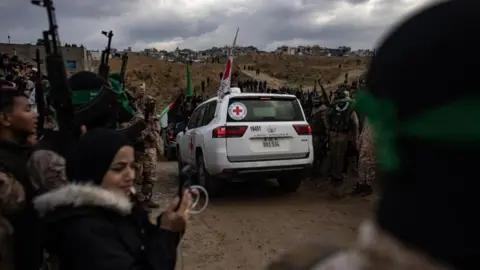
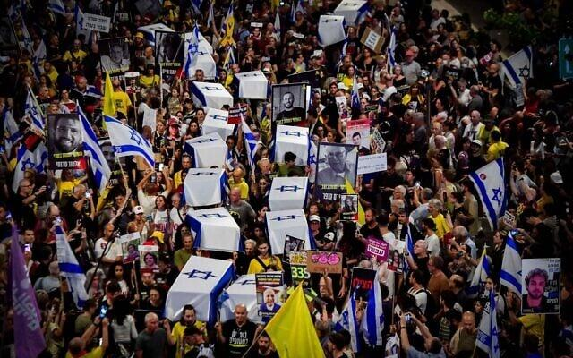
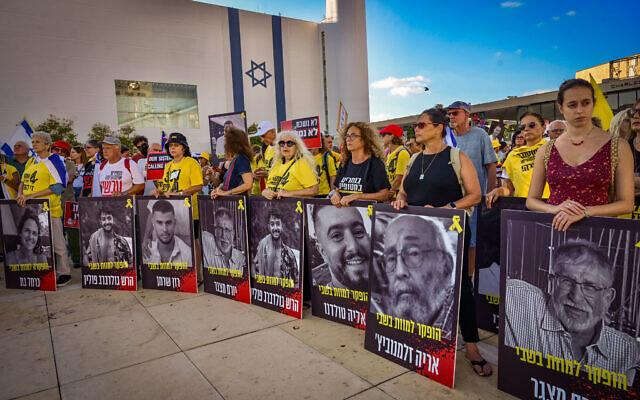
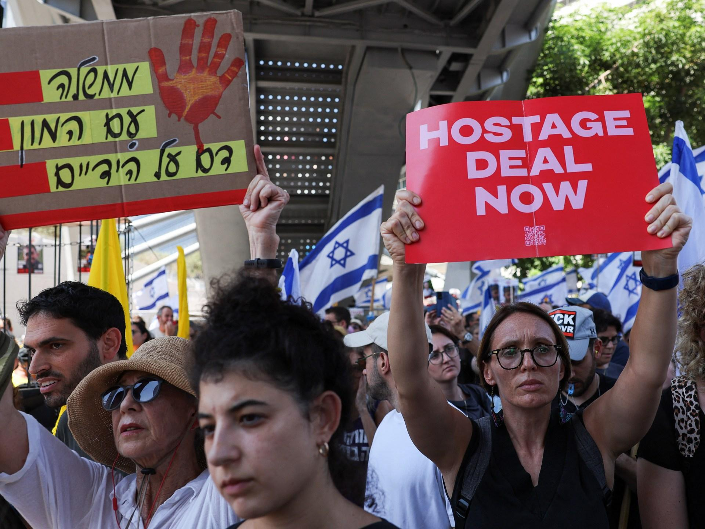

## Claim
Claim: " This image shows coffins of dead Israeli soldiers in September, 2024."

## Actions
```
web_search("Israeli coffins protest")
image_search("Israeli coffins protest")
reverse_search()
```

## Evidence
### Evidence from `web_search`
The BBC article discusses the return of the bodies of Israeli hostages in February 2025. The Times of Israel and Euronews reported on a protest in Tel Aviv on September 5, 2024, where protesters carried mock coffins draped with Israeli flags to represent hostages held in Gaza, demanding their release. , , , , , 

The protest, as reported by Euronews, involved people carrying makeshift coffins draped with Israeli flags. The protesters were angry with the Israeli government.


### Evidence from `image_search`
The BBC News website contains an image of coffins draped with Israeli flags (). Al Jazeera published an article about Hamas stating that Gaza captives will return in coffins if Israel continues raids, which includes an image of a protest ().


## Elaboration
The image depicts a protest in Tel Aviv on September 5, 2024, where mock coffins draped with Israeli flags were used to represent hostages held in Gaza. The evidence indicates that the coffins were not of dead Israeli soldiers, but rather a symbolic representation of the hostages.


## Final Judgement
The claim is inaccurate. The image shows a protest using mock coffins to represent hostages, not dead soldiers. The evidence from multiple sources confirms this. `false`

### Verdict: FALSE

### Justification
The image shows a protest in Tel Aviv on September 5, 2024, where mock coffins draped with Israeli flags were used to represent hostages held in Gaza, not dead soldiers, as reported by the [Times of Israel](https://www.timesofisrael.com/liveblog-oct-7-israel-hamas-war/).
