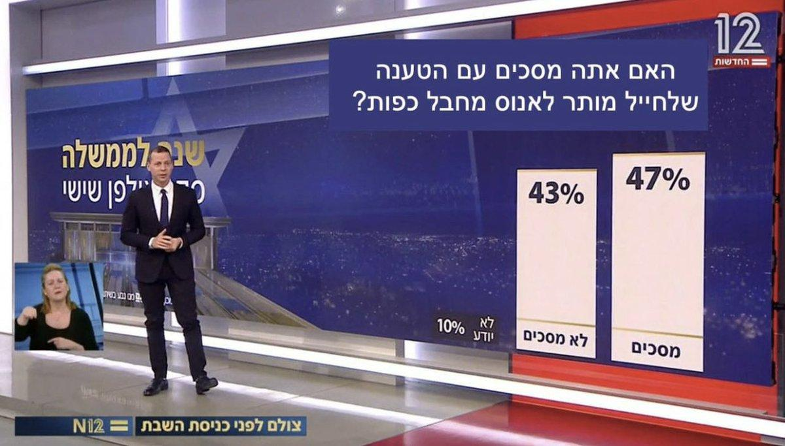

## Claim
Claim: " The image shows a screenshot of an authentic question from Israel's Channel 12 public opinion poll: 'Do you agree with the claim that a solder is allowed to rape a prisoner with his hands tied?'"

## Actions
```
web_search("Channel 12 Israel public opinion poll rape prisoner")
image_search("Channel 12 Israel poll soldier rape prisoner")
```

## Evidence
### Evidence from `web_search`
The image is a doctored screenshot of a Channel 12 news bulletin. The original video, published on May 27, 2022, featured a question about the government's reliance on supporters of terrorism. The altered image, which was shared on social media, shows a question about whether a soldier is allowed to rape a prisoner. Channel 12 has debunked the false posts. Another article discusses a poll indicating that 65% of Jewish Israelis oppose criminal prosecution for soldiers suspected of raping Palestinian detainees, referencing a Channel 12 report.

Sources: [https://cedmohub.eu/posts-share-doctored-prisoner-abuse-poll-from-israeli-tv-channel/](https://cedmohub.eu/posts-share-doctored-prisoner-abuse-poll-from-israeli-tv-channel/), [https://cbsaustin.com/news/nation-world/squad-member-shares-fake-poll-claiming-most-israelis-support-rape-of-palestinians-rashida-tlaib-noura-erakat-alex-zeldin-ritchie-torres-israel-palestine-hamas-war-terrorism-gaza](https://cbsaustin.com/news/nation-world/squad-member-shares-fake-poll-claiming-most-israelis-support-rape-of-palestinians-rashida-tlaib-noura-erakat-alex-zeldin-ritchie-torres-israel-palestine-hamas-war-terrorism-gaza), [https://mondoweiss.net/2024/08/65-of-israeli-jews-oppose-criminal-prosecution-for-soldiers-suspected-of-raping-palestinian-detainees/](https://mondoweiss.net/2024/08/65-of-israeli-jews-oppose-criminal-prosecution-for-soldiers-suspected-of-raping-palestinian-detainees/). , , , 


### Evidence from `image_search`
From [Source](https://theintercept.com/2024/08/09/israel-prison-sde-teiman-palestinian-abuse-torture/): 
Content: The Intercept published an article that includes an image with the Channel 12 logo. 


## Elaboration
The claim is false. The image is a doctored screenshot from Channel 12 news. The original video was about the government's reliance on supporters of terrorism, not about soldiers raping prisoners. Channel 12 has debunked the false posts.


## Final Judgement
The image is a manipulated screenshot from Channel 12 news. The original broadcast featured a different question, and the claim presented is a fabrication.

`false`

### Verdict: FALSE

### Justification
The image is a manipulated screenshot from Israel's Channel 12 news, as confirmed by multiple sources ([https://cedmohub.eu/posts-share-doctored-prisoner-abuse-poll-from-israeli-tv-channel/](https://cedmohub.eu/posts-share-doctored-prisoner-abuse-poll-from-israeli-tv-channel/)). The original broadcast featured a different question, and the claim presented is a fabrication.
