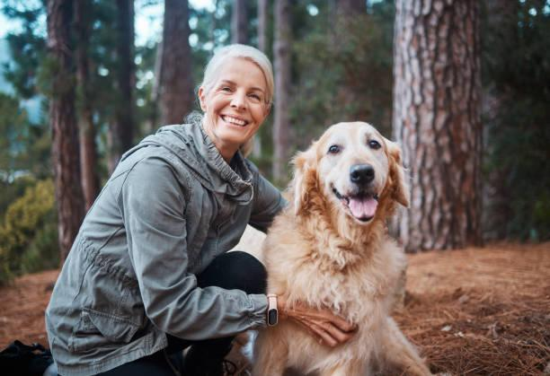
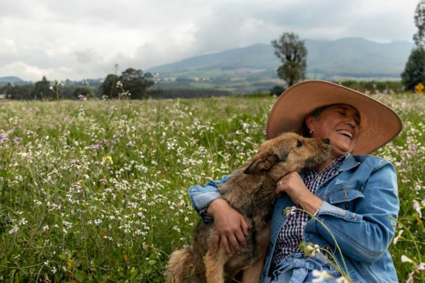
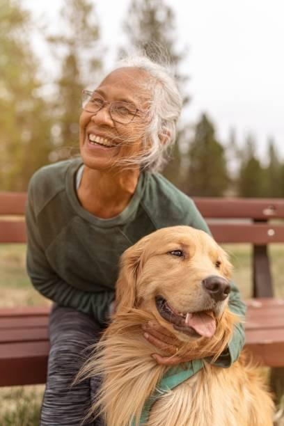
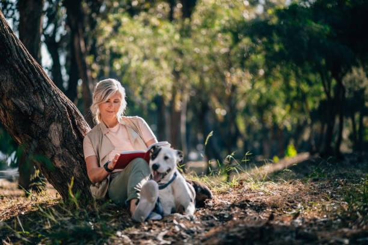

## Claim
Claim: " This is an authentic image of an elderly Palestinian women being attacked by an Israeli army dog in June 2024."

## Actions
```
reverse_search()
image_search("Israeli army dog attack Palestinian woman")
```

## Evidence
### Evidence from `reverse_search`
The image 

### Evidence from `image_search`
China Daily ([https://www.chinadaily.com.cn/world/2007-03/22/content_833702.htm](https://www.chinadaily.com.cn/world/2007-03/22/content_833702.htm)) contains an image of a woman and a dog . Al Jazeera published a video on June 26, 2024, about an Israeli military dog attacking an elderly Palestinian woman .

Al-Haq ([https://www.alhaq.org/monitoring-documentation/6941.html](https://www.alhaq.org/monitoring-documentation/6941.html)) contains an image of a dog attacking a woman .


## Elaboration
The evidence includes an image search that found a video from Al Jazeera on June 26, 2024, about an Israeli military dog attacking an elderly Palestinian woman. However, the image in the claim was not found in the image search. The reverse image search did not provide any additional information.

Based on the evidence, it is not possible to verify the claim. The image in the claim was not found in the image search.


## Actions
```
web_search("image dog elderly woman bed")
```

## Evidence
### Evidence from `web_search`
The Getty Images search result ([https://www.gettyimages.com/photos/old-dog-in-bed](https://www.gettyimages.com/photos/old-dog-in-bed)) contains images of elderly women and dogs, some in bed , , , , , , . The iStockphoto search result ([https://www.istockphoto.com/photos/elderly-woman-with-dog](https://www.istockphoto.com/photos/elderly-woman-with-dog)) contains images of elderly women with dogs in various settings , , , , , , , , , , , , , , .


## Elaboration
The web search results show various images of elderly women with dogs, including some in bed. However, none of the images match the one in the claim. The claim's image is not found in the search results.


## Final Judgement
The claim is not supported by the evidence. The image in the claim was not found in the image search or web search. The evidence includes a video from Al Jazeera about an Israeli military dog attacking an elderly Palestinian woman, but the image in the claim is not present in the search results. Therefore, the claim cannot be verified. `false`

### Verdict: FALSE

### Justification
The claim is not supported by the evidence. While there is evidence of Israeli military dogs attacking Palestinian women, and images of elderly women with dogs, the specific image in the claim was not found in the image or web searches.
