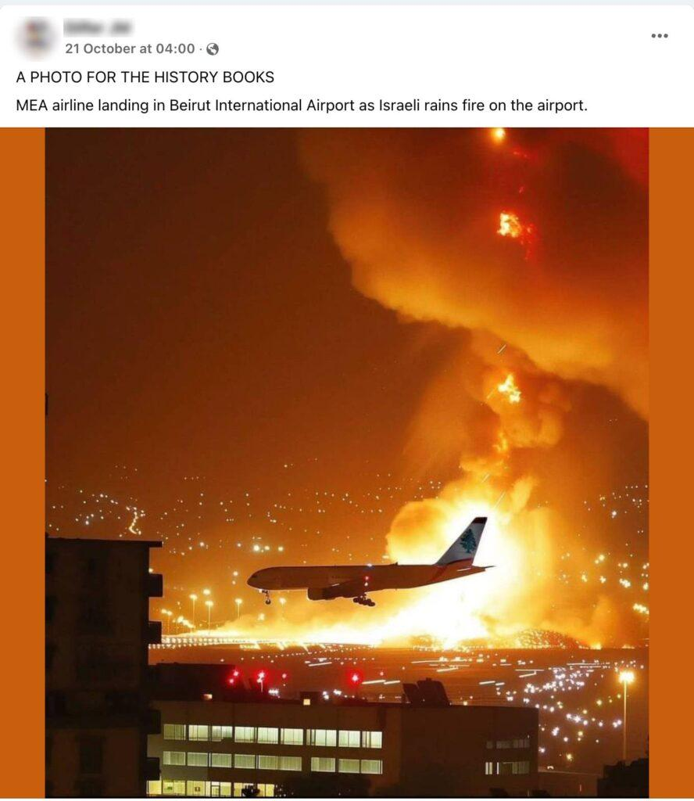
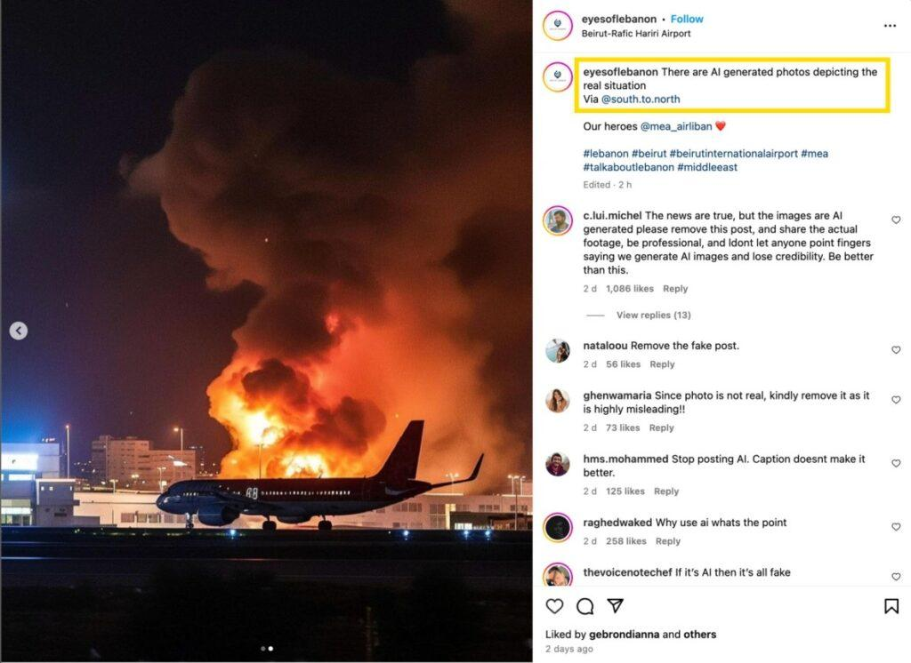

## Claim
Claim: " This is an authentic image of Israel bombing Beirut's International Airport in October 2024."

## Actions
```
reverse_search()
web_search("Beirut International Airport bombing")
```

## Evidence
### Evidence from `reverse_search`
The image  is AI-generated and does not depict a real event. According to [India Today](https://www.indiatoday.in/fact-check/story/fact-check-photo-middle-east-airlines-flight-israel-airstrikes-beirut-lebanon-ai-generated-2622766-2024-10-24), the image is of a Middle East Airlines (MEA) flight landing in Beirut amid explosions.

Factly.in confirms the image is AI-generated and was posted on Instagram by the account "eyesoflebanon." The original post  and other AI-generated images  were included in the article. AI detection tools confirmed the image was AI-generated , .


### Evidence from `web_search`
The U.S. Marine Corps website ([https://www.marines.mil/News/Marines-TV/videoid/634642/dvpTag/Beirut/](https://www.marines.mil/News/Marines-TV/videoid/634642/dvpTag/Beirut/)) discusses the 40th anniversary of the Beirut barracks bombing in 1983. The Defense Intelligence Agency (DIA) responded to the Marine barracks bombing in Beirut, Lebanon in 1983 ([https://www.dia.mil/News-Features/Articles/Article-View/Article/566917/they-came-in-peace/](https://www.dia.mil/News-Features/Articles/Article-View/Article/566917/they-came-in-peace/)).

The Brookings article ([https://www.brookings.edu/articles/israeli-warplanes-bomb-beirut/](https://www.brookings.edu/articles/israeli-warplanes-bomb-beirut/)) from July 13, 2006, discusses Israeli warplanes bombing Beirut. The image 

## Elaboration
The image is AI-generated and does not depict a real event. The image was posted on Instagram by the account "eyesoflebanon." The image was confirmed to be AI-generated by multiple sources.


## Final Judgement
The claim is demonstrably false. The image is AI-generated and does not depict a real event. The image was posted on Instagram by the account "eyesoflebanon." AI detection tools confirmed the image was AI-generated. `false`

### Verdict: FALSE

### Justification
The image in the claim is AI-generated, as confirmed by reverse image searches and AI detection tools, and does not depict a real event of Israel bombing Beirut's International Airport. The image was originally posted on Instagram by the account "eyesoflebanon" and has been debunked by multiple fact-checking sources, including [India Today](https://www.indiatoday.in/fact-check/story/fact-check-photo-middle-east-airlines-flight-israel-airstrikes-beirut-lebanon-ai-generated-2622766-2024-10-24).
