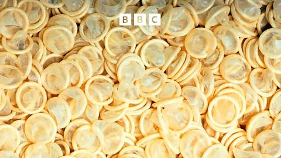

## Claim
Claim: "$50 Million in US taxpayer money almost went to fund condoms in Gaza before DOGE cut it."

## Actions
```
web_search("US taxpayer money condoms Gaza DOGE")
```

## Evidence
### Evidence from `web_search`
CNN fact-checked the claim that $50 million in US taxpayer money was going to fund condoms in Gaza, stating the White House offered no evidence, and USAID spent no money on condoms in the Middle East in recent years (<image:k>). Elon Musk retracted his claim, stating the funds were intended for Mozambique, not Gaza (<image:0>). The BBC's "More or Less: Behind the Stats" fact-checked the claim that DOGE cancelled $50 million worth of condoms being sent to Gaza by USAID ().

The sources include articles from CNN ([Source](https://www.cnn.com/2025/01/29/politics/gaza-condoms-fact-check)), Anadolu Agency ([Source](https://www.aa.com.tr/en/americas/musk-walks-back-claim-us-intended-to-send-50m-worth-of-condoms-to-gaza/3479148)), and BBC ([Source](https://www.bbc.com/audio/play/p0krbdgz)).


## Elaboration
The claim is not supported by the evidence. CNN fact-checked the claim and found no evidence to support it. Elon Musk retracted his claim, stating the funds were intended for Mozambique, not Gaza. The BBC also fact-checked the claim.


## Final Judgement
The claim that $50 million in US taxpayer money was going to fund condoms in Gaza before DOGE cut it is not accurate. Fact-checks from CNN and the BBC, along with a retraction from Elon Musk, indicate that the funds were not intended for Gaza and that there is no evidence to support the claim.

`false`


### Verdict: FALSE

### Justification
The claim is false. Fact-checks from CNN and the BBC, along with a retraction from Elon Musk, debunk the assertion that $50 million in US taxpayer money was intended for condoms in Gaza. The funds were not allocated for Gaza, and there is no evidence to support the claim.
