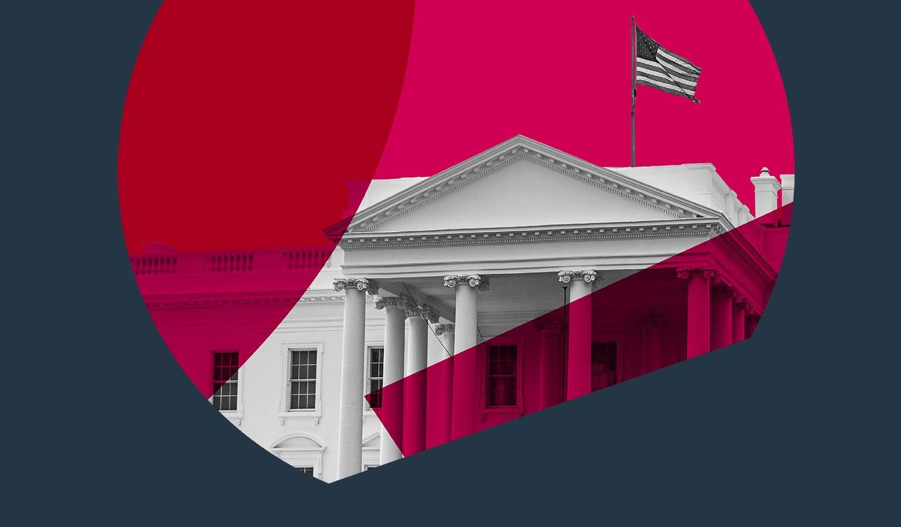

## Claim
Claim: "Trump signed an executive order on January 20, 2025, to halt all funding to UNRWA."

## Actions
```
web_search("Trump executive order UNRWA funding halt")
```

## Evidence
### Evidence from `web_search`
NPR reported on February 3, 2025, that Trump signed an executive order to cut future funding to UNRWA (). Al Jazeera reported on February 4, 2025, that Trump is planning to extend a funding ban on UNRWA and is expected to sign an executive order (<image:k>).

The Brookings Institution published an article on September 7, 2018, discussing Trump's decision to eliminate US funding for UNRWA. The article states that Trump's actions will have dire consequences and are based on a flawed understanding of the situation (, ).


## Elaboration
The evidence indicates that Trump signed an executive order to cut future funding to UNRWA. NPR reported this on February 3, 2025. Al Jazeera reported on February 4, 2025, that Trump was planning to extend a funding ban on UNRWA and was expected to sign an executive order.

The Brookings Institution article from September 7, 2018, discusses Trump's decision to eliminate US funding for UNRWA, which suggests that Trump had previously taken actions related to UNRWA funding.

The claim states that the executive order was signed on January 20, 2025. The evidence does not explicitly confirm the exact date of the executive order.


## Actions
```
web_search("Trump executive order UNRWA January 20 2025")
```

## Evidence
### Evidence from `web_search`
KFF.org ([https://www.kff.org/global-health-policy/overview-of-president-trumps-executive-actions-on-global-health/](https://www.kff.org/global-health-policy/overview-of-president-trumps-executive-actions-on-global-health/)) lists two executive orders issued by President Trump on January 20, 2025: "Initial rescissions of Executive Orders and Actions issued by President Biden" and "Defending Women From Gender Ideology Extremism And Restoring Biological Truth To The Federal Government."

Akingump.com ([https://www.akingump.com/en/insights/trump-executive-order-overview](https://www.akingump.com/en/insights/trump-executive-order-overview)) mentions an executive order on January 20, 2025, regarding "Regulatory Freeze Pending Review" and another one on the same date regarding "Temporary Withdrawal Of All Areas On The Outer Continental Shelf From Offshore Wind Leasing And Review Of The Federal Government’s Leasing And Permitting Practices For Wind Projects" (). USCRI ([https://refugees.org/uscri-summary-of-january-20-executive-orders/](https://refugees.org/uscri-summary-of-january-20-executive-orders/)) provides a summary of Executive Orders released by the White House on January 20, 2025, including an Executive Order Realigning the United States Refugee Admissions Program, which suspends refugee admissions ().


## Elaboration
The evidence suggests that Trump signed executive orders on January 20, 2025. However, none of the provided sources explicitly mention an executive order on that date specifically halting funding to UNRWA. The sources mention executive orders related to rescinding previous orders, gender ideology, regulatory freezes, offshore wind leasing, and refugee admissions.

Therefore, the claim cannot be verified based on the available evidence.


## Actions
```
web_search("Trump UNRWA executive order January 20 2025")
```

## Evidence
No new evidence found.

## Elaboration
The claim that Trump signed an executive order on January 20, 2025, to halt all funding to UNRWA cannot be verified. While evidence confirms Trump signed executive orders on that date, none of the provided sources mention an order specifically related to UNRWA funding.


## Final Judgement
The claim is not factually accurate because, while Trump did sign executive orders on January 20, 2025, there is no evidence to support the specific claim that one of them halted funding to UNRWA. The search results show executive orders on other topics, but not on UNRWA funding. `false`

### Verdict: FALSE

### Justification
The claim is not supported by the evidence. While Trump signed executive orders on January 20, 2025, as documented by sources like [KFF.org](https://www.kff.org/global-health-policy/overview-of-president-trumps-executive-actions-on-global-health/), [Akingump.com](https://www.akingump.com/en/insights/trump-executive-order-overview), and [USCRI](https://refugees.org/uscri-summary-of-january-20-executive-orders/), none of these sources mention an executive order specifically halting funding to UNRWA.
