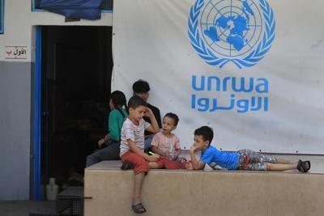

## Claim
Claim: " This image shows a screenshot of the X profile of UNRWA which has placed a black band over its profile photo in mourning for the death of Yahya Sinwar, Hamas leader in the Gaza Strip, in October 2024."

## Actions
```
web_search("UNRWA Yahya Sinwar mourning")
```

## Evidence
### Evidence from `web_search`
The fact-checks from DW.com ([https://www.dw.com/en/fact-check-black-ribbon-on-unrwa-logo-does-not-show-mourning-for-sinwar/a-70532996](https://www.dw.com/en/fact-check-black-ribbon-on-unrwa-logo-does-not-show-mourning-for-sinwar/a-70532996)) and The Canadian Press News ([https://www.thecanadianpressnews.ca/fact_checking/black-band-on-unrwas-social-media-profiles-appeared-before-yahya-sinwars-death/article_33032eb2-f64b-55c6-8a57-3289e6a014cf.html](https://www.thecanadianpressnews.ca/fact_checking/black-band-on-unrwas-social-media-profiles-appeared-before-yahya-sinwars-death/article_33032eb2-f64b-55c6-8a57-3289e6a014cf.html)) debunk the claim that UNRWA placed a black band on its profile photo in mourning for Yahya Sinwar. The black band was present before Sinwar's death and symbolizes solidarity with the victims of war.  

An opinion piece in the National Post included a debunked claim about Yahya Sinwar carrying an UNRWA identity card ([https://www.cjpmemap.ca/alert_2024_10_18_ai_national_post](https://www.cjpmemap.ca/alert_2024_10_18_ai_national_post)).


## Elaboration
The claim is false. Fact-checks from DW.com ([https://www.dw.com/en/fact-check-black-ribbon-on-unrwa-logo-does-not-show-mourning-for-sinwar/a-70532996](https://www.dw.com/en/fact-check-black-ribbon-on-unrwa-logo-does-not-show-mourning-for-sinwar/a-70532996)) and The Canadian Press News ([https://www.thecanadianpressnews.ca/fact_checking/black-band-on-unrwas-social-media-profiles-appeared-before-yahya-sinwars-death/article_33032eb2-f64b-55c6-8a57-3289e6a014cf.html](https://www.thecanadianpressnews.ca/fact_checking/black-band-on-unrwas-social-media-profiles-appeared-before-yahya-sinwars-death/article_33032eb2-f64b-55c6-8a57-3289e6a014cf.html)) confirm that the black band on UNRWA's profile photo was present before Yahya Sinwar's death and symbolizes solidarity with war victims.


## Final Judgement
The fact-check reveals that the claim is false. Multiple sources confirm that the black band on UNRWA's profile photo was present before Yahya Sinwar's death and was not in mourning for him.

The claim is `false`.

### Verdict: FALSE

### Justification
The claim is false. Fact-checks from DW.com ([https://www.dw.com/en/fact-check-black-ribbon-on-unrwa-logo-does-not-show-mourning-for-sinwar/a-70532996](https://www.dw.com/en/fact-check-black-ribbon-on-unrwa-logo-does-not-show-mourning-for-sinwar/a-70532996)) and The Canadian Press News ([https://www.thecanadianpressnews.ca/fact_checking/black-band-on-unrwas-social-media-profiles-appeared-before-yahya-sinwars-death/article_33032eb2-f64b-55c6-8a57-3289e6a014cf.html](https://www.thecanadianpressnews.ca/fact_checking/black-band-on-unrwas-social-media-profiles-appeared-before-yahya-sinwars-death/article_33032eb2-f64b-55c6-8a57-3289e6a014cf.html)) demonstrate that the black band on UNRWA's profile photo predates Yahya Sinwar's death and represents solidarity with war victims.
