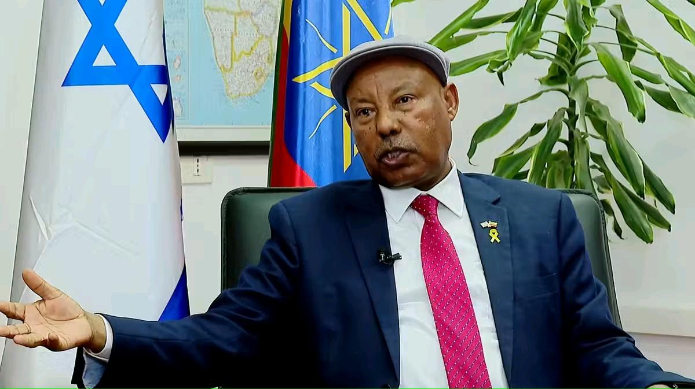

## Claim
Claim: "Ethiopia has expelled Israel's ambassador in April 2025."

## Actions
```
web_search("Ethiopia Israel relations April 2025")
```

## Evidence
### Evidence from `web_search`
On April 2, 2025, both the Ethiopian News Agency ([Source](https://www.ena.et/web/eng/w/eng_6302848)) and Fana Media Corporation S.C. ([Source](https://www.fanamc.com/english/israel-seeks-stronger-economic-people-ties-with-ethiopia-ambassador/)) reported that Israel's ambassador to Ethiopia, Abraham Negussie, expressed a commitment to strengthening ties between the two countries. , 

An article published by Al-Akhbar on May 20, 2025 ([Source](https://en.al-akhbar.com/news/israel-s-red-sea-ambitions--ethiopia-as-the-key-player)) also mentions the Israeli Ambassador to Ethiopia, Abraham Nigusse. <image:k>


## Elaboration
The evidence indicates that in April and May 2025, Israel's ambassador to Ethiopia was Abraham Negussie. The Ethiopian News Agency ([Source](https://www.ena.et/web/eng/w/eng_6302848)) and Fana Media Corporation S.C. ([Source](https://www.fanamc.com/english/israel-seeks-stronger-economic-people-ties-with-ethiopia-ambassador/)) reported on April 2, 2025, that he was committed to strengthening ties.

The evidence does not support the claim that Ethiopia expelled Israel's ambassador in April 2025. Instead, it suggests the opposite, with the ambassador actively engaged in diplomatic efforts.

Therefore, the claim is false.


## Final Judgement
The search results from April and May 2025 show that the Israeli ambassador to Ethiopia, Abraham Negussie, was actively engaged in strengthening ties between the two countries. This contradicts the claim that Ethiopia expelled the ambassador in April 2025.

`false`

### Verdict: FALSE

### Justification
The claim is false. Evidence from April 2025, reported by the Ethiopian News Agency ([Source](https://www.ena.et/web/eng/w/eng_6302848)) and Fana Media Corporation S.C. ([Source](https://www.fanamc.com/english/israel-seeks-stronger-economic-people-ties-with-ethiopia-ambassador/)), indicates that the Israeli ambassador was actively working to strengthen ties, not being expelled.
