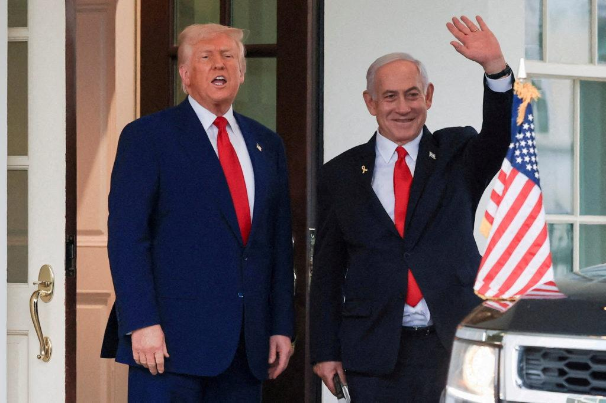

## Claim
Claim: "The assassination plot to kill Donald Trump in 2024 was orchestrated by two Jewish Americans. Israel wants war with Iran but wants American money to fund it and American servicemen to fight it."

## Actions
```
web_search("assassination plot Donald Trump 2024")
web_search("Israel Iran war US involvement")
```

## Evidence
### Evidence from `web_search`
One source discusses an attempted assassination of Donald Trump in Pennsylvania on July 13, 2024, by Thomas Matthew Crooks, who shot Trump with an AR-15-style rifle. The article mentions increased security for Trump due to intelligence indicating Iran was plotting to assassinate him. The article does not mention any Jewish Americans or Israel's involvement. [Source](https://en.wikipedia.org/wiki/Attempted_assassination_of_Donald_Trump_in_Pennsylvania) <image:i>

NPR and CNN report on a Justice Department announcement of an Iranian murder-for-hire plot against Donald Trump, orchestrated by an Iranian government official, Farhad Shakeri. Shakeri was tasked with planning the assassination of Trump and the killings of two Jewish-Americans living in New York. [Source](https://www.npr.org/2024/11/08/nx-s1-5184549/iran-donald-trump-murder-for-hire-plot-justice-department), [Source](https://www.cnn.com/2024/11/08/politics/doj-charges-three-iranian-plot-to-kill-donald-trump) , , , <image:i>


### Evidence from `web_search`
The PBS NewsHour article discusses the U.S. military's intervention in the Israel-Iran war, mentioning U.S. bombings of Iranian nuclear sites and casualties in both countries. The article includes a photograph of Donald Trump and Israeli Prime Minister Benjamin Netanyahu . The Wikipedia article discusses the Iran-Israel war, which took place from June 13–24, 2025, and mentions the involvement of the United States, including images of the conflict <image:k>. The CNN article discusses the conflict between Israel and Iran, including US involvement and President Trump's role <image:i>. The article mentions a ceasefire brokered by Trump, with both sides accusing each other of violations.

The CNN article also mentions that the US military strikes on three of Iran’s nuclear facilities over the weekend did not destroy the core components of its nuclear program. The article also mentions that Trump lashed out at Israel.


## Elaboration
The claim that the assassination plot was orchestrated by two Jewish Americans is false. Evidence indicates that the plot was orchestrated by an Iranian government official.

The claim that Israel wants war with Iran and wants American money and servicemen is partially supported. Evidence shows the US military's involvement in the Israel-Iran war, including bombings of Iranian nuclear sites. The evidence also shows that the US was involved in brokering a ceasefire.


## Final Judgement
The evidence indicates that the assassination plot was orchestrated by an Iranian government official, not Jewish Americans, making the first part of the claim false. The second part of the claim, regarding Israel's desire for war and American involvement, is partially supported by evidence of US military involvement in the conflict.

`false`

### Verdict: FALSE

### Justification
The claim is false. Evidence indicates that the assassination plot was orchestrated by an Iranian government official, not Jewish Americans, as reported by [NPR](https://www.npr.org/2024/11/08/nx-s1-5184549/iran-donald-trump-murder-for-hire-plot-justice-department) and [CNN](https://www.cnn.com/2024/11/08/politics/doj-charges-three-iranian-plot-to-kill-donald-trump). The second part of the claim is partially supported by evidence of US military involvement in the Israel-Iran conflict, as discussed by [PBS NewsHour](https://www.pbs.org/newshour/world/u-s-military-strikes-iranian-nuclear-sites-in-israel-iran-war).
