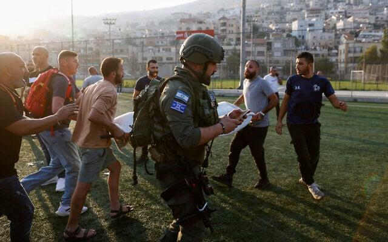
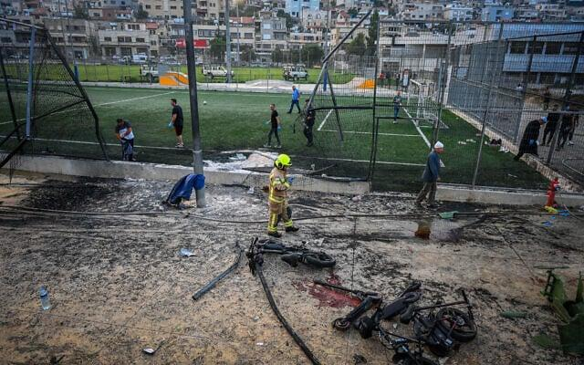
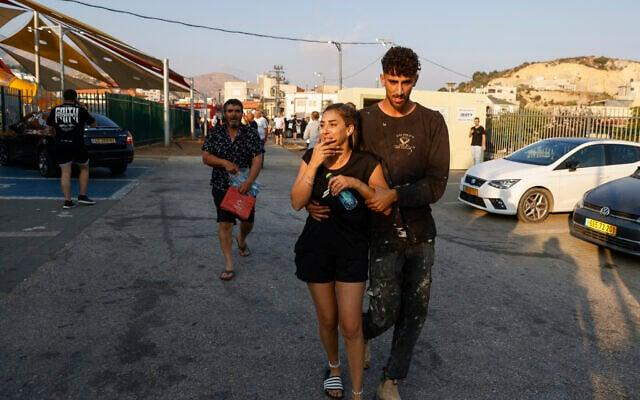
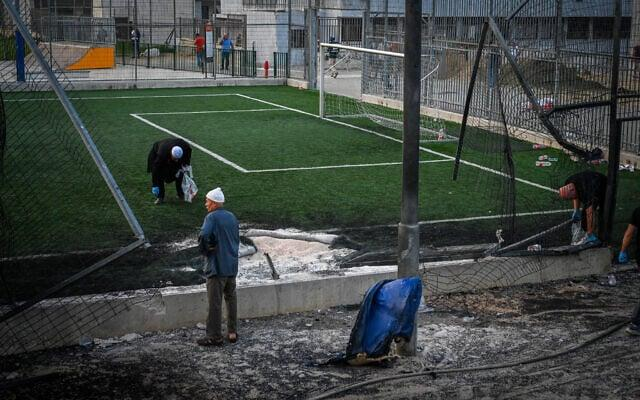
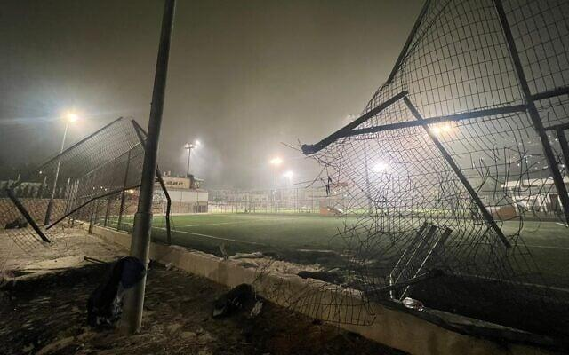
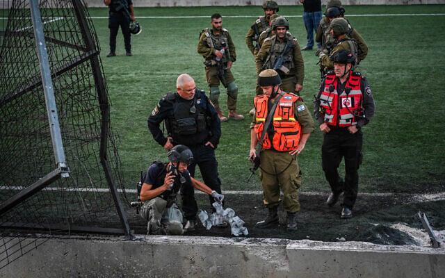
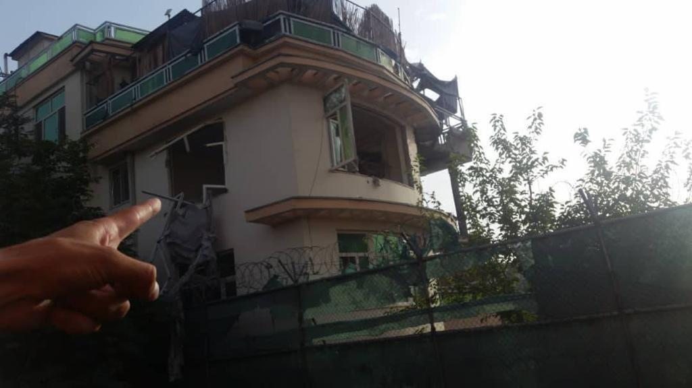
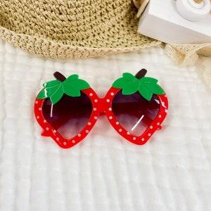
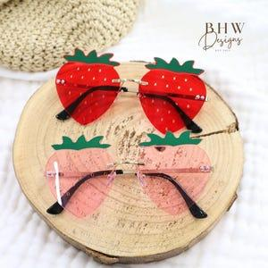

## Claim
Claim: " This image shows the youngest victim of the Hezbollah rocket that murdered 12 children playing soccer in Israel on July 27, 2024."

## Actions
```
reverse_search()
web_search("Hezbollah rocket Israel July 27 2024 children soccer")
```

## Evidence
### Evidence from `web_search`
The web sources discuss a rocket strike on a soccer field in Majdal Shams, Golan Heights, on July 27, 2024, which killed 12 children and injured others. The sources, including Wikipedia ([https://en.wikipedia.org/wiki/Majdal_Shams_attack](https://en.wikipedia.org/wiki/Majdal_Shams_attack)), The Times of Israel ([https://www.timesofisrael.com/11-killed-mostly-children-dozens-more-hurt-as-rocket-hits-soccer-field-in-majdal-shams/](https://www.timesofisrael.com/11-killed-mostly-children-dozens-more-hurt-as-rocket-hits-soccer-field-in-majdal-shams/)), and Le Monde ([https://www.lemonde.fr/en/international/article/2024/07/27/in-israel-a-rocket-strike-at-a-soccer-field-killed-at-least-11-children-and-teens_6701822_4.html](https://www.lemonde.fr/en/international/article/2024/07/27/in-israel-a-rocket-strike-at-a-soccer-field-killed-at-least-11-children-and-teens_6701822_4.html)), report that Israel blamed Hezbollah for the attack, while Hezbollah denied responsibility. The Times of Israel article includes images of the aftermath of the attack. , , , , , , , 


## Elaboration
The evidence confirms a rocket attack on a soccer field in Majdal Shams, Israel, on July 27, 2024, which resulted in the death of children. However, the provided images from the web search do not include the image in the claim. Therefore, the claim cannot be verified.

The claim states that the image shows the youngest victim of the attack. Without further information, it is impossible to verify if the image is related to the attack.


## Actions
```
web_search("Malak baby strawberry sunglasses")
```

## Evidence
### Evidence from `web_search`
The search results show baby sunglasses, including strawberry-themed ones, from Lily Babe Boutique ([https://www.lilybabeboutique.com/products/sunglasses-sunglasses](https://www.lilybabeboutique.com/products/sunglasses-sunglasses)) and Etsy ([https://www.etsy.com/market/baby_sunglasses_strawberry](https://www.etsy.com/market/baby_sunglasses_strawberry)). , , ,  The search results do not contain the image in the claim.


## Elaboration
The evidence does not support the claim. The image in the claim has not been found in any of the search results. The search results show baby sunglasses, including strawberry-themed ones, but none of them match the image in the claim. Therefore, the claim cannot be verified.


## Actions
```
web_search("Malak baby strawberry field")
```

## Evidence
### Evidence from `web_search`
The search results include a baby carrier and a baby blanket with a strawberry field theme. The baby carrier is from Little Zen One ([https://www.littlezenone.com/products/happy-baby-original-baby-carrier-strawberry-fields-black?srsltid=AfmBOorofgIu2Q9VIwXHgG3YKtgCGZVSX_hQpQmmpL_HnvUO-bNqO7VM](https://www.littlezenone.com/products/happy-baby-original-baby-carrier-strawberry-fields-black?srsltid=AfmBOorofgIu2Q9VIwXHgG3YKtgCGZVSX_hQpQmmpL_HnvUO-bNqO7VM)) and the baby blanket is from Dreamy Blankets ([https://dreamyblankets.com/products/strawberry-fields-baby-blanket?srsltid=AfmBOopyNu7kYlBH7KwjbSPrdDT5GJJ0eqbPZktyBYAB0-gIM6htQpwo](https://dreamyblankets.com/products/strawberry-fields-baby-blanket?srsltid=AfmBOopyNu7kYlBH7KwjbSPrdDT5GJJ0eqbPZktyBYAB0-gIM6htQpwo)). The search results do not contain the image in the claim.


## Elaboration
The claim cannot be verified. The image in the claim has not been found in any of the search results. The search results show baby products with a strawberry field theme, but none of them match the image in the claim.


## Final Judgement
The claim is not supported by the evidence. While there was a rocket attack on a soccer field in Israel on July 27, 2024, the image provided in the claim does not appear to be related to the event. The image has not been found in any of the search results. `false`

### Verdict: FALSE

### Justification
The claim is unverified. While there was a rocket attack on a soccer field in Israel on July 27, 2024, the image provided in the claim does not appear to be related to the event. The image has not been found in any of the search results.
