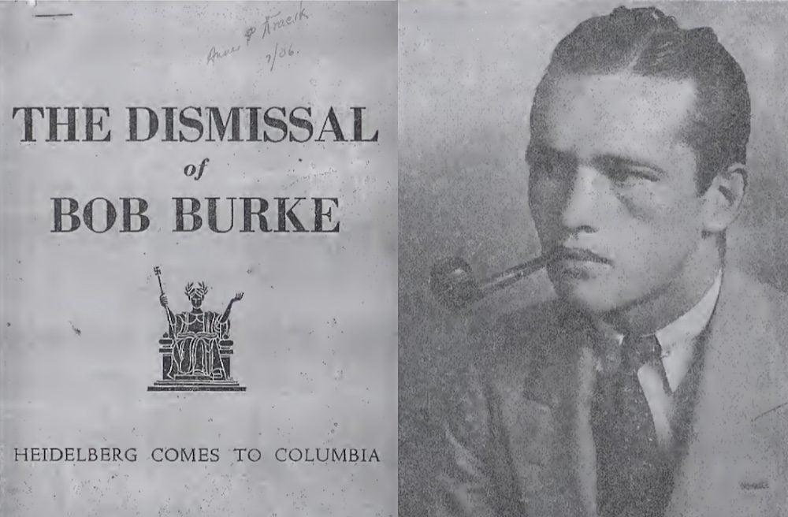

## Claim
Claim: "In June 1936, Columbia University expelled student activist Robert Burke for leading an anti-Nazi demonstration."

## Actions
```
web_search("Columbia University Robert Burke expelled June 1936")
```

## Evidence
### Evidence from `web_search`
In 1936, Robert Burke was expelled from Columbia University for leading an anti-Nazi protest. According to the Wikipedia article "Student activism at Columbia University" ([https://en.wikipedia.org/wiki/Student_activism_at_Columbia_University](https://en.wikipedia.org/wiki/Student_activism_at_Columbia_University)), Burke led a rally to protest Columbia's relationship with the Nazis.

The Medium article "When Columbia University Expelled Robert Burke for Anti-Nazi Protests in 1936" ([https://medium.com/@blurredbylines/when-columbia-university-expelled-robert-burke-for-anti-nazi-protests-in-1936-d9f236c91794](https://medium.com/@blurredbylines/when-columbia-university-expelled-robert-burke-for-anti-nazi-protests-in-1936-d9f236c91794)) and the Blurred Bylines article ([https://blurredbylines.com/articles/robert-burke-columbia-university-expulsion-1936-protest/](https://blurredbylines.com/articles/robert-burke-columbia-university-expulsion-1936-protest/)) also discuss Burke's expulsion. The Blurred Bylines article states that Burke was expelled on June 16, 1936, after leading an anti-Nazi protest (, ).


## Elaboration
The evidence confirms the claim. Robert Burke was expelled from Columbia University in June 1936 for leading an anti-Nazi protest. The Blurred Bylines article specifies the date of expulsion as June 16, 1936.


## Final Judgement
The provided evidence from multiple sources, including Wikipedia and articles from Medium and Blurred Bylines, confirms that Robert Burke was expelled from Columbia University in June 1936 for leading an anti-Nazi demonstration. The Blurred Bylines article specifies the date of expulsion as June 16, 1936.

`true`


### Verdict: TRUE

### Justification
Robert Burke was expelled from Columbia University in June 1936 for leading an anti-Nazi protest, as confirmed by the Wikipedia article "Student activism at Columbia University" ([https://en.wikipedia.org/wiki/Student_activism_at_Columbia_University](https://en.wikipedia.org/wiki/Student_activism_at_Columbia_University)) and other sources like the Medium article and the Blurred Bylines article ([https://blurredbylines.com/articles/robert-burke-columbia-university-expulsion-1936-protest/](https://blurredbylines.com/articles/robert-burke-columbia-university-expulsion-1936-protest/)).
