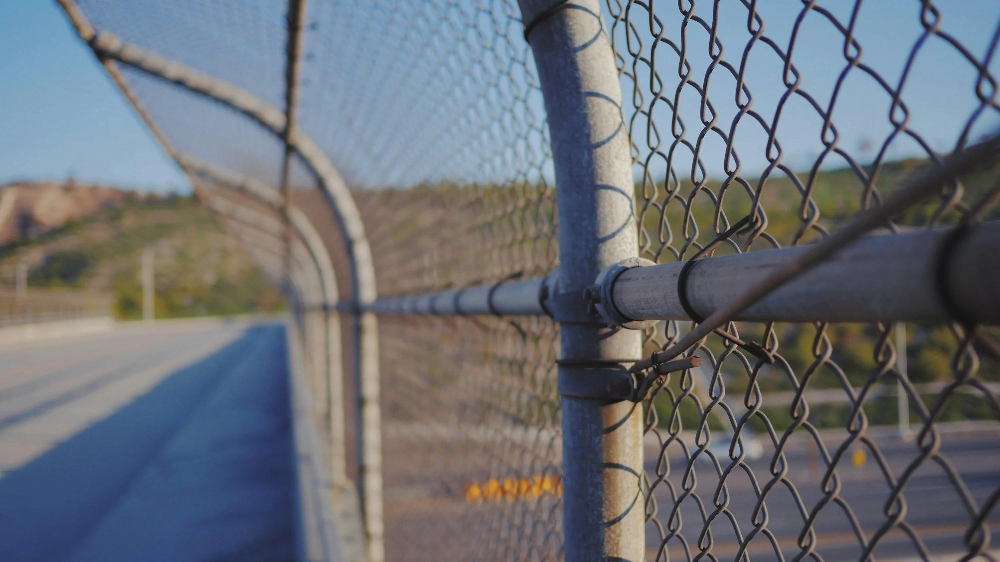

## Claim
Claim: "In March 2025, U.S. Immigration and Customs Enforcement (ICE) agents arrested and detained Palestinian activist Mahmoud Khalil, a lawful permanent resident of the U.S."

## Actions
```
web_search("Mahmoud Khalil ICE arrest March 2025")
```

## Evidence
### Evidence from `web_search`
According to Wikipedia ([https://en.wikipedia.org/wiki/Detention_of_Mahmoud_Khalil](https://en.wikipedia.org/wiki/Detention_of_Mahmoud_Khalil)), Mahmoud Khalil was arrested and detained by ICE agents on March 8, 2025, after attending a protest at Barnard in early March 2025. The White House posted a picture of Khalil on social media on March 10, 2025. Demonstrations protesting his detention were held in New York City.

NPR ([https://www.npr.org/2025/06/23/nx-s1-5441691/mahmoud-khalil-interview](https://www.npr.org/2025/06/23/nx-s1-5441691/mahmoud-khalil-interview)) reports that Khalil, a legal permanent resident, was arrested by ICE agents in early March and detained in Louisiana. He was released on bail after 104 days. ,  The Arab American Institute ([https://www.aaiusa.org/library/fighting-deportation-for-dissent-the-legal-battle-of-mahmoud-khalil](https://www.aaiusa.org/library/fighting-deportation-for-dissent-the-legal-battle-of-mahmoud-khalil)) states that ICE agents arrested and detained Mahmoud Khalil on March 8, 2025. 


## Elaboration
The evidence confirms that Mahmoud Khalil, a lawful permanent resident, was arrested and detained by ICE agents in March 2025. Specifically, the arrest occurred on March 8, 2025, according to both Wikipedia ([https://en.wikipedia.org/wiki/Detention_of_Mahmoud_Khalil](https://en.wikipedia.org/wiki/Detention_of_Mahmoud_Khalil)) and the Arab American Institute ([https://www.aaiusa.org/library/fighting-deportation-for-dissent-the-legal-battle-of-mahmoud-khalil](https://www.aaiusa.org/library/fighting-deportation-for-dissent-the-legal-battle-of-mahmoud-khalil)).

NPR ([https://www.npr.org/2025/06/23/nx-s1-5441691/mahmoud-khalil-interview](https://www.npr.org/2025/06/23/nx-s1-5441691/mahmoud-khalil-interview)) adds that Khalil was detained in Louisiana and released on bail after 104 days. The evidence also mentions that the arrest followed a protest at Barnard and that the White House posted a picture of Khalil on social media.


## Final Judgement
The provided evidence from multiple sources, including Wikipedia, NPR, and the Arab American Institute, confirms that Mahmoud Khalil, a lawful permanent resident, was arrested and detained by ICE agents in March 2025. The arrest date is specified as March 8, 2025, and details about his detention and subsequent release on bail are also provided.

`true`


### Verdict: TRUE

### Justification
The claim is supported by multiple sources. According to Wikipedia ([https://en.wikipedia.org/wiki/Detention_of_Mahmoud_Khalil](https://en.wikipedia.org/wiki/Detention_of_Mahmoud_Khalil)) and the Arab American Institute ([https://www.aaiusa.org/library/fighting-deportation-for-dissent-the-legal-battle-of-mahmoud-khalil](https://www.aaiusa.org/library/fighting-deportation-for-dissent-the-legal-battle-of-mahmoud-khalil)), Mahmoud Khalil, a lawful permanent resident, was arrested and detained by ICE agents on March 8, 2025. NPR ([https://www.npr.org/2025/06/23/nx-s1-5441691/mahmoud-khalil-interview](https://www.npr.org/2025/06/23/nx-s1-5441691/mahmoud-khalil-interview)) adds that he was detained in Louisiana and released on bail after 104 days.
