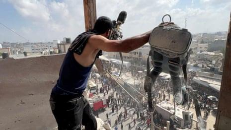
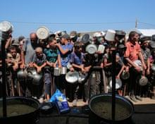
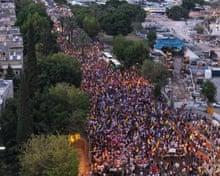

## Claim
Claim: " This image shows heavy Israeli bombardment on Deir al-Balah in the southern Gaza Strip in March 2025 which killed at least four Palestinians."

## Actions
```
reverse_search()
geolocate()
web_search("Deir al-Balah bombing March 2025")
```

## Evidence
### Evidence from `reverse_search`
From [Source](https://today.lorientlejour.com/article/1418485/israeli-strike-on-nabatieh-at-least-7-injured-and-14-suffocated.html): Found exact image on website with title: Residents in Nabatieh 'frightened' but determined to 'stay' after ...
Content: The search result from L'Orient Today, published on June 27, 2024, reports on an Israeli strike on Nabatieh, South Lebanon, on June 26, 2024, which injured nine people.  is found on the website. The article mentions the building was completely destroyed.


### Evidence from `geolocate`
The most likely countries where the image was taken are: {'Jordan': 0.25, 'United Arab Emirates': 0.16, 'Palestine': 0.15, 'Malta': 0.12, 'Tunisia': 0.09, 'Israel': 0.08, 'Pakistan': 0.03, 'Turkey': 0.02, 'Guatemala': 0.01, 'Italy': 0.01}

### Evidence from `web_search`
The Wikipedia article ([https://en.wikipedia.org/wiki/March_2025_Israeli_attacks_on_the_Gaza_Strip](https://en.wikipedia.org/wiki/March_2025_Israeli_attacks_on_the_Gaza_Strip)) discusses the March 2025 Israeli attacks on the Gaza Strip, which targeted multiple locations, including Deir al-Balah, and resulted in over 591 deaths. The UN News article ([https://news.un.org/en/story/2025/03/1161261](https://news.un.org/en/story/2025/03/1161261)) reports that an explosion at two UN guesthouses in Deir al-Balah killed at least one UN staff member and injured five others. The Guardian ([https://www.theguardian.com/world/2025/aug/25/journalists-among-people-killed-by-israeli-strike-on-gaza-hospital](https://www.theguardian.com/world/2025/aug/25/journalists-among-people-killed-by-israeli-strike-on-gaza-hospital)) reported on an Israeli strike on a Gaza hospital that killed at least 20 people, including five journalists. , , , , , .


## Elaboration
The reverse image search indicates that the image was taken in Nabatieh, South Lebanon, on June 26, 2024, and not in Deir al-Balah in March 2025. The geolocation data suggests Palestine as a possible location, but the reverse image search contradicts this. The web search confirms that there were attacks in Deir al-Balah in March 2025, but the provided image is not related to those events.

Therefore, the claim is false.


## Final Judgement
The image is from an Israeli strike on Nabatieh, South Lebanon, on June 26, 2024, and not from Deir al-Balah in March 2025. `false`

### Verdict: FALSE

### Justification
The claim is false. The image, as revealed by a reverse image search, depicts an Israeli strike in Nabatieh, South Lebanon, on June 26, 2024, and not an event in Deir al-Balah in March 2025, as the claim suggests ([https://today.lorientlejour.com/article/1418485/israeli-strike-on-nabatieh-at-least-7-injured-and-14-suffocated.html](https://today.lorientlejour.com/article/1418485/israeli-strike-on-nabatieh-at-least-7-injured-and-14-suffocated.html)).
