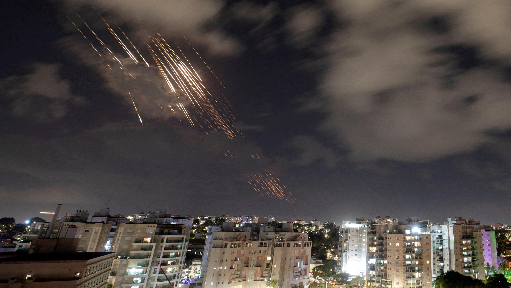
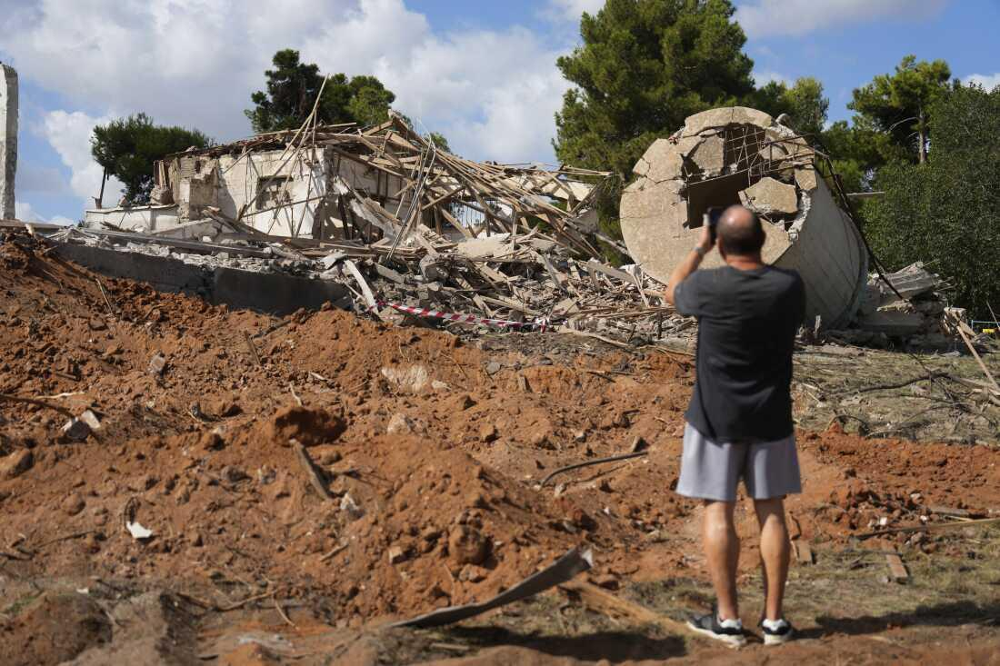

## Claim
Claim: "The Iron Dome intercepted 90% of ballistic missiles fired at Israel in Iran's attack on October 1, 2024."

## Actions
```
web_search("Iron Dome interception rate Iran attack October 1 2024")
```

## Evidence
### Evidence from `web_search`
The Wikipedia article on the October 1, 2024 Iranian strikes on Israel, codenamed Operation True Promise II, states that Iran launched approximately 200 ballistic missiles at Israel. Israel reported shooting down most of the missiles, while Iran claimed 90% of its missiles hit their targets. The Israeli military disputed Iran's claim, stating that "a large number" of missiles were intercepted. ([https://en.wikipedia.org/wiki/October_2024_Iranian_strikes_on_Israel](https://en.wikipedia.org/wiki/October_2024_Iranian_strikes_on_Israel)) <image:i>

TRT World reported on the Iran attack on October 1, 2024, stating that Israel intercepted a "majority" of the ballistic missiles. ([https://trt.global/world/article/18215314](https://trt.global/world/article/18215314))  PBS News reported that Iran fired over 180 missiles and that the Iron Dome has a success rate of over 90%. ([https://www.pbs.org/newshour/world/israels-air-defense-system-passes-test-in-fending-off-iranian-missile-strike](https://www.pbs.org/newshour/world/israels-air-defense-system-passes-test-in-fending-off-iranian-missile-strike)) 


## Elaboration
The evidence presents conflicting information regarding the Iron Dome's interception rate during the October 1, 2024, Iranian attack. While PBS News states that the Iron Dome has a success rate of over 90% ([https://www.pbs.org/newshour/world/israels-air-defense-system-passes-test-in-fending-off-iranian-missile-strike](https://www.pbs.org/newshour/world/israels-air-defense-system-passes-test-in-fending-off-iranian-missile-strike)), the Wikipedia article indicates that Israel reported shooting down "most" of the missiles, and the Israeli military disputed Iran's claim of 90% of its missiles hitting their targets ([https://en.wikipedia.org/wiki/October_2024_Iranian_strikes_on_Israel](https://en.wikipedia.org/wiki/October_2024_Iranian_strikes_on_Israel)).

TRT World reported that Israel intercepted a "majority" of the ballistic missiles ([https://trt.global/world/article/18215314](https://trt.global/world/article/18215314)). The evidence does not provide a specific interception rate for the Iron Dome during the attack.

Therefore, the claim cannot be verified with the available information.


## Actions
```
web_search("Iron Dome interception rate October 1 2024 Iran attack")
```

## Evidence
No new evidence found.

## Elaboration
The evidence does not provide a definitive interception rate for the Iron Dome during the October 1, 2024, Iranian attack. While PBS News states the Iron Dome has a success rate of over 90% ([https://www.pbs.org/newshour/world/israels-air-defense-system-passes-test-in-fending-off-iranian-missile-strike](https://www.pbs.org/newshour/world/israels-air-defense-system-passes-test-in-fending-off-iranian-missile-strike)), the other sources do not specify a percentage. The Wikipedia article states that Israel shot down "most" of the missiles ([https://en.wikipedia.org/wiki/October_2024_Iranian_strikes_on_Israel](https://en.wikipedia.org/wiki/October_2024_Iranian_strikes_on_Israel)), and TRT World reports that Israel intercepted a "majority" of the missiles ([https://trt.global/world/article/18215314](https://trt.global/world/article/18215314)).

The claim cannot be verified due to the lack of specific data on the interception rate during the attack.


## Actions
```
web_search("Iron Dome effectiveness October 1 2024 Iranian missile attack")
```

## Evidence
### Evidence from `web_search`
NPR reported that the Iranian missile strike on October 1, 2024, appeared to have hit some targets, and that the Iron Dome is used to intercept incoming missiles ([https://www.npr.org/2024/10/02/nx-s1-5135646/iran-missile-strike-israel-appears-to-hit-some-targets](https://www.npr.org/2024/10/02/nx-s1-5135646/iran-missile-strike-israel-appears-to-hit-some-targets)). The Washington Institute states that around three-quarters of the missiles were intercepted ([https://www.washingtoninstitute.org/policy-analysis/israels-missile-defense-performance-views-gulf](https://www.washingtoninstitute.org/policy-analysis/israels-missile-defense-performance-views-gulf)). Al Jazeera reports that the US and Israel worked together to shoot down most of the projectiles, and the Israeli military said it intercepted "a large number" of the 180 ballistic missiles launched by Iran, while the IRGC claimed 90 percent of the projectiles hit their targets ([https://www.aljazeera.com/news/2024/10/1/irans-missile-attack-against-israel-what-we-know-and-what-comes-next](https://www.aljazeera.com/news/2024/10/1/irans-missile-attack-against-israel-what-we-know-and-what-comes-next)). <image:i>   


## Elaboration
The evidence provides conflicting information regarding the interception rate. The Washington Institute states that around three-quarters of the missiles were intercepted ([https://www.washingtoninstitute.org/policy-analysis/israels-missile-defense-performance-views-gulf](https://www.washingtoninstitute.org/policy-analysis/israels-missile-defense-performance-views-gulf)). Al Jazeera reports that the Israeli military said it intercepted "a large number" of the 180 ballistic missiles, while the IRGC claimed 90 percent of the projectiles hit their targets ([https://www.aljazeera.com/news/2024/10/1/irans-missile-attack-against-israel-what-we-know-and-what-comes-next](https://www.aljazeera.com/news/2024/10/1/irans-missile-attack-against-israel-what-we-know-and-what-comes-next)).

The claim that the Iron Dome intercepted 90% of the missiles is not supported by the evidence. The evidence suggests a lower interception rate, with the Washington Institute reporting around three-quarters.

Therefore, the claim is not supported by the evidence.


## Final Judgement
The evidence indicates conflicting information regarding the Iron Dome's interception rate during the October 1, 2024, Iranian attack. While some sources suggest a high interception rate, others report that a "large number" of missiles were intercepted, and the Washington Institute estimates around three-quarters were intercepted. The claim of a 90% interception rate is not supported by the available evidence.

`false`

### Verdict: FALSE

### Justification
The claim is not supported by the evidence. While some sources suggest a high interception rate, the evidence indicates conflicting information. The Washington Institute estimates around three-quarters of the missiles were intercepted, and Al Jazeera reports that the Israeli military said it intercepted "a large number" of the missiles, while the IRGC claimed 90 percent of the projectiles hit their targets. ([https://www.washingtoninstitute.org/policy-analysis/israels-missile-defense-performance-views-gulf](https://www.washingtoninstitute.org/policy-analysis/israels-missile-defense-performance-views-gulf), [https://www.aljazeera.com/news/2024/10/1/irans-missile-attack-against-israel-what-we-know-and-what-comes-next](https://www.aljazeera.com/news/2024/10/1/irans-missile-attack-against-israel-what-we-know-and-what-comes-next)).
