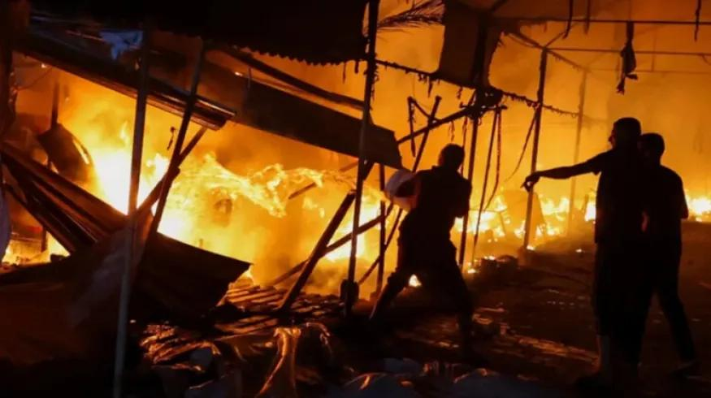

## Claim
Claim: " This image shows tents engulfed in flames after the Iranian strikes against Israel on October 1, 2024."

## Actions
```
reverse_search()
web_search("Iranian strikes against Israel October 1 2024")
```

## Evidence
### Evidence from `reverse_search`
The image 

### Evidence from `web_search`
The Wikipedia article discusses the October 1, 2024, Iranian strikes on Israel, codenamed Operation True Promise II, which targeted military facilities. The strikes resulted in minor damage and some injuries. The article also mentions the broader context of the 2024 Iran–Israel conflict and the ongoing Gaza war. () The NPR article discusses the Iranian strikes against Israel on October 1, 2024. (, , , )

The Institute for the Study of War (ISW) and Critical Threats Project published an Iran Update on October 1, 2024, discussing the Iranian ballistic missile attack on Israel, where Iran launched approximately 180 ballistic missiles targeting Israel. () The report also mentions Hezbollah's attacks targeting northern Israel and the IDF's ground operation in southern Lebanon.


## Elaboration
The evidence confirms that Iranian strikes against Israel occurred on October 1, 2024. However, the provided evidence does not contain any information about the image 

## Actions
```
web_search("image of tents on fire October 1 2024 Israel")
```

## Evidence
### Evidence from `web_search`
The Al Jazeera article from October 14, 2024, and the BBC article from October 15, 2024, report on an Israeli attack on tents sheltering displaced people in Gaza, resulting in a fire. The NPR article from October 7, 2024, features images related to the ongoing conflict between Israel and Hamas, including images of destruction and protests. (, , , )


## Elaboration
The evidence indicates that there were Iranian strikes against Israel on October 1, 2024, and that there was an Israeli attack on tents sheltering displaced people in Gaza. However, the provided evidence does not confirm that the image 

## Actions
```
geolocate()
```

## Evidence
### Evidence from `geolocate`
The most likely countries where the image was taken are: {'Indonesia': 0.23, 'Malaysia': 0.15, 'Sri Lanka': 0.15, 'Bangladesh': 0.13, 'Cambodia': 0.06, 'Philippines': 0.05, 'Ghana': 0.03, 'Uganda': 0.03, 'India': 0.02, 'Nigeria': 0.02}

## Elaboration
The geolocation analysis suggests that the image was not taken in Israel. Therefore, the claim that the image shows tents engulfed in flames after the Iranian strikes against Israel on October 1, 2024, is not supported by the evidence.


## Final Judgement
The evidence confirms that Iranian strikes against Israel occurred on October 1, 2024, and that there was an Israeli attack on tents sheltering displaced people in Gaza. However, the geolocation analysis suggests that the image was not taken in Israel. Therefore, the claim that the image shows tents engulfed in flames after the Iranian strikes against Israel on October 1, 2024, is not supported by the evidence. `false`

### Verdict: FALSE

### Justification
The claim is false. While there were Iranian strikes against Israel on October 1, 2024, and an Israeli attack on tents in Gaza, the image in question was not taken in Israel, according to geolocation analysis.
