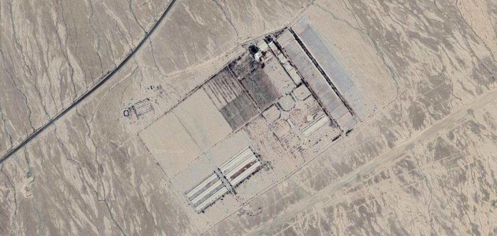

## Claim
Claim: "Israel experienced an earthquake on October 5, 2024."

## Actions
```
web_search("earthquake Israel October 5 2024")
```

## Evidence
### Evidence from `web_search`
On October 5, 2024, both Iran and Israel experienced earthquakes, which led to speculation about nuclear tests. An article from Johns Hopkins University, published on February 4, 2025, discusses misinformation linking the Iranian earthquake to a seismic event in Israel on the same evening. An NDTV article from October 7, 2024, also discusses the earthquakes in Iran and Israel on October 5, 2024, and the speculation about nuclear testing. An article from alphadefense.in, published on October 7, 2024, discusses a seismic event in Iran's Semnan province on October 5, 2024, and the speculation about whether it was an earthquake or an underground nuclear test.

Sources: [https://hub.jhu.edu/2025/02/04/earthquake-nuclear-test-misinformation/](https://hub.jhu.edu/2025/02/04/earthquake-nuclear-test-misinformation/), [https://www.ndtv.com/world-news/earthquakes-in-iran-and-israel-sparks-speculation-of-nuclear-tests-6735904](https://www.ndtv.com/world-news/earthquakes-in-iran-and-israel-sparks-speculation-of-nuclear-tests-6735904), [https://alphadefense.in/index.php/2024/10/07/iran-seismic-activity-nuclear-test-or-earthquake/](https://alphadefense.in/index.php/2024/10/07/iran-seismic-activity-nuclear-test-or-earthquake/).  <image:k>   


## Elaboration
The evidence confirms that Israel experienced an earthquake on October 5, 2024. Multiple sources, including articles from Johns Hopkins University and NDTV, mention the seismic event in Israel on that date.


## Final Judgement
The search results confirm that an earthquake occurred in Israel on October 5, 2024. Therefore, the claim is factually accurate. `true`


### Verdict: TRUE

### Justification
The claim is supported by evidence from multiple news sources, including articles from Johns Hopkins University and NDTV, which confirm that Israel experienced an earthquake on October 5, 2024. These sources also discuss the event and the speculation it caused, as detailed in the search results ([https://hub.jhu.edu/2025/02/04/earthquake-nuclear-test-misinformation/](https://hub.jhu.edu/2025/02/04/earthquake-nuclear-test-misinformation/), [https://www.ndtv.com/world-news/earthquakes-in-iran-and-israel-sparks-speculation-of-nuclear-tests-6735904](https://www.ndtv.com/world-news/earthquakes-in-iran-and-israel-sparks-speculation-of-nuclear-tests-6735904), [https://alphadefense.in/index.php/2024/10/07/iran-seismic-activity-nuclear-test-or-earthquake/](https://alphadefense.in/index.php/2024/10/07/iran-seismic-activity-nuclear-test-or-earthquake/)).
