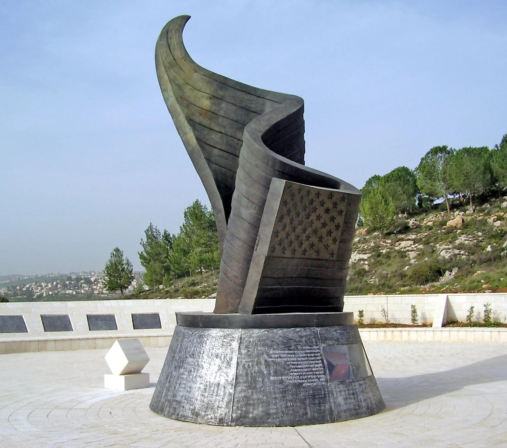
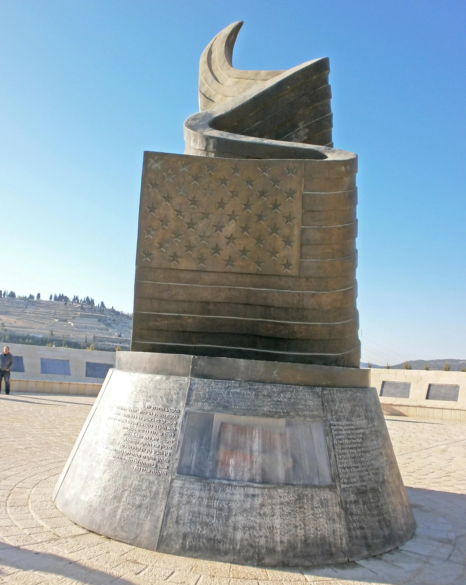
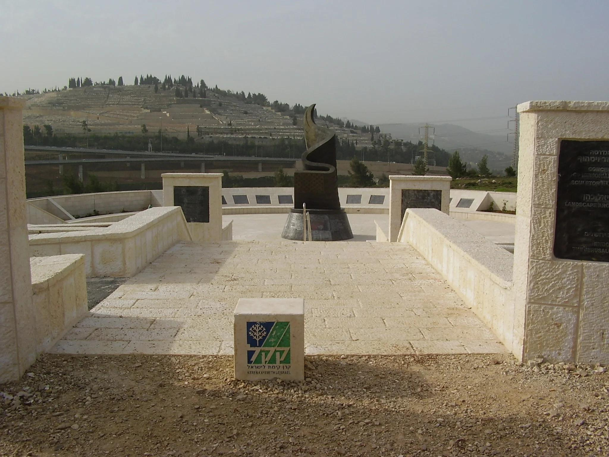
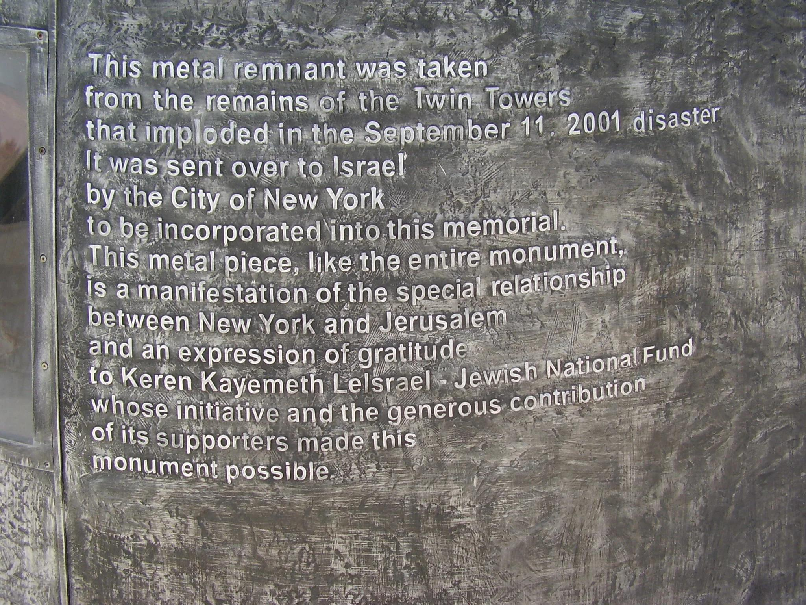
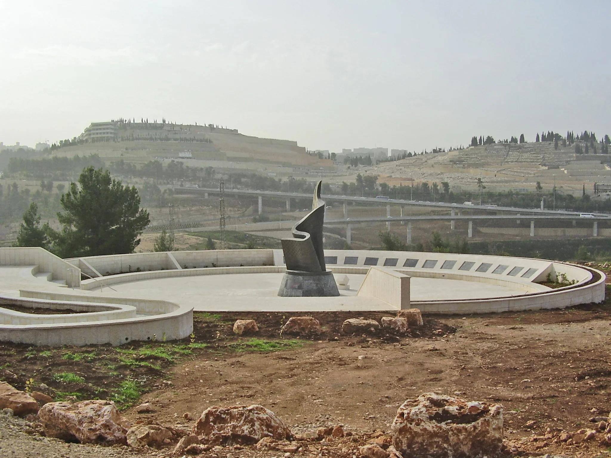

## Claim
Claim: " This image shows Israel's 9/11 memorial which is the only one outside the US."

## Actions
```
reverse_search()
geolocate()
```

## Evidence
### Evidence from `reverse_search`
The image shows the 9/11 Living Memorial Plaza in Jerusalem, Israel, which is the only memorial outside the US that lists the names of the nearly 3,000 victims of the 9/11 attacks. The memorial, completed in 2009, is a 30-foot high bronze sculpture of a waving American flag transforming into a flame. The base is made out of twin tower wreckage. ()

The memorial is made of granite, bronze, and aluminum. (, , , , )


### Evidence from `geolocate`
The most likely countries where the image was taken are: {'Israel': 0.63, 'Palestine': 0.26, 'Jordan': 0.05, 'United States': 0.05, 'Albania': 0.0, 'Andorra': 0.0, 'Argentina': 0.0, 'Australia': 0.0, 'Austria': 0.0, 'Bangladesh': 0.0}

## Elaboration
The evidence confirms that the image depicts the 9/11 Living Memorial Plaza in Jerusalem, Israel. The memorial is the only one outside the US that lists the names of the nearly 3,000 victims of the 9/11 attacks.


## Final Judgement
The claim is accurate. The image shows the 9/11 Living Memorial Plaza in Jerusalem, Israel, which is the only memorial outside the US that lists the names of the nearly 3,000 victims of the 9/11 attacks. `true`

### Verdict: TRUE

### Justification
The image shows the 9/11 Living Memorial Plaza in Jerusalem, Israel, which is the only memorial outside the US that lists the names of the nearly 3,000 victims of the 9/11 attacks, as confirmed by reverse image search results.
