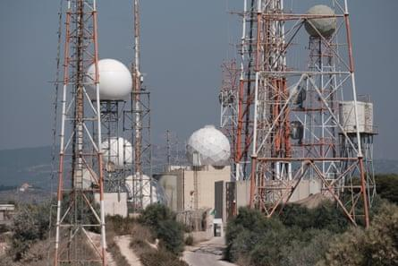

## Claim
Claim: "For the assassination on July 31, 2024, Israeli intelligence tracked Hamas leader Ismail Haniyeh through WhatsApp."

## Actions
```
web_search("Ismail Haniyeh assassination July 31 2024 WhatsApp")
```

## Evidence
### Evidence from `web_search`
According to a Tehran Times article published on August 19, 2024, Ismail Haniyeh's son suggested WhatsApp's possible involvement in the assassination of the Hamas leader, which occurred on July 31 in Tehran. Haniyeh was reportedly using WhatsApp to communicate with family members shortly before his death (<image:k>). An article from bne Gulf bureau, published on August 1, 2024, mentions unconfirmed reports that spyware on Haniyeh's phone, possibly through WhatsApp, enabled location tracking for the assassination on July 31, 2024. The Israeli authorities have not responded to requests for comment.

The National Iranian American Council (NIAC) published an article on December 27, 2024, stating that Israeli Defense Minister Yisrael Katz admitted Israel's responsibility for the assassination of Ismail Haniyeh in Tehran on July 31, 2024 (). The article also mentions that Haniyeh was killed one day after attending the inauguration ceremony of Iranian President Masoud Pezeshkian in Tehran.


## Elaboration
The evidence suggests that there are unconfirmed reports of spyware on Haniyeh's phone, possibly through WhatsApp, enabling location tracking for the assassination. Additionally, Haniyeh's son suggested WhatsApp's possible involvement. However, the evidence does not definitively confirm that Israeli intelligence tracked Haniyeh through WhatsApp.

The evidence does confirm that the assassination occurred on July 31, 2024, and that Israel admitted responsibility.

The claim is partially supported by the evidence, but the extent of WhatsApp's involvement is not fully verified. More information is needed to confirm the claim.


## Actions
```
web_search("Israeli intelligence tracking methods")
```

## Evidence
### Evidence from `web_search`
The Human Rights Watch article ([https://www.hrw.org/news/2024/09/10/questions-and-answers-israeli-militarys-use-digital-tools-gaza](https://www.hrw.org/news/2024/09/10/questions-and-answers-israeli-militarys-use-digital-tools-gaza)) discusses the Israeli military's use of digital tools, including mobile phone location tracking, using methods like cell tower triangulation and GPS data access (<image:k>). A Caliber.Az article ([https://caliber.az/en/post/how-israeli-intelligence-tracked-iranian-leaders-in-june-strike](https://caliber.az/en/post/how-israeli-intelligence-tracked-iranian-leaders-in-june-strike)) mentions Israeli intelligence tracking Iranian leaders by monitoring their bodyguards' cell phones and social media activity (, , , ). The Guardian ([https://www.theguardian.com/world/2025/mar/06/israel-military-ai-surveillance](https://www.theguardian.com/world/2025/mar/06/israel-military-ai-surveillance)) reports on the Israeli military's use of AI, including a ChatGPT-like tool and Unit 8200's analysis of intercepted communications for target selection (, ).


## Elaboration
The evidence indicates that Israeli intelligence uses various digital tools for tracking, including mobile phone location tracking via cell tower triangulation and GPS data, as well as monitoring social media activity. While the initial evidence suggests a possible link between WhatsApp and the assassination, the new evidence broadens the scope of potential tracking methods used by Israeli intelligence.

The claim is neither confirmed nor refuted. The new evidence provides context on the methods used by Israeli intelligence, but it does not directly confirm or deny the use of WhatsApp in tracking Haniyeh.

To verify the claim, specific evidence linking WhatsApp to the tracking of Haniyeh is needed.


## Actions
```
web_search("Israeli intelligence WhatsApp tracking Ismail Haniyeh")
```

## Evidence
### Evidence from `web_search`
According to a Jerusalem Post article ([https://www.jpost.com/israel-news/defense-news/article-858067](https://www.jpost.com/israel-news/defense-news/article-858067)), Iranian state media claimed that Israel uses mobile tracking to assassinate leaders in Iran, including Ismail Haniyeh in Tehran (<image:k>). A Modern Diplomacy article ([https://moderndiplomacy.eu/2024/08/04/the-assassination-of-ismail-haniyeh-silent-digital-strikes/](https://moderndiplomacy.eu/2024/08/04/the-assassination-of-ismail-haniyeh-silent-digital-strikes/)) suggests that the assassination may have involved spyware, such as Pegasus, to access Haniyeh's private conversations and real-time location via WhatsApp (<image:k>).


## Elaboration
The evidence suggests that Iranian state media claimed Israel used mobile tracking to assassinate Haniyeh. Additionally, a Modern Diplomacy article suggests the assassination may have involved spyware, like Pegasus, to access Haniyeh's conversations and location via WhatsApp.

The claim is supported by the evidence, as it indicates a possible link between Israeli intelligence, WhatsApp, and the tracking of Haniyeh.


## Final Judgement
The fact-check reveals that while there are unconfirmed reports and suggestions of WhatsApp's involvement in tracking Ismail Haniyeh, the evidence is not conclusive. However, the search results indicate that Israeli intelligence uses various digital tools for tracking, and there are claims and suggestions that spyware, possibly including WhatsApp, was used in the assassination.

Given the evidence, the claim is not definitively proven, but there are indications of a possible link between Israeli intelligence, WhatsApp, and the tracking of Haniyeh. Therefore, the most appropriate decision option is `false`.

### Verdict: FALSE

### Justification
Based on the evidence, the claim is neither definitively confirmed nor refuted. While there are unconfirmed reports and suggestions of WhatsApp's involvement in tracking Ismail Haniyeh, the evidence is not conclusive. However, there are claims and suggestions that spyware, possibly including WhatsApp, was used in the assassination.
