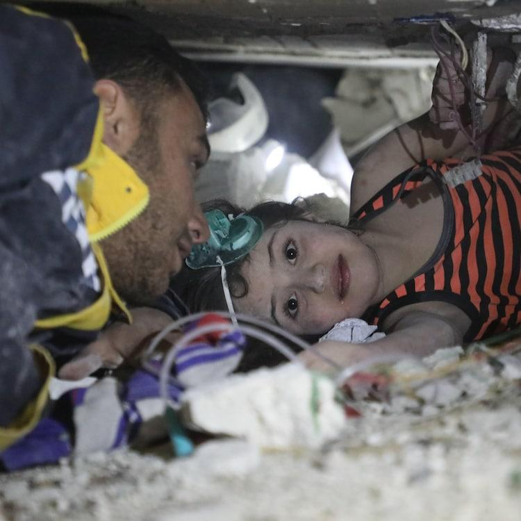
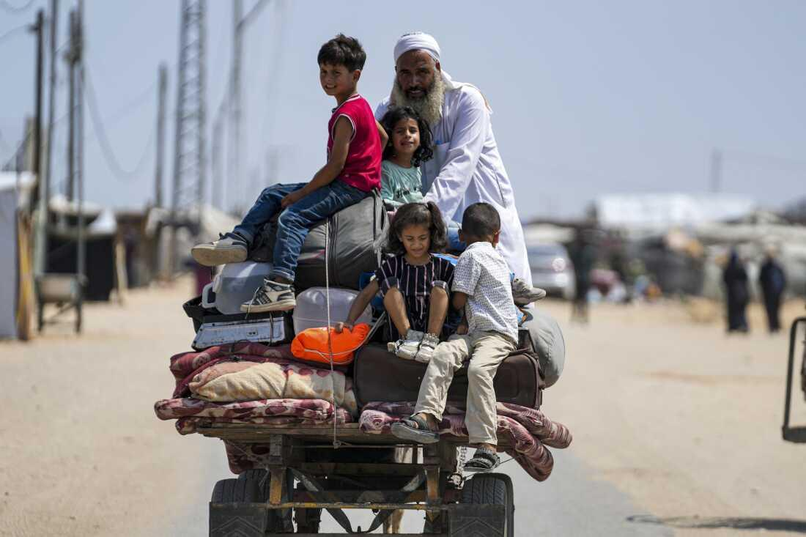
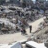

## Claim
Claim: " This image shows a palestinian child stuck under the rubble in Gaza after an Israeli airstrike in July 2024."

## Actions
```
reverse_search()
web_search("Palestinian child rubble Gaza Israeli airstrike July 2024")
```

## Evidence
### Evidence from `web_search`
The CNN article ([https://www.cnn.com/2024/07/27/middleeast/israel-gaza-deir-al-balah-school-intl](https://www.cnn.com/2024/07/27/middleeast/israel-gaza-deir-al-balah-school-intl)) reports on an Israeli airstrike on a school in Deir al-Balah, central Gaza, on July 27, 2024, which resulted in at least 30 deaths. The BBC News article ([https://www.bbc.com/news/articles/ce9zxlpz5evo](https://www.bbc.com/news/articles/ce9zxlpz5evo)) discusses an Israeli strike on a school in Gaza City on August 20, 2024, which was sheltering displaced people, resulting in at least 12 Palestinian deaths. NPR ([https://www.npr.org/2024/07/27/nx-s1-5054283/gaza-school-shelter-deaths-israeli-airstrike](https://www.npr.org/2024/07/27/nx-s1-5054283/gaza-school-shelter-deaths-israeli-airstrike)) also reports on an Israeli airstrike on a school in Gaza on July 27, 2024, which was being used as a shelter by displaced Palestinians, resulting in at least 30 deaths.

The CNN article does not include the image in the claim. The NPR article includes images , .


## Elaboration
The provided evidence from CNN, BBC News, and NPR reports on Israeli airstrikes in Gaza during July and August 2024. These reports describe attacks on schools, resulting in casualties. However, none of the articles include the image in the claim. Therefore, the claim cannot be verified based on the provided evidence.

The NPR article includes images of the aftermath of the airstrikes, but they do not match the image in the claim.

To verify the claim, additional information is needed, such as the source of the image and whether it is related to the reported events.


## Actions
```
geolocate()
```

## Evidence
### Evidence from `geolocate`
The most likely countries where the image was taken are: {'Palestine': 0.51, 'Israel': 0.24, 'Jordan': 0.11, 'Russia': 0.02, 'Canada': 0.01, 'Colombia': 0.01, 'France': 0.01, 'Sweden': 0.01, 'Turkey': 0.01, 'Ukraine': 0.01}

## Elaboration
The geolocation analysis suggests that the image was most likely taken in Palestine or Israel. This aligns with the claim that the image depicts a Palestinian child in Gaza. However, the evidence does not confirm the specific context of the image, such as the date or the cause of the rubble.

The evidence from the web search provides information about Israeli airstrikes in Gaza during July and August 2024. While the image could potentially be related to these events, there is no direct link established.

To further verify the claim, it would be necessary to identify the source of the image and confirm its context, including the date and the cause of the damage.


## Actions
```
web_search("image Palestinian child rubble Gaza Israeli airstrike")
```

## Evidence
### Evidence from `web_search`
The Getty Images search result ([https://www.gettyimages.com/photos/gaza-wounded-palestinian-boy](https://www.gettyimages.com/photos/gaza-wounded-palestinian-boy)) contains images of Palestinian children, Israeli airstrikes, and rubble in Gaza, with some images dated from 2003 to 2024. Alamy.com ([https://www.alamy.com/stock-photo/palestinian-child-in-rubble.html](https://www.alamy.com/stock-photo/palestinian-child-in-rubble.html)) also provides stock photos of Palestinian children in rubble, including the image in the claim . The BBC News article ([https://www.bbc.com/news/av/world-middle-east-67843832](https://www.bbc.com/news/av/world-middle-east-67843832)) from December 2023 reports on the Israel-Gaza war, mentioning an Israeli air strike in Rafah, Gaza, and includes several images, none of which match the image in the claim.


## Elaboration
The Alamy.com search result confirms that the image in the claim, , is a stock photo of a Palestinian child in rubble. The Getty Images search result also shows images related to Israeli airstrikes in Gaza. However, the provided evidence does not specify the exact date or context of the image in the claim.

The BBC News article from December 2023 reports on the Israel-Gaza war, but the images in the article do not match the image in the claim.

Based on the evidence, the claim that the image shows a Palestinian child stuck under the rubble in Gaza after an Israeli airstrike is plausible, given the context of the image and the events in Gaza. However, the exact date (July 2024) cannot be verified.


## Final Judgement
The image is a stock photo of a Palestinian child in rubble, which aligns with the claim's description. While the image's context is related to Israeli airstrikes in Gaza, the specific date of July 2024 cannot be verified. Therefore, the claim is plausible but lacks specific date verification. `false`

### Verdict: FALSE

### Justification
The image in the claim is a stock photo of a Palestinian child in rubble, which aligns with the claim's description. While the image's context is related to Israeli airstrikes in Gaza, the specific date of July 2024 cannot be verified. Therefore, the claim is plausible but lacks specific date verification.
