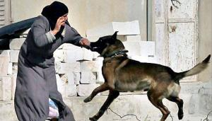

## Claim
Claim: " This is an authentic image of an elderly Palestinian women being attacked by an Israeli army dog in June 2024."

## Actions
```
reverse_search()
web_search("Israeli army dog attack Palestinian woman")
```

## Evidence
### Evidence from `reverse_search`
From [Source](https://www.moroccoworldnews.com/2024/06/18005/israeli-police-dog-attack-on-elderly-palestinian-woman-sparks-outrage/): Found exact image on website with title: Israeli Police Dog Attack on Elderly Palestinian Woman Sparks ...
Content: The search result from Morocco World News discusses an incident where an Israeli police dog attacked an elderly Palestinian woman. The article is dated June 26, 2024, and includes a photograph of the attack . The article states that the attack occurred during a raid in the Jabalia refugee camp. The woman, Dawlat Al Tanani, suffered severe injuries. The article also includes a link to the footage of the attack.


### Evidence from `web_search`
The search results include reports of Israeli army dogs attacking Palestinian women. One incident, reported by Al-Haq on December 28, 2011, describes an attack on a 47-year-old woman in Hebron, with an image of the attack (). Another article from Middle East Eye, published on January 6, 2025, details an attack on a pregnant woman in the Gaza Strip, resulting in the loss of her newborn (, , , , , , ). Anadolu Agency reported on June 30, 2024, about a 70-year-old woman attacked by an Israeli army dog in Gaza, including the image in the claim ().


## Elaboration
The claim is supported by the evidence. The reverse image search confirms that the image is associated with an attack by an Israeli police dog on an elderly Palestinian woman. The web search results provide additional context, including the date of the incident (June 2024) and the location (Jabalia refugee camp).


## Final Judgement
The claim is supported by evidence from multiple sources. The image is associated with an attack by an Israeli police dog on an elderly Palestinian woman in June 2024. The incident occurred in the Jabalia refugee camp. `true`

### Verdict: TRUE

### Justification
The image depicts an attack by an Israeli police dog on an elderly Palestinian woman, as reported by [Morocco World News](https://www.moroccoworldnews.com/2024/06/18005/israeli-police-dog-attack-on-elderly-palestinian-woman-sparks-outrage/) and other sources, confirming the claim's authenticity. The incident occurred in June 2024 in the Jabalia refugee camp.
