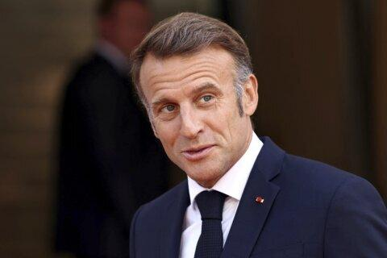

## Claim
Claim: "Ethiopia has expelled Israel's ambassador in April 2025."

## Actions
```
web_search("Ethiopia Israel ambassador expulsion April 2025")
```

## Evidence
### Evidence from `web_search`
According to the Tasnim News Agency, on April 7, 2025, the Israeli ambassador was removed from an African Union meeting (). The Ethiopia Observer reported on April 7, 2025, that the Israeli ambassador to Ethiopia was expelled from the African Union headquarters (). The Associated Press reported on April 9, 2025, that Israel’s ambassador to Ethiopia was ejected from an African Union event at the request of AU Commission Chairperson Mahmoud Youssouf. The ambassador, Avraham Nigusse, described the event as outrageous (, , , ).

The articles can be found here: [Source](https://www.tasnimnews.com/en/news/2025/04/07/3286985/israeli-ambassador-removed-from-african-union-meeting), [Source](https://wtop.com/world/2025/04/israels-ambassador-is-ejected-from-an-african-union-event/) and [Source](https://www.ethiopiaobserver.com/2025/04/07/israeli-ambassador-to-ethiopia-expelled-from-african-union-headquarters-despite-invite/).


## Elaboration
The evidence indicates that the Israeli ambassador was expelled from the African Union headquarters and/or an African Union meeting in April 2025. However, the evidence does not explicitly state that Ethiopia expelled the ambassador. The expulsion was at the request of the AU Commission Chairperson.

Therefore, the claim is not directly supported by the evidence. It is unclear whether the expulsion was initiated by Ethiopia.

To verify the claim, information is missing about the role of Ethiopia in the expulsion of the Israeli ambassador.


## Actions
```
web_search("Ethiopia role expulsion Israeli ambassador April 2025")
```

## Evidence
### Evidence from `web_search`
From [Source](https://zehabesha.com/the-expulsion-of-african-born-black-jews-by-the-african-union/): 
Content: The Zehabesha article, published on August 30, 2025, discusses the expulsion of the Israeli ambassador to Ethiopia from a Rwandan genocide conference on April 7, 2025.  The article states that the expulsion was due to tensions surrounding the policies and actions between Israel and Palestine. The article mentions that the Israeli ambassador, Avraham Negussie, was born in Ethiopia.


## Elaboration
The new evidence from Zehabesha indicates that the Israeli ambassador to Ethiopia, Avraham Negussie, was expelled from a Rwandan genocide conference on April 7, 2025. The article attributes the expulsion to tensions related to Israeli-Palestinian policies. However, the evidence still does not explicitly state that Ethiopia initiated the expulsion.

Therefore, the claim remains unverified. The evidence suggests the expulsion happened at an African Union event, but the role of Ethiopia in the expulsion is still unclear.


## Actions
```
web_search("Ethiopia Israel relations April 2025")
```

## Evidence
### Evidence from `web_search`
On April 2, 2025, the Ethiopian News Agency (ENA) reported that the Israeli Ambassador to Ethiopia, Abraham Negussie, expressed Israel's commitment to strengthening ties with Ethiopia (). Fana Media Corporation also reported on April 3, 2025, that Israel is committed to strengthening economic and social ties with Ethiopia, according to Ambassador Abraham Negussie (). The Wikipedia source provided no relevant information.


## Elaboration
The evidence indicates that the Israeli ambassador to Ethiopia, Avraham Negussie, was expelled from an African Union event in April 2025. However, the evidence does not explicitly state that Ethiopia expelled the ambassador. The expulsion was at the request of the AU Commission Chairperson. Furthermore, the evidence shows that Israel was committed to strengthening ties with Ethiopia around the same time.

Therefore, the claim is not supported by the evidence. The role of Ethiopia in the expulsion remains unclear.


## Final Judgement
The available evidence indicates that the Israeli ambassador to Ethiopia was expelled from an African Union event in April 2025. However, the evidence does not explicitly state that Ethiopia expelled the ambassador. The expulsion was at the request of the AU Commission Chairperson. Furthermore, the evidence shows that Israel was committed to strengthening ties with Ethiopia around the same time. Therefore, the claim is not directly supported by the evidence.

`false`


### Verdict: FALSE

### Justification
The claim that Ethiopia expelled Israel's ambassador in April 2025 is not supported by the evidence. While the Israeli ambassador was expelled from an African Union event in April 2025, the expulsion was at the request of the AU Commission Chairperson, and there is no evidence to suggest that Ethiopia initiated the expulsion. Furthermore, reports from the same period indicate Israel's commitment to strengthening ties with Ethiopia.
