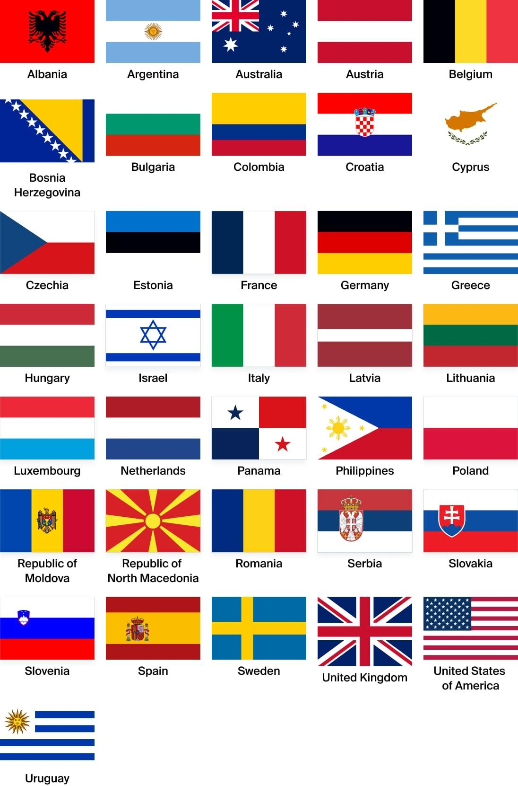

## Claim
Claim: "The World Jewish Congress (WJC) has amended the International Holocaust Remembrance Alliance (IHRA) working definition of antisemitism in March 2025 to include: 'Conflating the assassination of JFK to jews/israel'."

## Actions
```
web_search("World Jewish Congress IHRA antisemitism definition")
web_search("IHRA working definition of antisemitism March 2025")
```

## Evidence
### Evidence from `web_search`
The World Jewish Congress (WJC) website provides the International Holocaust Remembrance Alliance (IHRA) working definition of antisemitism, which was adopted on May 26, 2016. The definition includes examples of antisemitism, such as targeting the state of Israel, but does not mention the assassination of JFK. The IHRA definition has been adopted or endorsed by numerous countries and organizations. The search results do not mention any amendments to the definition in March 2025.

The United Kingdom adopted the IHRA definition on December 12, 2016. The definition has been adopted by several countries and institutions. The examples relating to Israel have been criticized by academics. The search result does not mention the World Jewish Congress or the claim's specific date of March 2025.
, 

Relevant URLs:
*   [https://en.wikipedia.org/wiki/IHRA\_definition\_of\_antisemitism](https://en.wikipedia.org/wiki/IHRA_definition_of_antisemitism)
*   [https://www.worldjewishcongress.org/en/working-definition-of-antisemitism](https://www.worldjewishcongress.org/en/working-definition-of-antisemitism)
*   [https://holocaustremembrance.com/resources/working-definition-antisemitism](https://holocaustremembrance.com/resources/working-definition-antisemitism)


### Evidence from `web_search`
The search results discuss the IHRA Working Definition of Antisemitism, adopted in May 2016. One source, from ReformJudaism.org, notes that the definition is a "working definition" and therefore subject to change. The article was published on August 26, 2025, and mentions the Nexus Document and the Jerusalem Declaration on Antisemitism, which were written in response to the IHRA definition. [https://urj.org/blog/five-definitions-antisemitism](https://urj.org/blog/five-definitions-antisemitism)

Another source, from palquest.org, mentions that by March 2025, the definition had been endorsed by 44 UN member states. This source does not mention the World Jewish Congress or any amendment to the definition in March 2025. [https://www.palquest.org/en/highlight/38757/ihra-working-definition-antisemitism](https://www.palquest.org/en/highlight/38757/ihra-working-definition-antisemitism)


## Elaboration
The evidence indicates that the IHRA definition of antisemitism was adopted in 2016 and has been endorsed by numerous countries and organizations. The search results do not mention any amendments to the definition in March 2025. The provided sources do not mention the specific claim about the assassination of JFK.

The evidence suggests that the IHRA definition is subject to change, but there is no information to support the claim that the WJC amended the definition in March 2025 to include the assassination of JFK.

To verify the claim, I would need to find a credible source that explicitly states the WJC amended the IHRA definition in March 2025 and included the specific wording mentioned in the claim.


## Final Judgement
The search results show that the IHRA definition of antisemitism was adopted in 2016 and has been endorsed by many countries and organizations. The search results do not mention any amendments to the definition in March 2025, nor do they mention the assassination of JFK.

The claim is not supported by the available evidence. There is no information to suggest that the WJC amended the IHRA definition in March 2025 to include the assassination of JFK.

`false`

### Verdict: FALSE

### Justification
The claim is false. The provided evidence, including the [World Jewish Congress website](https://www.worldjewishcongress.org/en/working-definition-of-antisemitism) and other search results, indicates that the IHRA definition of antisemitism was adopted in 2016 and does not mention any amendments in March 2025 or the assassination of JFK.
