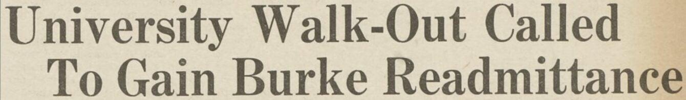

## Claim
Claim: "In June 1936, Columbia University expelled student activist Robert Burke for leading an anti-Nazi demonstration."

## Actions
```
web_search("Columbia University Robert Burke June 1936 expulsion")
web_search("Robert Burke Columbia University anti-Nazi demonstration")
```

## Evidence
### Evidence from `web_search`
Robert Burke was expelled from Columbia University in June 1936 for leading an anti-Nazi protest, according to an article on [Medium.com](https://medium.com/@blurredbylines/when-columbia-university-expelled-robert-burke-for-anti-nazi-protests-in-1936-d9f236c91794) written by Shari Rose and published on March 20, 2025. The article references a document titled "The Dismissal of Bob Burke. Heidelberg Comes to Columbia" and mentions that Burke was expelled soon after leading an anti-Nazi protest. The article also mentions that Columbia University agreed to attend an event at Heidelberg University, which led to student protests. 

Another article on [Blurred Bylines](https://blurredbylines.com/articles/robert-burke-columbia-university-expulsion-1936-protest/) states that Robert Burke was expelled on June 16, 1936, after leading an anti-Nazi protest. , 


### Evidence from `web_search`
From [Source](https://magazine.columbia.edu/article/book-review-third-reich-ivory-tower): 
Content: Columbia University expelled Robert Burke, a Columbia College student, for participating in a 1936 mock book burning and anti-Nazi picket on campus. <image:k>. The article is from Columbia Magazine, Spring 2010.


## Elaboration
The evidence confirms the claim. Multiple sources indicate that Robert Burke was expelled from Columbia University in June 1936 for leading an anti-Nazi protest. One source specifies the date as June 16, 1936. The protests were related to Columbia's planned event at Heidelberg University.


## Final Judgement
The claim is supported by multiple sources, including articles from Medium.com and Columbia Magazine, which state that Robert Burke was expelled from Columbia University in June 1936 for leading an anti-Nazi demonstration. Therefore, the claim is factually accurate. `true`


### Verdict: TRUE

### Justification
Multiple sources, including articles on [Medium.com](https://medium.com/@blurredbylines/when-columbia-university-expelled-robert-burke-for-anti-nazi-protests-in-1936-d9f236c91794) and [Columbia Magazine](https://magazine.columbia.edu/article/book-review-third-reich-ivory-tower), confirm that Robert Burke was expelled from Columbia University in June 1936 for leading an anti-Nazi protest.
