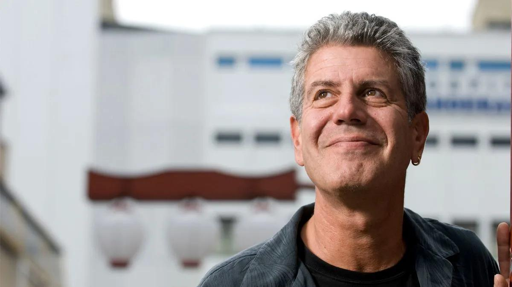

## Claim
Claim: "Anthony Bourdain once said, 'Today, nearly everything is made in China. Except for courage. Courage is made in Palestine.'"

## Actions
```
web_search("Anthony Bourdain quote courage Palestine")
```

## Evidence
### Evidence from `web_search`
From [Source](https://www.yahoo.com/entertainment/fact-check-anthony-bourdain-once-140000174.html): 
Content: The Yahoo search result, published on November 9, 2023, fact-checks the claim that Anthony Bourdain said, "Today, nearly everything is made in China. Except for courage. Courage is made in Palestine." The result states that there is no credible record of Bourdain making this exact statement and rates the claim as "Misattributed." ,  The oldest version of the quote found was from July 2021. The article mentions Bourdain's visit to Israel, the West Bank, and Gaza for a CNN show.


## Elaboration
The claim is misattributed. A fact-check from Yahoo, published on November 9, 2023, states there is no credible record of Anthony Bourdain making the statement. The quote's earliest appearance was in July 2021.


## Final Judgement
The claim that Anthony Bourdain said the quote is false. A fact-check from Yahoo indicates that there is no credible record of Bourdain making this statement and rates the claim as "Misattributed."

`false`


### Verdict: FALSE

### Justification
The claim is false. A fact-check from Yahoo ([Source](https://www.yahoo.com/entertainment/fact-check-anthony-bourdain-once-140000174.html)) indicates that there is no credible record of Anthony Bourdain making the statement, and the quote is considered misattributed.
