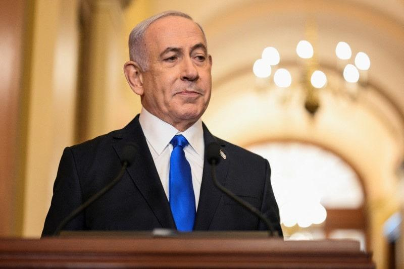

## Claim
Claim: "In a phone call with Benjamin Netanyahu on August 14, 2024, Donald Trump told the Israeli prime minister to stop a Gaza ceasefire deal because it would help Vice President Kamala Harris' 2024 presidential campaign."

## Actions
```
web_search("Donald Trump Benjamin Netanyahu phone call August 14 2024 Gaza ceasefire")
```

## Evidence
### Evidence from `web_search`
Reuters reports that Donald Trump and Benjamin Netanyahu spoke on August 14, 2024, discussing a Gaza ceasefire and hostage release deal ([https://www.reuters.com/world/trump-netanyahu-speak-about-gaza-hostage-ceasefire-deal-axios-reports-2024-08-15/](https://www.reuters.com/world/trump-netanyahu-speak-about-gaza-hostage-ceasefire-deal-axios-reports-2024-08-15/)). Newsweek reported on allegations that Trump urged Netanyahu not to make a deal because it would help the Harris campaign, but Trump and Netanyahu denied the call took place ([https://www.newsweek.com/donald-trump-accused-crime-benjamin-netanyahu-call-ceasefire-hamas-1942248](https://www.newsweek.com/donald-trump-accused-crime-benjamin-netanyahu-call-ceasefire-hamas-1942248)). NPR also reported on the resumption of Gaza cease-fire talks on August 14, 2024 ([https://www.npr.org/2024/08/14/g-s1-16958/gaza-ceasefire-talks-israel-hamas](https://www.npr.org/2024/08/14/g-s1-16958/gaza-ceasefire-talks-israel-hamas)).

The Reuters article mentions that one source told Axios that Trump's call was intended to encourage Netanyahu to take the deal. The Newsweek article mentions that the call was reported by PBS host Judy Woodruff, who said that Trump urged Netanyahu not to cut a deal because it would help the Harris campaign. , , , , .


## Elaboration
The evidence indicates that Donald Trump and Benjamin Netanyahu spoke on August 14, 2024, and discussed a Gaza ceasefire and hostage release deal ([https://www.reuters.com/world/trump-netanyahu-speak-about-gaza-hostage-ceasefire-deal-axios-reports-2024-08-15/](https://www.reuters.com/world/trump-netanyahu-speak-about-gaza-hostage-ceasefire-deal-axios-reports-2024-08-15/)). However, there are conflicting reports about the content of the call. One source told Axios that Trump encouraged Netanyahu to take the deal, while Newsweek reported allegations that Trump urged Netanyahu not to make a deal because it would help the Harris campaign, which Trump and Netanyahu denied ([https://www.newsweek.com/donald-trump-accused-crime-benjamin-netanyahu-call-ceasefire-hamas-1942248](https://www.newsweek.com/donald-trump-accused-crime-benjamin-netanyahu-call-ceasefire-hamas-1942248)).

The claim states that Trump told Netanyahu to stop the deal because it would help Kamala Harris' campaign. The evidence presents conflicting information, with one source alleging this to be true and another reporting a denial from both Trump and Netanyahu.

Therefore, the claim's veracity is uncertain due to the conflicting reports.


## Actions
```
web_search("Donald Trump Netanyahu call August 14 2024 Kamala Harris campaign")
```

## Evidence
### Evidence from `web_search`
From [Source](https://www.timesofisrael.com/how-donald-trump-and-kamala-harris-differ-and-agree-on-middle-east-policy/): 
Content: The Times of Israel reports that Donald Trump and Kamala Harris have differing views on Israel-related topics, but both support Israel's multi-front war. The article mentions that Trump has criticized Harris's calls for a ceasefire. The article also states that both Trump and Harris want a quick end to the war in Gaza. The article references an August press conference where Trump said he encouraged Netanyahu to end the war quickly. .


## Elaboration
The Times of Israel reports that Trump has criticized Harris's calls for a ceasefire and that Trump encouraged Netanyahu to end the war quickly ([https://www.timesofisrael.com/how-donald-trump-and-kamala-harris-differ-and-agree-on-middle-east-policy/](https://www.timesofisrael.com/how-donald-trump-and-kamala-harris-differ-and-agree-on-middle-east-policy/)). This supports the claim that Trump may have wanted to influence the situation in Gaza. However, the evidence does not directly confirm that Trump told Netanyahu to stop a ceasefire deal because it would help Harris's campaign.


## Actions
```
web_search("Trump Netanyahu call August 14 2024 Harris campaign ceasefire deal")
```

## Evidence
### Evidence from `web_search`
From [Source](https://www.bbc.com/news/articles/czq6v9jx939o): 
Content: The BBC reports that on July 26, 2024, Benjamin Netanyahu visited Donald Trump at Mar-a-Lago. During the visit, Trump criticized Kamala Harris's remarks on Israel as "disrespectful." Netanyahu stated that Israel would send negotiators to ceasefire talks. The article does not mention a phone call on August 14, 2024, or Trump urging Netanyahu to stop a ceasefire deal to help Harris's campaign.


## Elaboration
The evidence indicates that Trump and Netanyahu spoke on August 14, 2024, and discussed a Gaza ceasefire. However, the claim that Trump told Netanyahu to stop a ceasefire deal because it would help Kamala Harris's campaign is not directly confirmed. While one source alleges this, it is denied by both Trump and Netanyahu. The BBC article about a meeting on July 26, 2024, does not mention the phone call or the alleged motivations. Therefore, the claim remains unverified.


## Final Judgement
The claim is about a phone call between Trump and Netanyahu on August 14, 2024, where Trump allegedly told Netanyahu to stop a Gaza ceasefire deal to hurt Kamala Harris's campaign. While it's confirmed that the call took place and that a Gaza ceasefire was discussed, the evidence presents conflicting information about the call's content. One source alleges Trump's actions, but both Trump and Netanyahu deny it. Therefore, the claim cannot be definitively verified. `false`

### Verdict: FALSE

### Justification
The claim that Donald Trump told Benjamin Netanyahu to stop a Gaza ceasefire deal to hurt Kamala Harris's campaign on August 14, 2024, is unverified. While a phone call between Trump and Netanyahu on that date is confirmed, with discussions about a Gaza ceasefire, the evidence presents conflicting reports about the call's content. One source alleges Trump's actions, but both Trump and Netanyahu deny it.
