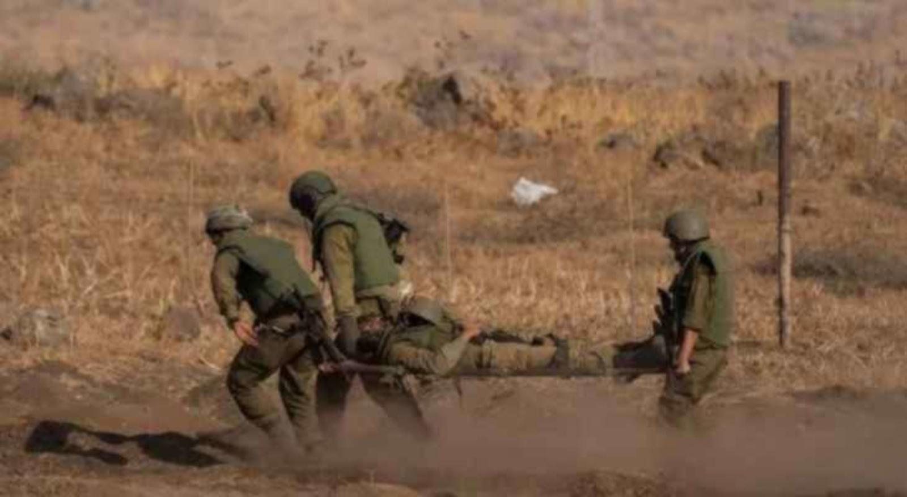
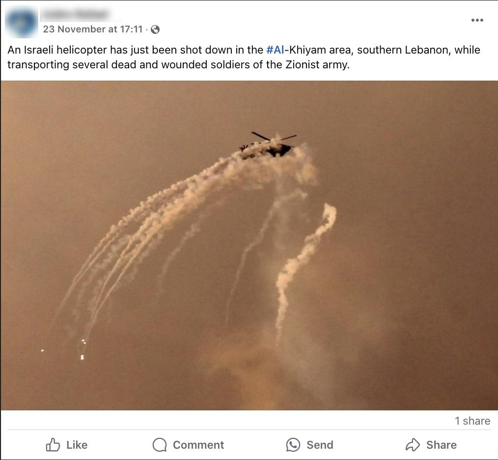
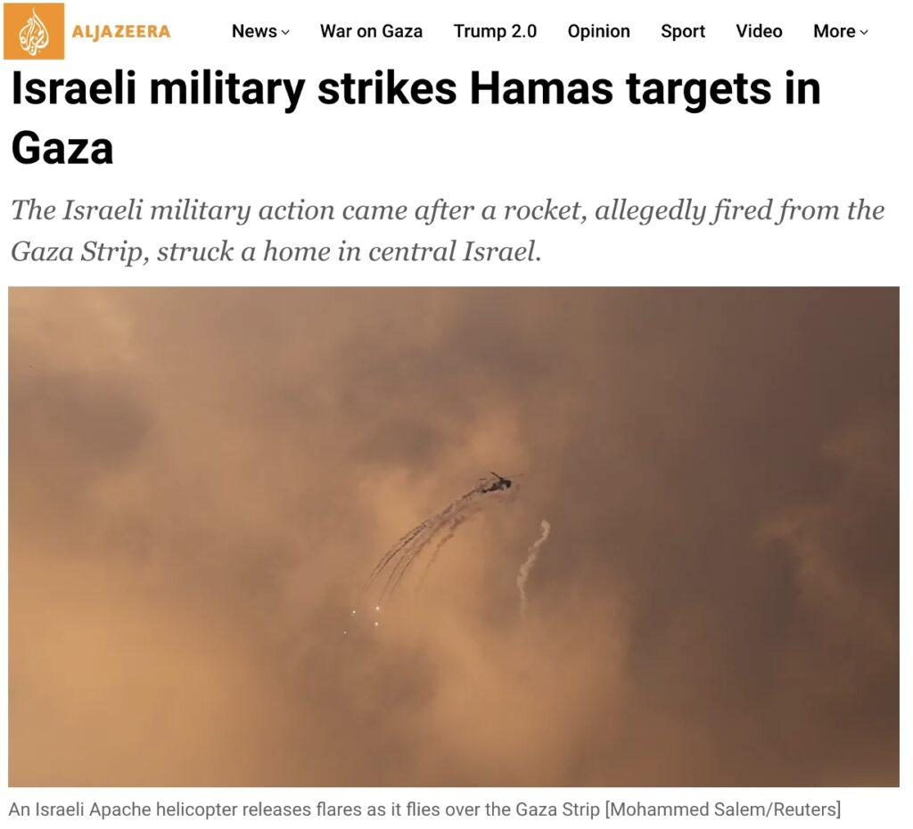

## Claim
Claim: " This image shows an Israeli helicopter shot down by Hezbollah amid clashes in Southern Lebanon on November 23, 2024."

## Actions
```
reverse_search()
```

## Evidence
### Evidence from `reverse_search`
The image 

## Elaboration
The reverse image search did not yield any results. Therefore, I cannot verify the claim. I need more information to determine the image's origin and the events it depicts.


## Actions
```
web_search("Israeli helicopter Hezbollah clashes Lebanon")
web_search("Hezbollah attacks Israeli helicopter November 2024")
```

## Evidence
### Evidence from `web_search`
The provided web sources discuss clashes between Hezbollah and the Israeli army in southern Lebanon. One source, a Wikipedia article, details the 2006 Lebanon War, mentioning that an Israeli helicopter was shot down during the conflict. Another source from Shafaq News reports on intense clashes in October 2024, with Israeli helicopters attempting to evacuate injured soldiers. The Guardian also reported on clashes in October 2024, where Hezbollah claimed to have inflicted casualties on Israeli soldiers.

*   [https://en.wikipedia.org/wiki/2006_Lebanon_War](https://en.wikipedia.org/wiki/2006_Lebanon_War)
*   [https://shafaq.com/en/World/Intense-clashes-between-Hezbollah-and-Israeli-army-in-southern-Lebanon](https://shafaq.com/en/World/Intense-clashes-between-Hezbollah-and-Israeli-army-in-southern-Lebanon)
*   [https://www.theguardian.com/world/2024/oct/02/israeli-soldiers-killed-hezbollah-lebanon](https://www.theguardian.com/world/2024/oct/02/israeli-soldiers-killed-hezbollah-lebanon)

The sources include images related to the conflict, such as <image:i>, <image:j>, <image:k>, 

### Evidence from `web_search`
The Wikipedia article "Timeline of the Israel–Hezbollah conflict (17 September – 26 November 2024)" ([https://en.wikipedia.org/wiki/Timeline_of_the_Israel%E2%80%93Hezbollah_conflict_(17_September_%E2%80%93_26_November_2024)](https://en.wikipedia.org/wiki/Timeline_of_the_Israel%E2%80%93Hezbollah_conflict_(17_September_%E2%80%93_26_November_2024))) details events from September 17, 2024, to November 26, 2024, including clashes and ceasefires. The Times of Israel reported on November 2, 2024, about an Israeli Air Force attack helicopter intercepting a Hezbollah drone near Haifa <image:i>.

Caliber.Az reported on March 17, 2025, that the IDF conducted airstrikes on March 16, 2025, targeting Hezbollah facilities in southern Lebanon ([https://caliber.az/en/post/israel-says-its-helicopters-attack-hezbollah-command-centre-in-southern-lebanon](https://caliber.az/en/post/israel-says-its-helicopters-attack-hezbollah-command-centre-in-southern-lebanon)).


## Elaboration
The evidence indicates that clashes between Hezbollah and the Israeli army occurred in Southern Lebanon in October and November 2024. The Times of Israel reported an incident on November 2, 2024, involving an Israeli Air Force attack helicopter. However, the provided evidence does not confirm that an Israeli helicopter was shot down by Hezbollah on November 23, 2024, as the claim suggests. The image search did not yield any results.

Therefore, I cannot verify the claim. More specific evidence is needed to confirm the event described in the claim.


## Actions
```
web_search("Israeli helicopter shot down Hezbollah November 23 2024 Lebanon")
```

## Evidence
### Evidence from `web_search`
The search results indicate that the claim is false. A Wikipedia article about the 2024 Israeli invasion of Lebanon does not mention any Israeli helicopters being shot down by Hezbollah. Factly.in reported on November 23, 2024, that an image circulating on social media, , purporting to show an Israeli helicopter shot down by Hezbollah on the same day, is actually from 2019 and depicts a Hamas attack on an Israeli helicopter. The article also mentions that there are no recent reports of Israeli helicopters being shot down by Hezbollah. The Factly.in article includes another image, .


## Elaboration
The claim is false. The image is not from November 23, 2024, and does not depict an Israeli helicopter shot down by Hezbollah. The image is from 2019 and shows a Hamas attack on an Israeli helicopter.


## Final Judgement
The image in the claim is not from November 23, 2024, and does not depict an Israeli helicopter shot down by Hezbollah. The image is from 2019 and shows a Hamas attack on an Israeli helicopter.

`false`

### Verdict: FALSE

### Justification
The claim is false. The image provided in the claim is from 2019 and depicts a Hamas attack on an Israeli helicopter, not an event from November 23, 2024, involving Hezbollah, as reported by [Factly.in](https://factly.in/).
